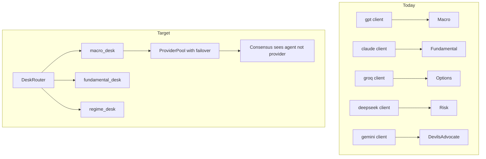
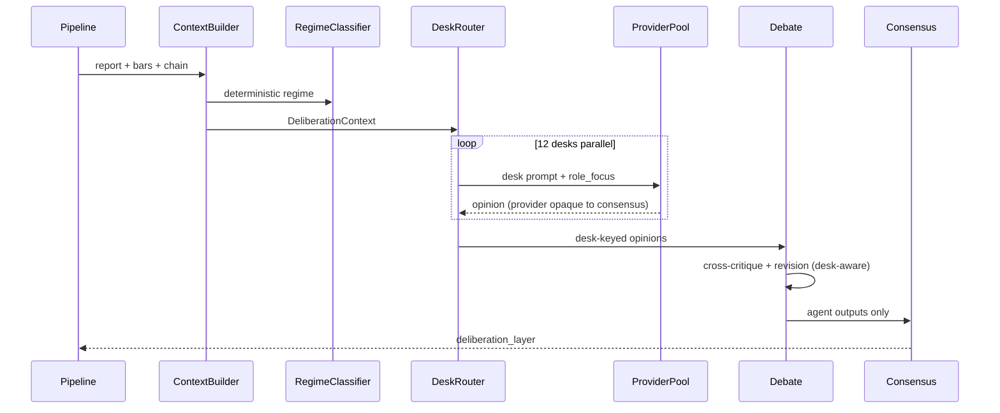

# 12-Desk Institutional DIL Expansion

## Current State vs Target

Today the DIL is a **5-model panel where provider = desk** ([`roles.py`](backend/app/services/deliberation/roles.py)):

```26:32:backend/app/services/deliberation/roles.py
DESK_ROLES: dict[str, dict[str, str]] = {
    "gpt": {"key": "macro_desk", "label": "Macro Desk"},
    "claude": {"key": "fundamental_desk", "label": "Fundamental Desk"},
    "groq": {"key": "options_desk", "label": "Options Desk"},
    "deepseek": {"key": "risk_desk", "label": "Risk Desk"},
    "gemini": {"key": "devils_advocate_desk", "label": "Devil's Advocate Desk"},
}
```

Round 1 iterates **clients**, debate rounds key off **model keys**, and role specialization stops after Round 1. Seven desks from your spec are missing or only partially absorbed into existing roles.



**Your decisions:** phased rollout; keep current primary provider mapping; add per-desk fallback chains.

---

## Phase 1 — Decouple Desks from Providers + Failover

**Goal:** Replace "one provider = one desk" with "one desk = primary provider + fallback chain." Round 1 becomes desk-centric. No new desks yet — behavior should match today when all providers are healthy.

### 1A. Desk registry and provider pool

Create [`backend/app/services/deliberation/desk_config.py`](backend/app/services/deliberation/desk_config.py):

```python
@dataclass(frozen=True)
class DeskDefinition:
    key: RoleKey
    label: str
    primary: ModelKey
    fallbacks: tuple[ModelKey, ...]  # ordered
    enabled: bool = True
```

- Move `DESK_ROLES`, `ROLE_STEP_TITLES`, and `context_view_for_role()` out of [`roles.py`](backend/app/services/deliberation/roles.py) into this module (keep `roles.py` as a thin re-export for backward compat).
- Default primary assignments **unchanged** (gpt→macro, claude→fundamental, groq→options, deepseek→risk, gemini→devils_advocate).
- Default fallbacks: remaining 4 providers in stable order (configurable).

Add [`backend/app/services/deliberation/role_executor.py`](backend/app/services/deliberation/role_executor.py):

```python
async def execute_desk(desk, prompt_fn, client_map) -> tuple[ModelKey | None, str | IndependentOpinion]:
    for provider in [desk.primary, *desk.fallbacks]:
        client = client_map.get(provider)
        if not client:
            continue
        try:
            return provider, await prompt_fn(client)
        except Exception:
            continue
    raise RuntimeError(f"No provider available for {desk.key}")
```

Refactor [`registry.py`](backend/app/services/deliberation/llm_clients/registry.py):

- Add `get_client_map(settings) -> dict[ModelKey, BaseDeliberationClient]`.
- Keep `get_enabled_clients()` for backward compat during migration.

### 1B. Config surface

Extend [`config.py`](backend/app/core/config.py) + [`.env.example`](backend/.env.example):

| Env var | Purpose |
|---------|---------|
| `DIL_ACTIVE_DESKS` | Comma list of desk keys to run (default: current 5) |
| `DIL_DESK_{KEY}_FALLBACKS` | Optional per-desk override, e.g. `DIL_DESK_MACRO_DESK_FALLBACKS=claude,gemini,deepseek,groq` |

Document in `.env.example`; no YAML file needed initially.

### 1C. Round 1 becomes desk-keyed

Refactor [`round1_independent.py`](backend/app/services/deliberation/debate/round1_independent.py):

- Input: `list[DeskDefinition]` + `client_map`, not `list[BaseDeliberationClient]`.
- Output: `dict[str, IndependentOpinion]` keyed by **`role_key`** (not `model_key`).
- Each opinion records `model` (which provider actually answered), `role_key`, `role_label`, and new optional `provider_attempts: list[str]` for observability.
- Parallelize with `asyncio.gather` over **desks** (same concurrency model as today).

Update [`orchestrator.py`](backend/app/services/deliberation/orchestrator.py):

- `models_requested` → add `desks_requested: list[str]`.
- `DIL_MIN_MODELS` semantics → rename internally to **min successful desk opinions** (keep env var name for compat; document behavior change).
- Success threshold: `len(valid_round1) >= dil_min_models`.

### 1D. Backward-compatible persistence shape

Consensus engine and frontend currently expect Round 1 keyed by model. Add a thin adapter in orchestrator serialization:

```python
round1_by_desk: dict[str, IndependentOpinion]  # canonical
round1_by_model: dict[str, IndependentOpinion]  # derived, deprecated
```

Store both in `DeliberationLayer.round1` during transition:

```json
{ "by_desk": { "macro_desk": {...} }, "by_model": { "gpt": {...} } }
```

Or keep flat dict keyed by desk and update downstream consumers in Phase 1 (preferred — cleaner long-term). Files to update in Phase 1:

- [`consensus.py`](backend/app/services/deliberation/debate/consensus.py)
- [`routing.py`](backend/app/services/deliberation/debate/routing.py) — route by desk, targets are desk keys
- [`round2_cross_critique.py`](backend/app/services/deliberation/debate/round2_cross_critique.py), [`round3_revision.py`](backend/app/services/deliberation/debate/round3_revision.py)
- [`scoring/*.py`](backend/app/services/deliberation/scoring/) — use desk labels from opinions
- [`frontend/src/types/schemas.ts`](frontend/src/types/schemas.ts) + [`shared.tsx`](frontend/src/components/deliberation/shared.tsx) — prefer `role_key`/`role_label` over model-keyed `DESK_LABELS`

### 1E. Tests

Extend [`test_roles.py`](backend/tests/deliberation/test_roles.py) and [`test_orchestrator_mock.py`](backend/tests/deliberation/test_orchestrator_mock.py):

- Primary provider fails → fallback succeeds
- All providers fail for one desk → neutral opinion with error; run continues if min desks met
- Round 1 output keyed by desk

---

## Phase 2 — Add 7 Specialized Desks + Context Sources

**Goal:** Expand from 5 → 12 desks. Each new desk gets a unique prompt, reasoning-step skeleton, and `role_focus` context slice.

### New desks

| Desk | Primary (keep rotation) | Context source | Notes |
|------|-------------------------|----------------|-------|
| `technical_desk` | gemini (fallback chain) | **New** TA block | RSI, MACD, ATR, support/resistance from OHLCV bars |
| `news_desk` | gemini | `article_evidence` + sentiment momentum | Narrative shift scoring from existing evidence |
| `earnings_desk` | claude | earnings articles + guidance events | Split from fundamental desk's earnings slice |
| `event_risk_desk` | groq | `options_intelligence.event_risk` + macro calendar | Mostly pre-computed; LLM interprets |
| `flow_desk` | gpt | **New** flow block | Unusual volume/OI spikes from chain (v1 heuristic) |
| `liquidity_desk` | deepseek | chain bid-ask, volume, OI | Extend [`options_chain.py`](backend/app/services/market/options_chain.py) |
| `regime_desk` | gpt | **New** regime classifier + analogs | Runs first logically; see below |

### 2A. Enrich `DeliberationContext`

Extend [`schemas.py`](backend/app/services/deliberation/schemas.py) + [`context_builder.py`](backend/app/services/deliberation/context_builder.py):

```python
class DeliberationContext(BaseModel):
    ...
    technical_context: dict[str, Any] | None = None   # RSI, MACD, levels
    flow_context: dict[str, Any] | None = None        # UOA heuristics
    liquidity_context: dict[str, Any] | None = None   # spread/OI quality
    regime_context: dict[str, Any] | None = None      # Risk-On/Off/Range/etc.
    news_momentum: dict[str, Any] | None = None       # sentiment velocity
```

Wire existing unused field:

- `historical_analogs` — populate from [`analog_service.py`](backend/app/services/analogs/analog_service.py) (currently hardcoded `[]` in context builder).

### 2B. New deterministic context builders (pipeline-side)

Add [`backend/app/services/deliberation/context/`](backend/app/services/deliberation/context/) subpackage:

| Module | Computes |
|--------|----------|
| `technical.py` | RSI(14), MACD, ATR, rolling support/resistance from pipeline OHLCV bars |
| `flow.py` | v1: volume/OI z-score vs 20-day mean on ATM strikes |
| `liquidity.py` | spread %, min OI threshold, volume rank from chain snapshot |
| `regime.py` | Deterministic classifier: inputs = `volatility_regime`, sentiment skew, macro event density, days-to-earnings → label enum matching your spec |
| `news_momentum.py` | Bearish/bullish article count delta over 48h window |

Call these from `build_deliberation_context()` or from pipeline before DIL (prefer context_builder to keep pipeline diff small).

**Regime desk runs first in Round 1** (sequential pre-pass or priority gather): its output is injected into other desks' `role_focus` as `regime_hint`. This matches your "Regime influences every other desk" requirement without adding a Round 0 LLM call — the deterministic classifier provides the hint; the Regime desk LLM validates/refines it.

### 2C. Desk prompts

Add 7 files under [`prompts/roles/`](backend/app/services/deliberation/prompts/roles/):

- `technical_desk.txt`, `news_desk.txt`, `earnings_desk.txt`, `event_risk_desk.txt`, `flow_desk.txt`, `liquidity_desk.txt`, `regime_desk.txt`

Follow existing pattern in [`options_desk.txt`](backend/app/services/deliberation/prompts/roles/options_desk.txt): mission statement, required step titles, explicit JSON output fields, reference to `role_focus` block.

Add `ROLE_STEP_TITLES` entries for each (mirror your spec's analytical responsibilities).

### 2D. Provider assignment for new desks

With current mapping preserved for core 5, assign new desks via fallback rotation (no remapping):

| New desk | Suggested primary | Rationale |
|----------|-------------------|-----------|
| technical_desk | gemini | Currently devil's advocate primary; gemini's fallbacks cover technical when gemini runs DA |
| news_desk | gemini | News synthesis strength |
| earnings_desk | claude | Already earnings-heavy in fundamental |
| event_risk_desk | groq | Options-adjacent |
| flow_desk | gpt | Macro/market flow |
| liquidity_desk | deepseek | Risk-adjacent |
| regime_desk | gpt | Macro/regime |

Each desk still gets full 4-deep fallback chain — when primary is same provider as another desk, failover ensures coverage.

Enable via `DIL_ACTIVE_DESKS=macro_desk,...,regime_desk` (default expands to all 12 once stable).

### 2E. Extend disagreement topics

Update [`scoring/disagreement.py`](backend/app/services/deliberation/scoring/disagreement.py):

```python
TOPICS = ("macro", "earnings", "volatility", "valuation", "liquidity",
          "technical", "flow", "regime", "news", "event_risk")
```

Add keyword patterns for new topics.

---

## Phase 3 — Desk-Aware Debate + UI

**Goal:** Debate rounds preserve desk identity; frontend renders 12-desk panel cleanly.

### 3A. Desk-aware debate rounds

Refactor [`round2_cross_critique.py`](backend/app/services/deliberation/debate/round2_cross_critique.py) and [`round3_revision.py`](backend/app/services/deliberation/debate/round3_revision.py):

- Iterate over desk opinions (not clients).
- Inject desk role prompt snippet + `role_label` into critique/revision user payload.
- Routing ([`routing.py`](backend/app/services/deliberation/debate/routing.py)): targets are **desk keys**; cross-stance routing compares desk stances; devil's advocate rotates among desks (not conflated with `devils_advocate_desk` permanent role — keep both mechanisms but rename routing role to `debate_devils_advocate` in assignments to avoid confusion).

Update `DebateCritique` schema:

```python
class DebateCritique(BaseModel):
    role_key: str          # desk that critiqued
    model: ModelKey        # provider used
    agrees_with: list[str] # desk keys
    disagrees_with: list[str]
    ...
```

### 3B. Frontend panel expansion

Update deliberation UI components:

| File | Change |
|------|--------|
| [`ModelOpinionCards.tsx`](frontend/src/components/deliberation/ModelOpinionCards.tsx) | Grid/columns for 12 desks; group by category (Core / Specialized) |
| [`shared.tsx`](frontend/src/components/deliberation/shared.tsx) | Replace model-keyed `DESK_LABELS` with desk-key map; tooltip shows provider |
| [`ConvictionHeatmap.tsx`](frontend/src/components/deliberation/ConvictionHeatmap.tsx) | 12×12 matrix or grouped heatmap |
| [`DebateTimeline.tsx`](frontend/src/components/deliberation/DebateTimeline.tsx) | Show desk-to-desk critique edges |
| [`DeliberationDashboard.tsx`](frontend/src/components/deliberation/DeliberationDashboard.tsx) | Optional collapsible "Specialized Desks" section |

Use `role_label` from API as source of truth (remove duplicated hardcoded maps where possible).

### 3C. Observability

Log per run:

- `desks_requested`, `desks_succeeded`, `provider_usage` histogram
- Per-desk failover events (`dil.desk.failover`, desk, attempted_providers)

---

## Architecture After All Phases



---

## Cost / Latency Expectations

| Phase | Round 1 LLM calls | Approx. added latency |
|-------|-------------------|----------------------|
| Phase 1 | 5 (unchanged) | ~0 |
| Phase 2 | 12 parallel | +15–30s (provider-dependent) |
| Phase 3 | 12 + 24 debate | +30–60s total |

Mitigations already in scope:

- `DIL_ACTIVE_DESKS` to run subset in dev
- Provider failover avoids full desk failure
- Regime classifier is deterministic (no extra LLM for hint injection)

---

## Files Touched (by phase)

**Phase 1 (core refactor):**
- NEW: `desk_config.py`, `role_executor.py`
- EDIT: `roles.py`, `round1_independent.py`, `orchestrator.py`, `registry.py`, `config.py`, `.env.example`
- EDIT: `routing.py`, `round2_*.py`, `round3_*.py`, `consensus.py`, `scoring/*`
- EDIT: `schemas.py`, frontend `schemas.ts`, `shared.tsx`, deliberation tests

**Phase 2 (new desks):**
- NEW: 7 prompt files, `context/technical.py`, `flow.py`, `liquidity.py`, `regime.py`, `news_momentum.py`
- EDIT: `context_builder.py`, `analog_service` wiring, `disagreement.py`

**Phase 3 (debate + UI):**
- EDIT: debate rounds, `DeliberationDashboard.tsx`, opinion cards, heatmap, timeline

---

## Out of Scope (defer)

- Remapping primary providers to your recommended assignment (you chose to keep current)
- LLM consensus synthesizer (`consensus.txt` remains unused; consensus stays deterministic per original DIL constraint)
- Live dark-pool / institutional flow feeds (Flow desk v1 uses chain heuristics only)
- Adding new LLM providers beyond the existing 5
