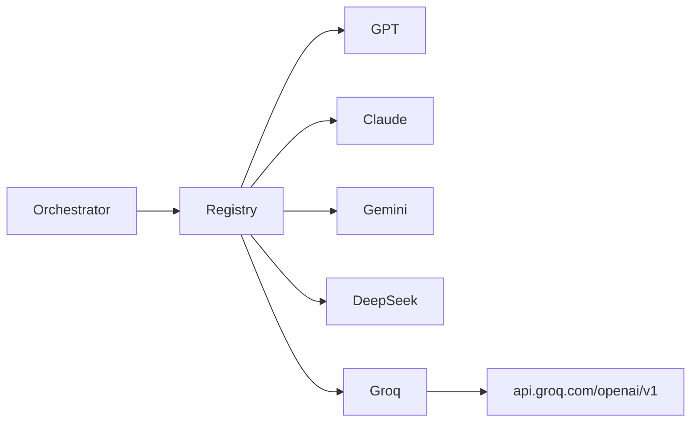

# Add Groq to Multi-LLM Deliberation Layer

## Context

The DIL layer already registers providers in [`backend/app/services/deliberation/llm_clients/registry.py`](backend/app/services/deliberation/llm_clients/registry.py): each provider is a small client class extending `BaseDeliberationClient`, enabled when its API key is set and not listed in `DIL_EXCLUDE_MODELS`.

Groq exposes an **OpenAI-compatible** chat completions API at `https://api.groq.com/openai/v1/chat/completions` and supports `response_format: { "type": "json_object" }`, so the implementation mirrors [`deepseek_client.py`](backend/app/services/deliberation/llm_clients/deepseek_client.py) almost exactly.



## Changes

### 1. New Groq client

Create [`backend/app/services/deliberation/llm_clients/groq_client.py`](backend/app/services/deliberation/llm_clients/groq_client.py):

- `model_key = "groq"`
- POST to `{groq_base_url}/chat/completions` (base URL default includes `/openai/v1`)
- Auth: `Authorization: Bearer {GROQ_API_KEY}`
- Payload: same shape as DeepSeek/OpenAI — `model`, `max_tokens`, `response_format: json_object`, system + user messages
- Default model: **`llama-3.3-70b-versatile`** (per your choice)

### 2. Config and env

Update [`backend/app/core/config.py`](backend/app/core/config.py) with three new settings:

| Setting | Env var | Default |
|---------|---------|---------|
| `groq_api_key` | `GROQ_API_KEY` | `""` |
| `groq_model` | `GROQ_MODEL` | `llama-3.3-70b-versatile` |
| `groq_base_url` | `GROQ_BASE_URL` | `https://api.groq.com/openai/v1` |

Add the same vars to [`backend/.env.example`](backend/.env.example) under the DIL section.

### 3. Register provider

Update [`registry.py`](backend/app/services/deliberation/llm_clients/registry.py):

- Import `GroqDeliberationClient`
- Enable when `settings.groq_api_key.strip()` and `"groq" not in excluded`
- Add a shared constant to avoid list drift:

```python
ALL_DIL_MODEL_KEYS = ["gpt", "claude", "gemini", "deepseek", "groq"]
```

### 4. Schema and hardcoded model lists

- Extend `ModelKey` in [`backend/app/services/deliberation/schemas.py`](backend/app/services/deliberation/schemas.py): add `"groq"`
- Replace hardcoded `models_requested` lists with `ALL_DIL_MODEL_KEYS` in:
  - [`backend/app/services/deliberation/orchestrator.py`](backend/app/services/deliberation/orchestrator.py) (line 39)
  - [`backend/app/services/orchestration/pipeline.py`](backend/app/services/orchestration/pipeline.py) (line 198)

No DB migration needed — deliberation JSON is schemaless and stores model keys as strings.

### 5. Frontend label

Update [`frontend/src/components/deliberation/shared.tsx`](frontend/src/components/deliberation/shared.tsx):

```typescript
groq: "Groq",
```

The dashboard, disagreement matrix, and timeline already use dynamic model keys from API data; only the display label map needs updating.

### 6. Optional prompt example tweak

[`backend/app/services/deliberation/prompts/critique.txt`](backend/app/services/deliberation/prompts/critique.txt) shows example model ids (`gpt`, `claude`, `gemini`). Runtime prompts already inject the real `client.model_key`. Updating the example to include `"groq"` is optional and low priority.

## Usage after implementation

Add to `backend/.env`:

```env
GROQ_API_KEY=gsk_...
GROQ_MODEL=llama-3.3-70b-versatile
# Optional: exclude other providers to force Groq participation
# DIL_EXCLUDE_MODELS=gemini
```

Groq joins deliberation automatically when the key is set. Exclude it with `DIL_EXCLUDE_MODELS=groq`.

## Verification

1. Unit: extend registry test (or add a small one) asserting Groq client is returned when `GROQ_API_KEY` is set and not excluded.
2. Manual: run deliberation on a ticker with `GROQ_API_KEY` set; confirm `models_used` includes `groq` and round-1 opinion appears in the dashboard.
3. Existing tests (`test_orchestrator_mock.py`, `test_scoring.py`) should pass unchanged — they mock clients and don't depend on the full model list.

## Scope note

This plan adds **Groq the inference provider** (`groq.com`), not a separate "Gorq" service. The internal model key will be `"groq"`.
