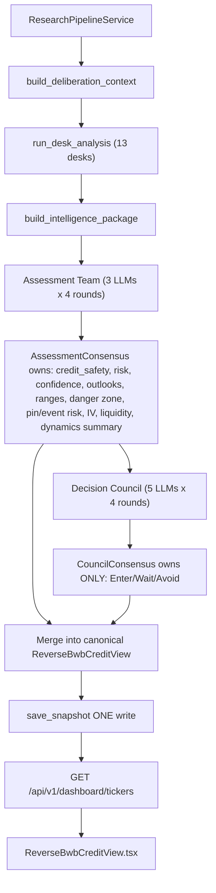

## Gap analysis (current vs. target)

Layer | Current | Target | Severity
---|---|---|---
Card-field ownership | Single `ReverseBwbSummarizer` (Anthropic) writes everything; council later patches only `decision`; `executive_summary` extractor is a third producer | 3-member Assessment Team consensus owns all card fields | High
Decision vocabulary | `SAFE/WATCH/AVOID` everywhere (`dashboard/schemas.py:27`, `decision_labels.py`, Zod) | `Enter/Wait/Avoid` | High
Enum widths | Risk has `Extreme`; outlook has 6 vals shared today vs 3d; chance has `None/Extreme`; IV `Cheap/Fair/Elevated/Rich`; liquidity `Poor/Fair/Good/Excellent` | Per spec: today=Bullish/Bearish/Sideways/Choppy; next=Bullish/Bearish/Sideways/Volatile; chance=L/M/H; IV+liquidity=Poor/Average/Good | High
Execution order | Pipeline → summarizer → DB write → async DIL → patch decision (`watchlist_batch.py:230`, `runner.py:157`) | Pipeline → desks → intel package → Assessment Team → Council → single merged DB write | High
Range math | `expected_range_today` uses 3-day horizon; `next_3d` is √3-widened from "today" | today recomputed at `horizon_days=1`, next_3d at `horizon_days=3` independently | Medium

## Target data flow



Schema decision (confirmed): structured fields stay (`expected_range_*: {low, high}`, `actual_dynamics_summary: list[str]` 3-4 sentences). Execution order (confirmed): both layers synchronous inside `WatchlistBatchService._refresh_ticker`, one DB write per ticker.

## File-by-file work

### Backend — new module `backend/app/services/assessment/`

- `schemas.py` — `AssessmentMemberOpinion` (full card fields), `AssessmentCritique`, `AssessmentRevision`, `AssessmentConsensus` (= ReverseBwbSummary minus `decision`), `AssessmentLayer` (rounds + consensus). Strict Pydantic mirroring `ReverseBwbSummary`.
- `assessment_config.py` — 3-member registry: `openai_assessment_analyst` (primary `gpt`), `claude_risk_assessment_analyst` (primary `claude`), `deepseek_quant_assessment_analyst` (primary `deepseek`); ordered fallbacks across the other providers; mirrors `council/council_config.py` pattern.
- `assessment_executor.py` — provider failover (copy of `council/council_executor.py`).
- `round1_independent.py` — each member emits a full structured card from the IntelligencePackage; strict JSON tool-use; reasoning steps.
- `round2_critique.py` — peer critique focused on numeric disagreements + risk gaps.
- `round3_revision.py` — revise own card after critique.
- `round4_consensus.py` — **deterministic** merge: numeric median for `credit_safety_score` + range `{low, high}` (round 2dp); modal vote with `_main_conflict` tie-break for enums (`risk`, `confidence`, outlooks, chances, pin/event risk, IV, liquidity); dynamics list concatenated, deduped, capped to 4 sentences. Mirrors `council/round4_consensus.py` style.
- `team_service.py` — `async def run_assessment_team(intel, client_map, settings) -> AssessmentLayer`.
- `prompts/assessment_independent.txt`, `assessment_critique.txt`, `assessment_revision.txt`, `roles/openai_assessment_analyst.txt`, `roles/claude_risk_assessment_analyst.txt`, `roles/deepseek_quant_assessment_analyst.txt` — narrowed enums + 3-day horizon math + body-zone/danger formatting rules.

### Backend — modified

- [backend/app/services/dashboard/schemas.py](backend/app/services/dashboard/schemas.py)
  - `DecisionLabel = Literal["Enter","Wait","Avoid"]`
  - `RiskLevel = Literal["Low","Medium","High"]` (drop Extreme)
  - Split `OutlookLabel` into `TodayOutlook` (`Bullish/Bearish/Sideways/Choppy`) and `NextOutlook` (`Bullish/Bearish/Sideways/Volatile`)
  - `ChanceLabel = Literal["Low","Medium","High"]`
  - `IvQualityLabel = Literal["Poor","Average","Good"]`
  - `LiquidityLabel = Literal["Poor","Average","Good"]`
  - Extend `normalize_summary_dict()` with legacy upgrades: `SAFE→Enter`, `WATCH→Wait`, `Cheap→Poor`, `Fair→Average`, `Elevated→Good`, `Rich→Good`, `Excellent→Good`, `Extreme→High`, `None→Low`, `Mixed→Choppy` (today) / `Mixed→Volatile` (next_3d).

- [backend/app/services/deliberation/schemas.py](backend/app/services/deliberation/schemas.py)
  - `IntelligencePackage` gains `assessment_consensus: dict | None = None` (carried into council prompt).
  - New `assessment_layer: dict | None = None` on `DeliberationLayer` for replay.

- [backend/app/services/deliberation/decision_labels.py](backend/app/services/deliberation/decision_labels.py)
  - Identity map: `ENTER→Enter, WAIT→Wait, AVOID→Avoid`. Remove SAFE/WATCH constants. Update referenced tests.

- [backend/app/services/deliberation/orchestrator.py](backend/app/services/deliberation/orchestrator.py)
  - After `build_intelligence_package`, when `settings.dil_assessment_enabled` and trigger is `reverse_bwb`, run `run_assessment_team(intel, ...)`, attach `assessment_consensus` to a fresh `intel` and pass into `run_decision_council`. Return `assessment_layer` on `DeliberationLayer`.

- [backend/app/services/dashboard/watchlist_batch.py](backend/app/services/dashboard/watchlist_batch.py) — `_refresh_ticker`:
  1. `report = await pipeline.run(...)` (existing, but with async DIL kick-off suppressed via flag)
  2. `layer = await DeliberationOrchestrator(settings).run(report, ticker)` — synchronous; returns `analysis_layer`, `assessment_layer`, `council_layer`
  3. Build `ReverseBwbSummary`:
     - All non-`decision` fields ← `layer.assessment_layer.consensus`
     - `decision` ← `layer.council_layer.consensus.decision` (already `Enter/Wait/Avoid`); fallback to deterministic projection if council unavailable
  4. `opportunities = self._opportunity_source.generate(...)`
  5. `await DashboardRepository(session).save_snapshot(ticker, report_json=report_with_layer, summary=summary, opportunities=opps, assessment_layer=..., council_layer=...)` — one write.
  6. Persist `deliberation_runs` row for audit (unchanged).

- [backend/app/services/orchestration/pipeline.py](backend/app/services/orchestration/pipeline.py) — accept `schedule_dil: bool` (default True); watchlist batch calls with `False` so deliberation is not double-scheduled.

- [backend/app/services/deliberation/runner.py](backend/app/services/deliberation/runner.py) — already idempotent via `_in_flight`. Add explicit short-circuit when `deliberation_layer.status == "complete"`.

- [backend/app/db/repositories/dashboard_repository.py](backend/app/db/repositories/dashboard_repository.py) — `save_snapshot` accepts optional `assessment_layer` / `council_layer` JSON to persist alongside the flat summary fields. Keep `patch_reverse_bwb_decision` for non-batch DIL completions but make it a no-op when the row already has a council-sourced decision.

- [backend/app/db/models/tables.py](backend/app/db/models/tables.py) — add JSONB columns `assessment_layer` and `council_layer` to `TickerReverseBwbSummaryModel`.

- `backend/alembic/versions/0011_assessment_council_columns.py` (new) — additive JSONB columns; no destructive changes to existing values.

- [backend/app/core/config.py](backend/app/core/config.py) — add `dil_assessment_enabled: bool` (default True), `dil_assessment_min_members: int` (default 2), `dil_assessment_fallbacks_raw` env override.

### Backend — deprecate (keep one cycle for fallback)

- [backend/app/services/dashboard/reverse_bwb_summarizer.py](backend/app/services/dashboard/reverse_bwb_summarizer.py) — wrap inside a `LegacyDeterministicProjector` used only when `dil_assessment_enabled=false` or all assessment members fail. Remove the LLM call; keep deterministic projector logic from the prompt rules.

### Frontend

- [frontend/src/types/schemas.ts](frontend/src/types/schemas.ts)
  - `reverseBwbDecisionSchema = z.enum(["Enter","Wait","Avoid"])`
  - `reverseBwbRiskLevelSchema = z.enum(["Low","Medium","High"])`
  - Split outlooks: `reverseBwbTodayOutlookSchema = z.enum(["Bullish","Bearish","Sideways","Choppy"])`, `reverseBwbNextOutlookSchema = z.enum(["Bullish","Bearish","Sideways","Volatile"])`
  - `reverseBwbChanceSchema = z.enum(["Low","Medium","High"])`
  - `reverseBwbIvQualitySchema = z.enum(["Poor","Average","Good"])`
  - `reverseBwbLiquiditySchema = z.enum(["Poor","Average","Good"])`
  - `mapped_decision: z.enum(["Enter","Wait","Avoid"]).optional()`

- [frontend/src/components/dashboard/ReverseBwbCreditView.tsx](frontend/src/components/dashboard/ReverseBwbCreditView.tsx)
  - Section title: `{summary.ticker} — Reverse BWB Credit View`
  - Label tweaks to exact spec strings (Today's outlook, Next 2–3 days outlook, Chance of +2–3% move, Body / danger zone, Pin risk near body, IV / premium quality, Actual dynamics summary).

- [frontend/src/lib/deriveDecisionTone.ts](frontend/src/lib/deriveDecisionTone.ts) — add `Enter/Wait/Avoid` tone map; collapse IV quality + liquidity onto unified `Poor/Average/Good` palette.

### Tests

- `backend/tests/assessment/test_consensus.py` — median + modal merge rules; tie-breaks; dynamics dedup/cap.
- `backend/tests/assessment/test_team_service.py` — mocked client_map end-to-end (3 members → consensus card).
- `backend/tests/assessment/test_round1_independent.py` — strict JSON validation; bad payload raises.
- `backend/tests/dashboard/test_watchlist_batch.py` (existing) — extend with mocked assessment + council to assert single-write canonical row.
- `backend/tests/dashboard/test_council_refresh.py` — replace `SAFE/WATCH` assertions with `Enter/Wait`.
- `backend/tests/deliberation/test_decision_labels.py` — identity map.
- `backend/tests/dashboard/test_reverse_bwb_summarizer.py` — convert to deterministic-fallback test or delete.

## Migration + rollout

1. Ship Alembic `0011` (additive columns), narrowed enums, `normalize_summary_dict` upgrades.
2. Ship Assessment Team module + orchestrator hook behind `dil_assessment_enabled=true` (default on in dev, off in prod for one cycle).
3. Flip dashboard `WatchlistBatchService` to the synchronous flow.
4. Frontend Zod + UI label pass.
5. Trigger `POST /api/v1/dashboard/refresh` once to repopulate every ticker with the new vocabulary + Assessment-owned cards.
6. After verifying, drop the legacy `ReverseBwbSummarizer` LLM call entirely (keep deterministic fallback only).

## Backward compatibility

- Read path normalizes legacy `SAFE/WATCH/Extreme/Cheap/...` values into the new vocab so unrefreshed rows still render.
- `mapped_decision` field stays in `DeliberationLayer` but its value is now `Enter/Wait/Avoid`.
- Non-dashboard `/research/{ticker}` reports keep using the existing async `runner.py`; orchestrator still produces the same `DeliberationLayer` shape plus the optional `assessment_layer` block.

## Verification

```bash
curl -X POST http://localhost:8000/api/v1/dashboard/refresh/SPY
curl http://localhost:8000/api/v1/dashboard/tickers/SPY | jq '.reverse_bwb'
```

Expected: `decision` is one of `Enter/Wait/Avoid`; every other field comes from `assessment_layer.consensus`; ranges differ between today (1-day) and next_3d (3-day); dynamics summary has 3-4 plain sentences covering calm-vs-move, directional bias, body safety.