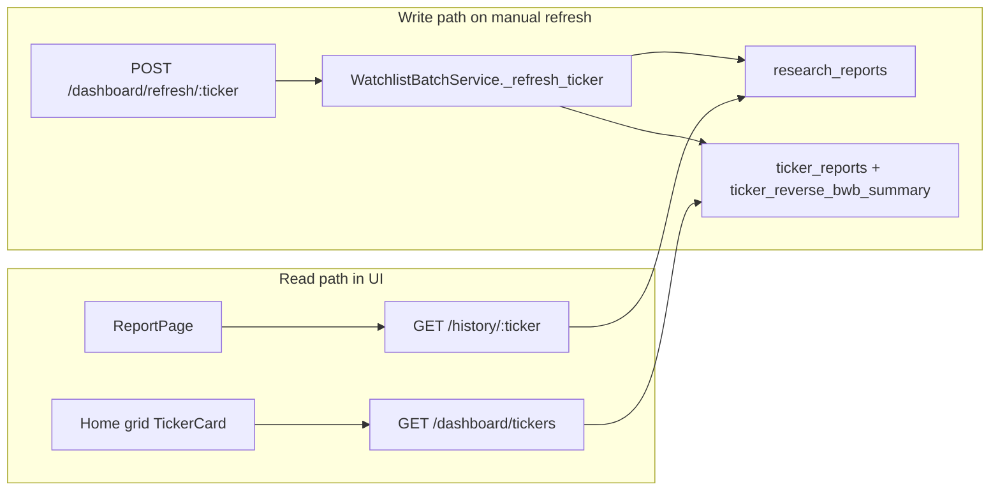
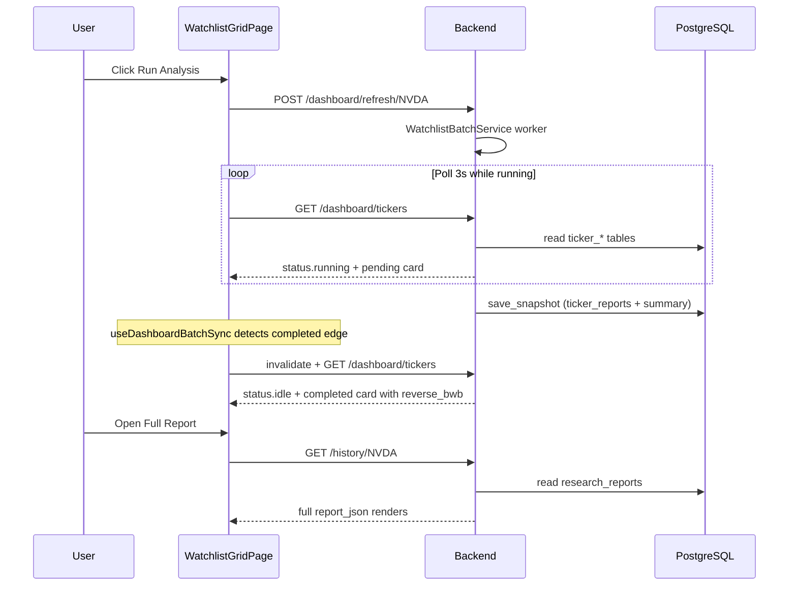

# Dashboard Manual-Trigger + Auto-Render Fix

## Gap analysis

### Issue 1 — Unwanted automatic generation

Generation today can start **without** a dashboard click in three places:

| Source | Trigger | File |
|--------|---------|------|
| Full Report page mount | Auto `GET /research/{ticker}` when `/history` is empty | [`frontend/src/pages/ReportPage.tsx`](frontend/src/pages/ReportPage.tsx) L82–103 |
| Backend startup (opt-in) | `WATCHLIST_AUTO_RUN_ON_STARTUP=true` → batch for all 12 tickers | [`backend/app/main.py`](backend/app/main.py) L84–86 |
| Deliberation polling | Stale `pending` DIL job re-kicked after 15s when viewing a report | [`backend/app/services/deliberation/runner.py`](backend/app/services/deliberation/runner.py) L189–218 |

The **home grid** (`WatchlistGridPage`) is already read-only on load — it only polls `GET /dashboard/tickers`. Generation there requires **Refresh All** or **Run Analysis** (correct behavior).

You confirmed: **all generation must be manual** (including Full Report page).

---

### Issue 2 — DB save succeeds but UI does not render

There are **two data stores** and **no completion sync**:



**Root causes for “saved in DB, blank in UI”:**

1. **No refetch when batch finishes** — [`useDashboardCards`](frontend/src/hooks/useDashboardCards.ts) polls every 3s while `status.state === "running"`, but when the worker drains the queue it flips to `idle` immediately ([`watchlist_batch.py`](backend/app/services/dashboard/watchlist_batch.py) L229–232). Polling then drops to **30s** with no final forced refetch, so the last completed card can stay on `EmptyCardState` for up to 30 seconds (or appear “stuck” if the user looks before the next poll).

2. **Mutations only update batch status, not card bodies** — [`useRefreshDashboard`](frontend/src/hooks/useRefreshDashboard.ts) `onSuccess` sets `status` in cache but never merges new `cards[]` data.

3. **ReportPage sticky local state** — [`ReportPage.tsx`](frontend/src/pages/ReportPage.tsx) L76–80 only hydrates `report` when `!report`. Once set (or empty), later `/history` updates are ignored, so the full report view never reflects a freshly saved report while the page stays open.

4. **Split React Query keys with no cross-invalidation** — `["dashboard","tickers"]` vs `["latest-report", ticker]` are never invalidated together after a dashboard refresh completes.

5. **Strict card render gate** — [`TickerCard.tsx`](frontend/src/components/dashboard/TickerCard.tsx) L50–51 requires `status === "completed" && reverse_bwb`; **Open Full Report** is disabled otherwise, even if `research_reports` already has a row via `report_id`.

6. **(Secondary)** Zod parse in `useDashboardCards` is all-or-nothing — one malformed card fails the entire grid query ([`schemas.ts`](frontend/src/types/schemas.ts) L566 `actual_dynamics_summary.min(3)`).

---

## Fix strategy

### A. Manual-only generation (Issue 1)

**Frontend**
- Remove the auto-run `useEffect` in [`ReportPage.tsx`](frontend/src/pages/ReportPage.tsx) (L82–103) and related `autoTriggered` state.
- Keep the existing empty-state CTA: “Click **Re-run analysis** to generate one” (L179–184).
- Rename button label on empty state to **Run analysis** for clarity (optional, small UX tweak).

**Backend**
- Confirm [`WATCHLIST_AUTO_RUN_ON_STARTUP=false`](backend/.env.example) in your local [`.env`](backend/.env) (not currently set — defaults to false).
- Add a startup log line when auto-run is explicitly enabled so it is obvious in logs (small change in [`main.py`](backend/app/main.py)).

**Deliberation stale-kick**
- Gate `schedule_deliberation_if_stale()` so it only runs when the client explicitly requested research (e.g. add optional query param `?kick=1` on deliberation GET, or skip stale-kick entirely for reports created by the dashboard batch since DIL runs inline). Simplest safe fix: **remove the stale auto-kick from the read endpoint** and rely on explicit `/research` or dashboard batch for generation — aligns with “manual only.”

---

### B. Auto-render after save (Issue 2)

**1. Batch-completion sync hook (new)**

Add [`frontend/src/hooks/useDashboardBatchSync.ts`](frontend/src/hooks/useDashboardBatchSync.ts) and call it from [`WatchlistGridPage.tsx`](frontend/src/pages/WatchlistGridPage.tsx):

- Track previous `WatchlistBatchStatus` in a ref.
- **On each new entry in `status.completed`** → `invalidateQueries(["dashboard","tickers"])`.
- **On transition `running` → `idle|completed|failed`** → force invalidate dashboard cards + invalidate `["latest-report", ticker]` for all tickers in `completed`.
- Optionally call `refetchQueries` immediately (not just invalidate) for snappier UX.

```typescript
// Pseudocode — detect completion edges
if (prev.state === "running" && status.state !== "running") {
  qc.invalidateQueries({ queryKey: DASHBOARD_CARDS_QUERY_KEY });
  status.completed.forEach(t => qc.invalidateQueries({ queryKey: ["latest-report", t] }));
}
if (status.completed.length > prev.completed.length) {
  qc.invalidateQueries({ queryKey: DASHBOARD_CARDS_QUERY_KEY });
}
```

**2. Tighten polling window**

In [`useDashboardCards.ts`](frontend/src/hooks/useDashboardCards.ts), extend fast polling to also cover `status.state === "completed"` for ~5s after batch finish (or rely solely on the sync hook above — prefer the hook as the primary fix).

**3. Fix ReportPage data binding**

Refactor [`ReportPage.tsx`](frontend/src/pages/ReportPage.tsx) to treat React Query as source of truth:

- Replace sticky `useState(report)` with derived state:
  - `displayReport = research.data ?? latest.data ?? null`
- After manual **Run analysis** / **Re-run**, invalidate both `["latest-report", ticker]` and `["dashboard","tickers"]`.
- Add `refetchInterval` on `useLatestPersistedReport` while a sibling batch status shows that ticker running (optional enhancement via shared batch status from dashboard query).

**4. Open Full Report gate — `report_id` only**

In [`TickerCard.tsx`](frontend/src/components/dashboard/TickerCard.tsx), replace the current gate (`status === "completed" && reverse_bwb`) with:

```typescript
const canOpenReport = Boolean(card.report_id) && !isThisTickerRunning;
```

**Rationale:** Sometimes `research_reports` is persisted before the dashboard summary row refreshes (partial failure, timing edge, or summary still building). The user should always be able to open the full report when a persisted report exists — `report_id` is the single source of truth.

Card body rendering (`hasData`) stays unchanged: still requires `status === "completed" && reverse_bwb` for the Reverse BWB + opportunities sections.

**5. Card header — last successful analysis + analysis status**

Add two metadata lines to every card header so users can distinguish **fresh vs stale data** and **current vs last outcome** (critical in trading UIs).

**Layout** (below ticker/company/price block in [`TickerCard.tsx`](frontend/src/components/dashboard/TickerCard.tsx), or extend [`CardHeader`](frontend/src/components/grid/CardHeader.tsx) with an optional `meta` slot):

```
Updated:
23 May 2026 · 21:33 UTC

Analysis:
Completed
```

**Line 1 — Last successful analysis**

- Label: **Updated:** (maps to “last successful analysis” timestamp)
- Source: `card.generated_at` — already persisted on successful `save_snapshot()` ([`dashboard_repository.py`](backend/app/db/repositories/dashboard_repository.py) L155)
- On failure, `mark_failed()` **preserves** prior `generated_at` on upsert (L321–329), so a failed re-run still shows when data was last good — exactly the stale-data signal we want
- Format: `23 May 2026 · 21:33 UTC` via [`formatTimestamp.ts`](frontend/src/lib/formatTimestamp.ts)
- Display rules:
  | State | Updated line |
  |-------|----------------|
  | `generated_at` present | Formatted UTC timestamp |
  | Running + prior `generated_at` | Prior timestamp (signals stale while refresh runs) |
  | Running + no prior success | `Updating…` |
  | Pending, never run | `Not yet analyzed` |

**Line 2 — Analysis status**

- Label: **Analysis:**
- Source: `card.status` (+ batch overlay for in-flight tickers)
- Display mapping:
  | `status` / overlay | Shown value | Tone |
  |--------------------|-------------|------|
  | batch running this ticker | `Running` | amber |
  | `completed` | `Completed` | green |
  | `failed` | `Failed` | rose (show `error_message` in tooltip if present) |
  | `pending` | `Pending` | muted |

This pair avoids confusion: e.g. a card can show `Analysis: Failed` while `Updated:` still reflects the last successful run’s timestamp, making it clear the visible body (if any) may be stale.

**Backend:** No migration or new API field required — `generated_at` + `status` already exist on [`DashboardTickerCard`](backend/app/services/dashboard/schemas.py).

**6. Defensive card parsing (hardening)**

In [`useDashboardCards.ts`](frontend/src/hooks/useDashboardCards.ts), parse `status` globally but parse each card individually — on Zod failure, fall back to a `pending` card with `error_message` instead of failing the entire grid.

---

## Files to change

| File | Change |
|------|--------|
| [`frontend/src/pages/ReportPage.tsx`](frontend/src/pages/ReportPage.tsx) | Remove auto-run; fix report hydration; cross-invalidate caches |
| [`frontend/src/hooks/useDashboardBatchSync.ts`](frontend/src/hooks/useDashboardBatchSync.ts) | **New** — completion-edge refetch |
| [`frontend/src/pages/WatchlistGridPage.tsx`](frontend/src/pages/WatchlistGridPage.tsx) | Wire batch sync hook |
| [`frontend/src/hooks/useDashboardCards.ts`](frontend/src/hooks/useDashboardCards.ts) | Defensive per-card Zod parse |
| [`frontend/src/hooks/useRefreshDashboard.ts`](frontend/src/hooks/useRefreshDashboard.ts) | Invalidate dashboard + history on mutation settle (belt-and-suspenders) |
| [`frontend/src/components/dashboard/TickerCard.tsx`](frontend/src/components/dashboard/TickerCard.tsx) | `report_id`-only Open Full Report; header `Updated:` + `Analysis:` meta lines |
| [`frontend/src/lib/formatTimestamp.ts`](frontend/src/lib/formatTimestamp.ts) | **New** — UTC formatter for last-successful-analysis line |
| [`backend/app/api/v1/routes/deliberation.py`](backend/app/api/v1/routes/deliberation.py) | Remove or gate stale auto-kick on GET |
| [`backend/app/main.py`](backend/app/main.py) | Explicit log when startup auto-run enabled |

---

## Verification plan

1. **No auto-generation**
   - Restart backend with default env → no batch starts (check logs).
   - Open `/report/NVDA` with empty history → page shows empty CTA, **no** `/research` network call until button click.
   - Open home `/` → no POST to `/dashboard/refresh` on load.

2. **Auto-render after manual refresh**
   - Click **Run Analysis** on one ticker → card shows running state, then within ~3s of completion renders Reverse BWB + opportunities without page reload.
   - Click **Refresh All** → progress chip updates; each card populates as tickers complete.
   - After completion, click **Open Full Report** → full TradingIntelligence + Deliberation panels load from `/history`.
   - Card header shows `Updated: <date> · <time> UTC` (last successful analysis) and `Analysis: Completed|Failed|Running|Pending`.
   - After a failed re-run, `Analysis: Failed` appears while `Updated:` retains the prior successful timestamp (stale-data clarity).

3. **Open Full Report with partial data**
   - Ticker with `report_id` but missing `reverse_bwb` → **Open Full Report** enabled; card body still shows empty/pending state.

4. **Regression**
   - Run existing backend tests: `pytest backend/tests/dashboard/`
   - Manual check: workbench `/workbench` manual run still works (unchanged intentional path).

---

## Architecture after fix



---

## Future enhancement — push-based completion (not in this PR)

The current fix uses **polling + completion-edge invalidation** (`useDashboardBatchSync`). This is sufficient for now but still poll-driven between completion events.

**Future:** Replace polling with a push channel (SSE or WebSocket) emitting structured progress events per ticker:

| Event | When | UI effect |
|-------|------|-----------|
| `analysis_started` | Pipeline begins | Card → running |
| `analysis_progress` | Pipeline stage change | Optional progress detail |
| `assessment_ready` | Assessment Team consensus written | Partial card body if desired |
| `council_ready` | Decision Council verdict | Decision label update |
| `completed` | `save_snapshot()` committed | Full card body + `Updated:` timestamp |

This would give **instant** card updates with no 3s/30s poll window. The existing workbench WebSocket at `WS /ws/research-progress` could be extended, or a new `GET /dashboard/events` SSE stream could mirror `WatchlistBatchService` state transitions.

**Scope boundary:** Document only — implement in a follow-up after the polling-based sync fix lands.
