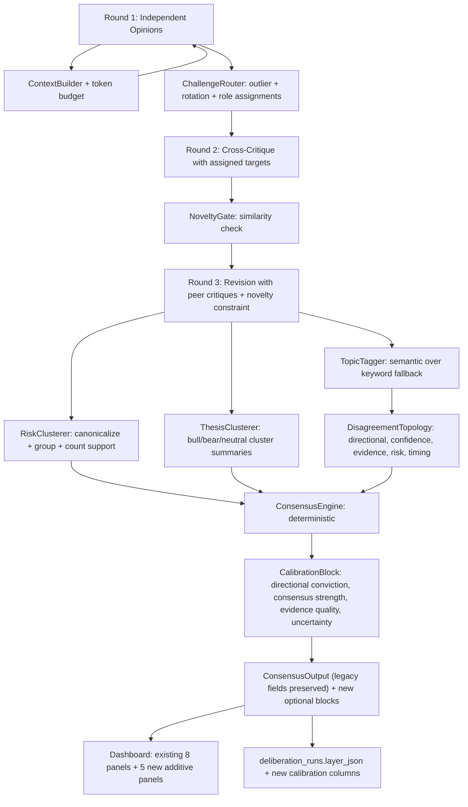

# DIL Audit, Redesign & Implementation Plan

## Part 1 — Audit findings (mapped to your failing example)

The current DIL pipeline (deterministic consensus, no LLM arbiter — see [backend/app/services/deliberation/prompts/consensus.txt](backend/app/services/deliberation/prompts/consensus.txt)) is structurally sound but has seven concrete defects that fully explain your `{mixed, bullish, neutral, mixed} → "Bullish 86% confidence"` output.

| # | Bug | Source |
|---|---|---|
| G1 | `agreement_score = 1 − variance(stance_scores)` with `mixed=0.25`, `neutral=0` — four divergent stances yield 0.86 | [backend/app/services/deliberation/scoring/weighting.py](backend/app/services/deliberation/scoring/weighting.py) `agreement_score`, `STANCE_SCORES` |
| G2 | **UI mislabels `agreement_score` as "confidence"** in the headline verdict | [frontend/src/components/deliberation/InstitutionalVerdict.tsx](frontend/src/components/deliberation/InstitutionalVerdict.tsx) line 29 |
| G3 | Two contradicting verdict mechanisms: mean-score label (`bullish`) vs. plurality (`mixed (gpt, deepseek)`) coexist with no reconciliation | [backend/app/services/deliberation/debate/consensus.py](backend/app/services/deliberation/debate/consensus.py) `_dominant_and_conflicting_theses` vs. [weighting.py](backend/app/services/deliberation/scoring/weighting.py) `equal_weight_mean_stance` |
| G4 | `mixed = 0.25` (bullish-skewed) + threshold `>= 0.35` → "bullish" when plurality is `mixed` and 0/4 models say plain bullish | [weighting.py](backend/app/services/deliberation/scoring/weighting.py) `STANCE_SCORES`, `score_to_consensus_label` |
| G5 | No challenge routing — `critique.txt` lets each model freely pick `disagrees_with`, so outliers get piled on | [round2_cross_critique.py](backend/app/services/deliberation/debate/round2_cross_critique.py), [prompts/critique.txt](backend/app/services/deliberation/prompts/critique.txt) |
| G6 | Revision round receives **only the model's own prior critique** (no peer critiques), so Round 2 restates Round 1 | [round3_revision.py](backend/app/services/deliberation/debate/round3_revision.py) lines 32–38, [prompts/revision.txt](backend/app/services/deliberation/prompts/revision.txt) |
| G7 | Hidden risks deduped by exact `.strip().lower()` only, in both backend and frontend, then re-merged in UI | [consensus.py](backend/app/services/deliberation/debate/consensus.py) `_collect_hidden_risks`, [HiddenRisksPanel.tsx](frontend/src/components/deliberation/HiddenRisksPanel.tsx) |
| G8 | Topic stance via `TOPIC_KEYWORDS` regex — substring `"risk"` forces bearish; defaults inherit overall stance | [scoring/disagreement.py](backend/app/services/deliberation/scoring/disagreement.py) `_extract_topic_views`, `_topic_stance_from_text` |
| G9 | `ConsensusOutput` schema has **no aggregate confidence field**; model confidences never bubble up | [backend/app/services/deliberation/schemas.py](backend/app/services/deliberation/schemas.py) `ConsensusOutput` |
| G10 | LLM clients lack timeouts and provider fallback; Anthropic has no JSON-mode enforcement | [llm_clients/base.py](backend/app/services/deliberation/llm_clients/base.py), [anthropic_client.py](backend/app/services/deliberation/llm_clients/anthropic_client.py) |

**Strengths preserved**: deterministic consensus (auditable), 5-provider client registry, per-round per-model persistence in `deliberation_runs.layer_json` (calibration-ready), Zod `.passthrough()` on the frontend (safe additive schema extensions).

---

## Part 2 — Target architecture



**Key design rules:**
- Every new field is **optional** on existing schemas. No required keys change.
- Legacy fields (`consensus`, `agreement_score`, `uncertainty`, `dominant_thesis`, `conflicting_thesis`, `hidden_risks: string[]`) keep their exact shape and meaning.
- New fields live alongside (`calibration`, `support_counts`, `thesis_clusters`, `structured_risks`, `conviction_heatmap`, `contradictions`, `disagreement_topology`).
- Consensus stays deterministic — no LLM arbiter. New computations are pure functions over Round-1 + debate outputs.
- Feature flags in [backend/app/core/config.py](backend/app/core/config.py): `DIL_USE_CHALLENGE_ROUTING`, `DIL_USE_RISK_CLUSTERING`, `DIL_USE_NOVELTY_GATE`, `DIL_USE_LLM_TOPIC_TAGGING`. Default all to `True` once stable; off-by-default during rollout.

---

## Part 3 — Improvement roadmap (by impact)

### HIGH impact (fixes the failing example end-to-end)

1. **Consensus calibration & verdict honesty** — fix G1, G2, G3, G4, G9. Stop bullish-skew, add real calibration metrics, fix UI mislabel.
2. **Debate challenge routing** — fix G5. Stop 3-vs-1 pile-ons; force cross-stance critique.
3. **Round-2 novelty enforcement** — fix G6. Inject peer critiques + novelty gate.
4. **Hidden risk clustering** — fix G7. Canonical name + token-overlap clustering with model support counts.

### MEDIUM impact (institutional polish)

5. **Disagreement topology engine** — fix G8 + add directional/confidence/evidence/risk/timing subscores; treat disagreement as first-class signal.
6. **Thesis clustering** — replace per-model opinion list with bull/bear/neutral thesis groups + support counts.
7. **Conviction heatmap** — topic × {agreement, confidence, risk_score} matrix as a new panel.
8. **Contradiction analysis** — surface pairwise model contradictions and stance-vs-evidence mismatches.

### LOW impact (foundations for the future)

9. **Historical calibration schema** — add `deliberation_runs` columns for outcome tracking + lineage. No outcome ingestion now.
10. **Evidence verification hooks** — schema + integration points (`evidence_verification[]`); no live verifier yet.
11. **Performance / cost** — context compression, token budgets, summarized prior-round digests, LLM-client timeouts & fallback, Anthropic JSON-mode hardening.

---

## Part 4 — Implementation plan (incremental, backward-compatible)

Each todo below corresponds to **one self-contained PR-sized change**. All changes are additive; existing API responses, DB columns, and frontend panels remain functional with old data.

### PR1 — Consensus calibration & verdict honesty

**Backend** ([scoring/weighting.py](backend/app/services/deliberation/scoring/weighting.py), [debate/consensus.py](backend/app/services/deliberation/debate/consensus.py), [schemas.py](backend/app/services/deliberation/schemas.py)):
- Change `STANCE_SCORES["mixed"] = 0.0` (was `0.25`). `mixed` and `neutral` aggregate identically; they remain distinct as stance labels.
- Add `stance_plurality(opinions) -> (label, count, total)`.
- Reconcile verdict: if plurality stance is non-directional (`mixed`/`neutral`) **or** plurality count ≥ ⌈n/2⌉, prefer plurality label; otherwise keep mean-score label. Always include both via new optional fields.
- Add to `ConsensusOutput` (all optional):
  ```
  support_counts: dict[stance, list[str]]  # {"bullish":["groq"], "mixed":["gpt","deepseek"], ...}
  calibration: {
    directional_conviction: float,   # |mean_score|, 0..1
    consensus_strength: float,        # 1 - normalized_stance_entropy
    evidence_quality: float,          # mean reasoning_overlap + source_reliability proxy
    confidence_aggregate: float,      # weighted-mean of model confidences, dampened by 1-divergence
    uncertainty: "low|medium|high"
  }
  reconciled_label: str               # "bullish" | "weak_bullish" | "mixed_with_bullish_tilt" | ...
  ```
- `confidence_aggregate` = `mean(confidence) * (1 - 0.5*divergence)` — explicitly dampened so 4 models at avg 58% can never inflate to 86%.

**Frontend** ([InstitutionalVerdict.tsx](frontend/src/components/deliberation/InstitutionalVerdict.tsx), new [CalibrationDisplay.tsx](frontend/src/components/deliberation/CalibrationDisplay.tsx), [types/schemas.ts](frontend/src/types/schemas.ts)):
- Fix the mislabel: replace `"{x}% confidence"` with three pills — `Directional Conviction X%`, `Consensus Strength Y%`, `Uncertainty: High/Med/Low`. Pull from `calibration` when present; fall back to legacy display for old reports.
- Add `Support: bullish 1/4 · mixed 2/4 · neutral 1/4` line from `support_counts`.
- Extend `consensusOutputSchema` with new optional fields. Zod `.passthrough()` already in place.

**Tests**: [backend/tests/deliberation/test_scoring.py](backend/tests/deliberation/test_scoring.py) — explicit case for `{mixed, bullish, neutral, mixed}` asserting `reconciled_label == "mixed_with_bullish_tilt"`, `confidence_aggregate < 0.65`.

### PR2 — Debate challenge routing

**Backend** (new [debate/routing.py](backend/app/services/deliberation/debate/routing.py), [round2_cross_critique.py](backend/app/services/deliberation/debate/round2_cross_critique.py), [prompts/critique.txt](backend/app/services/deliberation/prompts/critique.txt)):
- New module computes per-model assignments:
  - Detect stance outliers (z-score on stance scores).
  - Assign each model: 1 cross-stance target (mandatory) + 1 same-stance target (assumption audit).
  - Rotate a **devil's-advocate** role across rounds — one model must argue against the consensus regardless of its prior stance.
- Prompt update: explicit `assigned_targets` and `assigned_role` (default / devil's_advocate / assumption_auditor) in the user message; require the model to critique each named target by id.
- Add `debate_assignments: list[{round, model, targets[], role}]` to `DeliberationLayer` (optional).
- Behind `DIL_USE_CHALLENGE_ROUTING=true`. If disabled, falls back to current free-form critique.

**Frontend** ([DebateTimeline.tsx](frontend/src/components/deliberation/DebateTimeline.tsx)):
- When `debate_assignments` present, show small badge `→ targets GPT, Groq` and `role: Devil's Advocate` per row.

### PR3 — Round-2 novelty enforcement

**Backend** ([round3_revision.py](backend/app/services/deliberation/debate/round3_revision.py), [prompts/revision.txt](backend/app/services/deliberation/prompts/revision.txt), new `_summarize_peer_critiques()`):
- Inject **peer critiques targeted at this model** from the previous round (using `disagrees_with` lists) into the revision context. The model must respond to specific challenges by id.
- Prompt: require `revised_strongest_counterargument` and `new_arguments_introduced[]`; forbid restating `weakest_reasoning_detected` from the prior round.
- Add `NoveltyGate`: post-parse, compute Jaccard similarity between `revision.strongest_counterargument` and `critique.strongest_counterargument` per model; if `>0.7`, mark `low_novelty: true` (and optionally re-prompt once, behind `DIL_NOVELTY_REPROMPT=false` by default for cost control).
- Add `metrics.round_novelty: list[{model, similarity, low_novelty}]`.

**Frontend** ([DebateTimeline.tsx](frontend/src/components/deliberation/DebateTimeline.tsx)): show a `low novelty` pill when flagged.

### PR4 — Hidden risk clustering

**Backend** (new [scoring/risk_clustering.py](backend/app/services/deliberation/scoring/risk_clustering.py), [debate/consensus.py](backend/app/services/deliberation/debate/consensus.py)):
- Two-pass deterministic clusterer (no extra LLM cost):
  1. **Canonicalize**: lowercase, strip punctuation, lemmatize via simple stemming, extract entity tokens (e.g., `"trade desk"`, `"ad market"`).
  2. **Cluster**: greedy agglomerative on token Jaccard ≥ 0.4 OR shared canonical entity. Track contributing models per cluster.
- Output `structured_risks: list[{cluster_id, headline, members[], support_models[], support_count, severity, topic}]` where `headline` is the longest representative.
- `severity`: `"high"` if ≥3 models or appears in `invalidators`; `"medium"` if 2 models; `"low"` if 1.
- Keep legacy `hidden_risks: list[str]` populated with `headline`s — existing UI keeps working.
- Behind `DIL_USE_RISK_CLUSTERING=true`.

**Frontend** ([HiddenRisksPanel.tsx](frontend/src/components/deliberation/HiddenRisksPanel.tsx)):
- If `structured_risks` present, render grouped: `Digital Advertising Weakness · 3/4 models · High` then bullet list of supporting model labels and member phrasings. Else fall back to current flat list.
- Remove frontend re-merge — trust backend clusters.

### PR5 — Disagreement topology engine

**Backend** (new [scoring/topology.py](backend/app/services/deliberation/scoring/topology.py), refactor [scoring/disagreement.py](backend/app/services/deliberation/scoring/disagreement.py)):
- Replace single `disagreement_matrix` with five disagreement axes:
  - `directional_disagreement` — current stance variance
  - `confidence_disagreement` — std-dev of confidences
  - `evidence_disagreement` — Jaccard distance over cited entities/articles
  - `risk_disagreement` — Jaccard distance over `structured_risks` cluster sets per model
  - `timing_disagreement` — variance over `time_horizon` enums (mapped to ordinal)
- Add `disagreement_topology: {axes: dict[axis, float], hot_topics: list[topic]}` to `metrics`.
- Improve topic tagging: keep regex as fast-path; add optional LLM tagging (single batched call) behind `DIL_USE_LLM_TOPIC_TAGGING=false`. The LLM call tags each reasoning step with `{topic, stance}` from a fixed taxonomy.
- Drop the `"risk" → bearish` substring rule; require explicit stance markers.

**Frontend** (new [components/deliberation/DisagreementTopology.tsx](frontend/src/components/deliberation/DisagreementTopology.tsx)):
- Radar/bar chart over the five axes. Keep existing `DisagreementMatrix` panel unchanged.

### PR6 — Thesis clustering

**Backend** (new [scoring/thesis_clustering.py](backend/app/services/deliberation/scoring/thesis_clustering.py)):
- Deterministic clustering of reasoning bullets by stance → produce `thesis_clusters: list[{stance, models[], bullets[], summary, support_count}]`.
- `summary` is rule-based: top-3 most-cited entity phrases joined.
- Keep legacy `dominant_thesis` / `conflicting_thesis` strings (PR1 already preserves them).

**Frontend** (new [components/deliberation/ThesisClusterSummary.tsx](frontend/src/components/deliberation/ThesisClusterSummary.tsx)):
- Insert above `ModelOpinionCards`. Three cards (Bull / Bear / Neutral) each showing bullets + supporting model badges + `X/N`.

### PR7 — Conviction heatmap + contradiction analysis

**Backend** ([scoring/topology.py](backend/app/services/deliberation/scoring/topology.py), [schemas.py](backend/app/services/deliberation/schemas.py)):
- Compute `conviction_heatmap: {topics[], models[], cells: topic→model→{stance, confidence, risk_score}}`.
- Compute `contradictions: list[{type, model_a, model_b?, topic?, stance_a, stance_b, evidence_refs[], severity}]` covering:
  - Pairwise stance opposition on the same topic
  - Stance-vs-evidence mismatch (e.g., bullish stance + bearish-clustered risks dominant)
  - Confidence-vs-reasoning-quality mismatch (high confidence + low reasoning_overlap)

**Frontend** (new [ConvictionHeatmap.tsx](frontend/src/components/deliberation/ConvictionHeatmap.tsx), [ContradictionAnalysisPanel.tsx](frontend/src/components/deliberation/ContradictionAnalysisPanel.tsx)).

### PR8 — Historical calibration schema (design only)

**Backend** (new migration `backend/alembic/versions/0009_calibration_lineage.py`, [db/models/tables.py](backend/app/db/models/tables.py), [db/repositories/deliberation_repository.py](backend/app/db/repositories/deliberation_repository.py)):
- Add columns to `deliberation_runs`:
  ```
  consensus_stance     text
  consensus_confidence numeric(4,3)
  directional_conviction numeric(4,3)
  agreement_score      numeric(4,3)
  divergence           numeric(4,3)
  contradiction_density numeric(4,3)
  primary_risks        jsonb       -- top N cluster headlines
  outcome_window_end   timestamptz -- e.g. started_at + 3d
  realized_return      numeric     -- nullable, filled later
  outcome_label        text        -- nullable
  calibration_score    numeric     -- nullable, filled later
  ```
- Repository methods to upsert these on completion. No outcome ingestion — leave nullable.
- No frontend change.

### PR9 — Evidence verification hooks (schema only)

**Backend** ([schemas.py](backend/app/services/deliberation/schemas.py)):
- Add `evidence_verification: list[{id, claim, source_title?, source_url?, status: "verified|partial|unverified", supporting_models[], contradicting_models[]}]` to `DeliberationLayer` (optional).
- Add `EvidenceVerifier` stub class returning `unverified` for all claims; wire into orchestrator behind `DIL_USE_EVIDENCE_VERIFICATION=false`.
- Reserves the integration point. No real verifier yet.

### PR10 — Performance & resilience

- **Context compression** in [context_builder.py](backend/app/services/deliberation/context_builder.py): cap `article_evidence` per token budget (`DIL_CONTEXT_TOKEN_BUDGET`, default 6000); summarize via top-impact ranking instead of slicing.
- **Round-2/3 context**: replace full JSON dump of own prior opinion with a structured delta (`stance`, `top_3_risks`, `top_3_reasoning_titles`). Saves ~30% tokens.
- **LLM clients** ([llm_clients/base.py](backend/app/services/deliberation/llm_clients/base.py), [anthropic_client.py](backend/app/services/deliberation/llm_clients/anthropic_client.py)):
  - Add `ClientTimeout(total=60)` to all `aiohttp.ClientSession`.
  - Force JSON output for Anthropic via tool-use response format (Claude `tools` with required JSON schema).
  - Add provider fallback: if a model fails twice, skip it and continue if `len(success) >= dil_min_models`; do not crash the whole run.
- **Logging/metrics**: emit per-model token counts to existing `dil.*` structured logs to enable cost dashboards later.

---

## Part 5 — File touch summary

**Backend new modules**:
- [backend/app/services/deliberation/debate/routing.py](backend/app/services/deliberation/debate/routing.py)
- [backend/app/services/deliberation/scoring/risk_clustering.py](backend/app/services/deliberation/scoring/risk_clustering.py)
- [backend/app/services/deliberation/scoring/topology.py](backend/app/services/deliberation/scoring/topology.py)
- [backend/app/services/deliberation/scoring/thesis_clustering.py](backend/app/services/deliberation/scoring/thesis_clustering.py)
- [backend/app/services/deliberation/evidence_verifier.py](backend/app/services/deliberation/evidence_verifier.py) (stub)
- [backend/alembic/versions/0009_calibration_lineage.py](backend/alembic/versions/0009_calibration_lineage.py)

**Backend edits** (additive only):
- [schemas.py](backend/app/services/deliberation/schemas.py), [weighting.py](backend/app/services/deliberation/scoring/weighting.py), [disagreement.py](backend/app/services/deliberation/scoring/disagreement.py), [consensus.py](backend/app/services/deliberation/debate/consensus.py), [round2_cross_critique.py](backend/app/services/deliberation/debate/round2_cross_critique.py), [round3_revision.py](backend/app/services/deliberation/debate/round3_revision.py), [orchestrator.py](backend/app/services/deliberation/orchestrator.py), [context_builder.py](backend/app/services/deliberation/context_builder.py), [llm_clients/base.py](backend/app/services/deliberation/llm_clients/base.py), [llm_clients/anthropic_client.py](backend/app/services/deliberation/llm_clients/anthropic_client.py), [prompts/critique.txt](backend/app/services/deliberation/prompts/critique.txt), [prompts/revision.txt](backend/app/services/deliberation/prompts/revision.txt), [core/config.py](backend/app/core/config.py), [db/models/tables.py](backend/app/db/models/tables.py), [db/repositories/deliberation_repository.py](backend/app/db/repositories/deliberation_repository.py)

**Frontend new components**:
- [frontend/src/components/deliberation/CalibrationDisplay.tsx](frontend/src/components/deliberation/CalibrationDisplay.tsx)
- [frontend/src/components/deliberation/ThesisClusterSummary.tsx](frontend/src/components/deliberation/ThesisClusterSummary.tsx)
- [frontend/src/components/deliberation/ConvictionHeatmap.tsx](frontend/src/components/deliberation/ConvictionHeatmap.tsx)
- [frontend/src/components/deliberation/ContradictionAnalysisPanel.tsx](frontend/src/components/deliberation/ContradictionAnalysisPanel.tsx)
- [frontend/src/components/deliberation/DisagreementTopology.tsx](frontend/src/components/deliberation/DisagreementTopology.tsx)

**Frontend edits** (additive only):
- [types/schemas.ts](frontend/src/types/schemas.ts), [InstitutionalVerdict.tsx](frontend/src/components/deliberation/InstitutionalVerdict.tsx) (fix label bug), [HiddenRisksPanel.tsx](frontend/src/components/deliberation/HiddenRisksPanel.tsx) (consume clusters), [DebateTimeline.tsx](frontend/src/components/deliberation/DebateTimeline.tsx) (badges), [DeliberationDashboard.tsx](frontend/src/components/deliberation/DeliberationDashboard.tsx) (slot new panels)

**Untouched**: existing 8 panels' core rendering paths, `TradingIntelligenceDashboard`, `deriveTradeDecision`, all existing REST routes' shapes, `research_reports` table.

---

## Part 6 — Backward compatibility guarantees

- All new fields are optional. Pydantic models default to `None`/`[]`/`{}`. Zod schemas use `.optional()` plus existing `.passthrough()`.
- `consensus.consensus`, `consensus.agreement_score`, `consensus.uncertainty`, `consensus.dominant_thesis`, `consensus.conflicting_thesis`, `consensus.hidden_risks: string[]` retain exact shape and meaning. Historical reports render identically.
- All new logic gated by feature flags (default ON in dev, OFF for first prod rollout): `DIL_USE_CHALLENGE_ROUTING`, `DIL_USE_NOVELTY_GATE`, `DIL_USE_RISK_CLUSTERING`, `DIL_USE_LLM_TOPIC_TAGGING`, `DIL_USE_EVIDENCE_VERIFICATION`.
- DB migration is purely additive (`ALTER TABLE ADD COLUMN ... NULL`). No data backfill required.
- `DIL_MAX_DEBATE_ROUNDS` still hard-capped at 2; no behavior regression.

---

## Success criteria (verifiable)

For the `{GPT: mixed, Groq: bullish, Claude: neutral, DeepSeek: mixed}` case after PR1–PR4 ship:
- `reconciled_label` ∈ {`mixed`, `mixed_with_bullish_tilt`} — not `bullish`.
- `calibration.directional_conviction` ≤ 0.40.
- `calibration.confidence_aggregate` ≤ 0.62.
- UI no longer shows `"86% confidence"`; shows `Directional Conviction 38% · Consensus Strength 42% · Uncertainty: High`.
- `support_counts` displayed: `bullish 1/4 · mixed 2/4 · neutral 1/4`.
- Hidden-risk list collapses from ~20 bullets to ≤ 8 clusters, each with a support count.
- Round-2 critiques are flagged `low_novelty` when essentially repeating Round-1.
- Debate timeline shows `→ targets X, Y` and at least one model rotates to `Devil's Advocate` role.