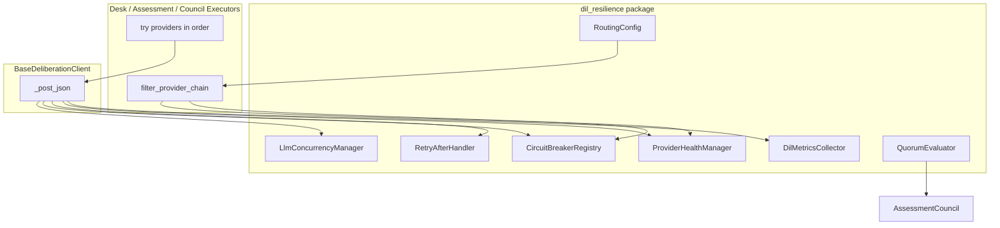
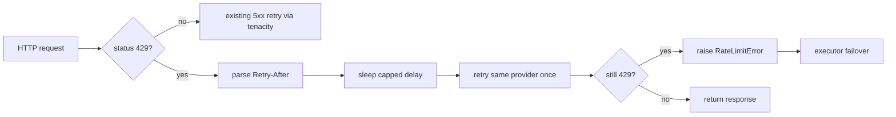

# DIL Production Resilience Architecture

## Current State (verified from codebase)

| Capability | Status | Location |
|---|---|---|
| Provider failover | Working | [`role_executor.py`](backend/app/services/deliberation/role_executor.py), [`assessment_executor.py`](backend/app/services/assessment/assessment_executor.py), [`council_executor.py`](backend/app/services/deliberation/council/council_executor.py) |
| HTTP retry | Partial (no 429) | [`base.py::_post_json`](backend/app/services/deliberation/llm_clients/base.py) — retries 408/409/5xx only |
| Parallel burst | Unbounded | [`run_desk_analysis.py`](backend/app/services/deliberation/analysis/run_desk_analysis.py) — up to 12 desks via `asyncio.gather`; council/assessment rounds same pattern |
| Quorum gates | Exist but abort | Assessment/council return `None` below threshold ([`team_service.py`](backend/app/services/assessment/team_service.py), [`council/__init__.py`](backend/app/services/deliberation/council/__init__.py)) |
| Routing | Partially config-driven | Primaries hardcoded in [`desk_config.py`](backend/app/services/deliberation/desk_config.py); fallbacks via `DIL_DESK_FALLBACKS` |
| Observability | Logs only | structlog events (`dil.llm_call`, `dil.desk.failover`); no DIL health API |

**Model key convention:** config uses `gpt`, `claude`, `gemini`, `deepseek`, `groq` (not `openai`).

---

## Target Architecture



**Design principle:** one integration surface for all LLM traffic. Wrap [`BaseDeliberationClient._post_json`](backend/app/services/deliberation/llm_clients/base.py) for concurrency, 429 retry, health/circuit updates, and metrics. Extend the three executors with chain filtering and structured failover recording.

---

## New Package: `backend/app/services/dil_resilience/`

| Module | Responsibility |
|---|---|
| `concurrency.py` | `LlmConcurrencyManager` — process-wide `asyncio.Semaphore` |
| `retry.py` | `RetryAfterHandler` — parse `Retry-After` / provider error bodies |
| `health.py` | `ProviderHealthManager` + `ProviderHealthSnapshot` + abstract `HealthStore` |
| `circuit_breaker.py` | `CircuitBreaker` + `CircuitBreakerRegistry` per provider |
| `routing.py` | `RoutingConfig` — parse/validate full provider chains |
| `metrics.py` | `DilMetricsCollector` — counters/histograms for health API |
| `quorum.py` | `QuorumEvaluator` — shared assessment/council quorum logic |
| `registry.py` | Process-local singleton wiring (future Redis swap point) |
| `gateway.py` | `ResilienceGateway` — orchestrates pre/post call hooks |

---

## Phase 1 — Global Concurrency Control

### Implementation

Create `LlmConcurrencyManager`:

```python
class LlmConcurrencyManager:
    def __init__(self, max_concurrent: int): ...
    async def acquire(self, provider: str, role: str) -> None: ...
    async def release(self) -> None: ...
    @property
    def stats(self) -> ConcurrencyStats: ...  # active, waiting, max
```

Integrate in `_post_json` (before HTTP, in `finally` release):

```python
await gateway.concurrency.acquire(self.model_key, context_role)
try:
    ...
finally:
    await gateway.concurrency.release()
```

Pass optional `role` context via a `contextvars.ContextVar` set by executors (`desk:macro_desk`, `assessment:openai_assessment_analyst`, etc.) for metrics only — no API signature change on clients.

### Config

| Env var | Default | Notes |
|---|---|---|
| `DIL_MAX_CONCURRENT_LLM_REQUESTS` | `5` | Alias: `MAX_CONCURRENT_LLM_REQUESTS` |
| `DIL_RESILIENCE_ENABLED` | `true` | Master kill-switch; `false` = current behavior |

### Logging

- `dil.resilience.concurrency.acquire` — provider, role, active, waiting
- `dil.resilience.concurrency.wait` — when semaphore blocks > 100ms

### Tests

- [`backend/tests/dil_resilience/test_concurrency.py`](backend/tests/dil_resilience/test_concurrency.py): N parallel calls with limit=2 → max 2 in-flight; release allows next

---

## Phase 2 — 429-Aware Retry Strategy

### Implementation

Create `RetryAfterHandler`:

```python
class RetryAfterHandler:
    def parse_retry_after(self, status: int, headers: Mapping, body: str) -> float | None: ...
    async def sleep_and_retry(self, attempt: int, delay: float) -> None: ...
```

Provider-specific body parsers (fallback when header missing):

| Provider | Body signal |
|---|---|
| OpenAI (`gpt`) | `"Please try again in Xs"` in error message |
| Groq | `"Please try again in XmYs"` |
| Anthropic (`claude`) | `retry-after` header (standard) |
| DeepSeek | OpenAI-compatible message |
| Gemini | `RetryInfo` in error JSON if present; else exponential |

Update `_post_json` flow:



**Caps:** `DIL_429_MAX_WAIT_S=60`, `DIL_429_MAX_RETRIES=1` (same provider).

Record metrics: `retries`, `429_count`, `retry_wait_ms`.

### Tests

- Mock aiohttp responses with/without `Retry-After` header
- Verify: 429 → sleep → success (no failover); 429 → 429 → failover triggered
- Provider body parsing unit tests per adapter

---

## Phase 3 — Provider Health Manager

### Implementation

```python
class ProviderState(str, Enum):
    HEALTHY = "healthy"
    DEGRADED = "degraded"
    UNHEALTHY = "unhealthy"
    COOLDOWN = "cooldown"

@dataclass
class ProviderHealthSnapshot:
    provider: str
    state: ProviderState
    success_count: int
    failure_count: int
    rate_limit_count: int
    consecutive_failures: int
    consecutive_429s: int
    last_failure_at: datetime | None
    cooldown_until: datetime | None
```

**Rules (configurable defaults):**

| Rule | Default |
|---|---|
| 3 consecutive 429s | → `DEGRADED` |
| 5 consecutive failures | → `UNHEALTHY` → `COOLDOWN` |
| Cooldown duration | 5 min (`DIL_PROVIDER_COOLDOWN_S=300`) |

**Chain filtering** in shared executor helper:

```python
def filter_provider_chain(chain, health, breakers) -> list[str]:
    available = [p for p in chain if breakers.allow(p) and health.allow(p)]
    return available or list(chain)  # last-resort: try all if none available
```

During cooldown: skip provider unless it is the only configured option.

### Storage

- v1: `InMemoryHealthStore` (process-local, thread-safe)
- Abstract `HealthStore` protocol for future Redis backend (`RedisHealthStore` stub + interface only)

### Tests

- State transitions: 3x429 → DEGRADED; 5x failure → COOLDOWN; success resets consecutive counters
- Cooldown expiry restores to HEALTHY

---

## Phase 4 — Circuit Breaker

### Implementation

Per-provider `CircuitBreaker` with states `CLOSED | OPEN | HALF_OPEN`:

| State | Behavior |
|---|---|
| CLOSED | Normal traffic |
| OPEN | Skip provider (integrates with health COOLDOWN) |
| HALF_OPEN | Allow 1 probe request per `DIL_CB_PROBE_INTERVAL_S` |

Transitions:

- CLOSED → OPEN: health reaches UNHEALTHY/COOLDOWN or `failure_threshold` (default 5) in sliding window
- OPEN → HALF_OPEN: after `DIL_CB_OPEN_DURATION_S` (default 300)
- HALF_OPEN → CLOSED: probe succeeds
- HALF_OPEN → OPEN: probe fails

`CircuitBreakerRegistry` shares state with `ProviderHealthManager` — health drives open, breaker drives half-open probes.

### Tests

- Integration: breaker OPEN skips provider in chain; HALF_OPEN probe closes on success
- Metrics: `circuit_open_count`, `circuit_half_open_probes`

---

## Phase 5 — Weighted / Config-Driven Provider Routing

### Problem

Default fallbacks always include all other models, causing GPT concentration when Groq fails across many desks simultaneously.

### Solution

Extend routing config to support **full ordered chains** (primary + fallbacks) without hardcoding in Python.

**New env vars** (backward compatible with existing fallback-only vars):

```
# Full chain: first = primary, rest = fallbacks (semicolon-separated desks)
DIL_DESK_ROUTING=macro_desk=claude,gemini,gpt;options_desk=gpt,deepseek,claude;risk_desk=claude,deepseek,gpt;quant_desk=deepseek,gpt,claude

# Same pattern for assessment/council (optional)
DIL_ASSESSMENT_ROUTING=openai_assessment_analyst=gpt,claude,deepseek;...
DIL_COUNCIL_ROUTING=portfolio_manager=claude,gpt,deepseek;...
```

**Precedence:**

1. `DIL_*_ROUTING` (full chain override)
2. Existing `DIL_*_FALLBACKS` (fallbacks only, keep code defaults for primary)
3. Code defaults in [`desk_config.py`](backend/app/services/deliberation/desk_config.py) / council / assessment configs

**Validation** in `RoutingConfig`:

- Unknown provider keys rejected at startup (log warning, skip invalid)
- Duplicate providers in chain deduplicated
- Primary must differ from excluded models (`DIL_EXCLUDE_MODELS`)
- Minimum 1 provider per role

Update [`build_desk_registry`](backend/app/services/deliberation/desk_config.py), [`build_council_registry`](backend/app/services/deliberation/council/council_config.py), [`build_assessment_registry`](backend/app/services/assessment/assessment_config.py) to consume `RoutingConfig`.

**Documentation:** add commented recommended routing block to [`.env.example`](backend/.env.example) — not enabled by default (backward compat).

### Tests

- Routing precedence, validation errors, env override parsing
- Extend [`test_desk_config.py`](backend/tests/deliberation/test_desk_config.py)

---

## Phase 6 — Assessment Team Quorum (Degraded Mode)

### Current vs target

| Scenario | Current | Target |
|---|---|---|
| 2/3 valid, min=2 | Continue (no degraded flag) | Continue; `degraded=True` when valid < total |
| 1/3 valid, min=2 | Return `None` | Return `None`; dashboard uses deterministic projector |
| 0/3 valid | Return `None` | Return `None` |

### Implementation

Create `QuorumEvaluator`:

```python
@dataclass
class QuorumResult:
    valid_count: int
    required: int
    total: int
    meets_quorum: bool
    degraded: bool  # meets_quorum and valid_count < total
```

Update [`AssessmentLayer`](backend/app/services/assessment/schemas.py):

```python
degraded: bool = False
quorum_meta: dict[str, Any] = Field(default_factory=dict)
```

Update [`team_service.py`](backend/app/services/assessment/team_service.py):

- If `meets_quorum`: run R2–R4 regardless of partial failures
- Set `degraded=True`, populate `quorum_meta` with `{valid, total, required, failed_roles}`
- If not `meets_quorum`: return `None` (unchanged)

**Config alias:** `ASSESSMENT_MIN_VALID_MEMBERS` → existing `DIL_ASSESSMENT_MIN_MEMBERS` (default 2)

### Tests

- Extend [`test_team_service.py`](backend/tests/assessment/test_team_service.py): 2/3 → consensus + degraded; 1/3 → None

---

## Phase 7 — Decision Council Quorum (Degraded Mode)

Mirror Phase 6 for council:

Update [`CouncilLayer`](backend/app/services/deliberation/schemas.py):

```python
degraded: bool = False
quorum_meta: dict[str, Any] = Field(default_factory=dict)
```

Update [`run_decision_council`](backend/app/services/deliberation/council/__init__.py):

- 3/5 valid (min=3): proceed, `degraded=True`, consensus from valid voters
- [`round4_consensus.py`](backend/app/services/deliberation/council/round4_consensus.py): annotate `main_conflict` when degraded ("Partial council — N/5 members")

**Config alias:** `COUNCIL_MIN_VALID_MEMBERS` → `DIL_COUNCIL_MIN_MEMBERS` (default 3)

Below quorum: return `None` (orchestrator keeps existing fallback decision path).

### Tests

- New [`test_council_quorum.py`](backend/tests/deliberation/test_council_quorum.py): 3/5 degraded consensus; 2/5 → None

---

## Phase 8 — Observability

### Metrics collector

`DilMetricsCollector` tracks:

**Provider:** requests, successes, failures, latency_ms (p50/p95 in-memory), retries, failovers, 429_count, cooldown_skips

**Desk:** per-desk success, failover_count, latency

**Assessment/Council:** valid_members, degraded_runs, quorum_failures

### API endpoint

New [`backend/app/api/v1/routes/dil.py`](backend/app/api/v1/routes/dil.py):

```
GET /api/v1/dil/health
```

Register in [`router.py`](backend/app/api/v1/router.py).

**Response shape:**

```json
{
  "resilience_enabled": true,
  "providers": {
    "gpt": {"state": "degraded", "success_rate": 0.82, "429_count": 4, ...}
  },
  "circuit_breakers": {"groq": {"state": "open", "opened_at": "..."}},
  "concurrency": {"max": 5, "active": 2, "waiting": 0},
  "routing": {"desks_configured": 13, "custom_chains": 4},
  "last_run": {"assessment_degraded": true, "council_valid": 3}
}
```

Read-only; no auth required in dev (match existing `/health` pattern).

### Tests

- [`test_dil_health_endpoint.py`](backend/tests/dil_resilience/test_dil_health_endpoint.py)

---

## Phase 9 — Load Simulation Tests

New [`backend/tests/dil_resilience/test_load_simulation.py`](backend/tests/dil_resilience/test_load_simulation.py) with mocked clients (no real API calls):

| Scenario | Setup | Assertions |
|---|---|---|
| A: Groq 429 | 13 desks, groq primary fails 429 once then succeeds | retry on groq; no immediate GPT stampede; semaphore respected |
| B: GPT 429 burst | all chains include gpt; gpt returns 429 | health → DEGRADED; traffic shifts; cooldown skips gpt |
| C: Full pipeline | 13 desks + 3 assessment + 5 council parallel | max concurrent ≤ limit; quorum preserved; no total pipeline collapse |

Use `asyncio.gather` + mock `_post_json` with configurable latency/status.

---

## Executor Refactor (shared helper)

Consolidate the three near-identical executors into one internal helper to avoid drift:

```python
# dil_resilience/executor.py
async def execute_with_failover(
    role_key: str,
    provider_chain: tuple[str, ...],
    client_map: dict,
    prompt_fn: Callable,
    log_prefix: str,  # desk | assessment | council
) -> tuple[str | None, list[str], T | None, str | None]: ...
```

Existing public functions (`execute_desk`, etc.) become thin wrappers — **backward compatible**.

---

## Config Summary (all new env vars)

| Variable | Default | Phase |
|---|---|---|
| `DIL_RESILIENCE_ENABLED` | `true` | All |
| `DIL_MAX_CONCURRENT_LLM_REQUESTS` | `5` | 1 |
| `DIL_429_MAX_RETRIES` | `1` | 2 |
| `DIL_429_MAX_WAIT_S` | `60` | 2 |
| `DIL_PROVIDER_COOLDOWN_S` | `300` | 3 |
| `DIL_HEALTH_DEGRADED_429_THRESHOLD` | `3` | 3 |
| `DIL_HEALTH_UNHEALTHY_FAILURE_THRESHOLD` | `5` | 3 |
| `DIL_CB_OPEN_DURATION_S` | `300` | 4 |
| `DIL_CB_PROBE_INTERVAL_S` | `30` | 4 |
| `DIL_DESK_ROUTING` | `""` | 5 |
| `DIL_ASSESSMENT_ROUTING` | `""` | 5 |
| `DIL_COUNCIL_ROUTING` | `""` | 5 |
| `ASSESSMENT_MIN_VALID_MEMBERS` | alias → `2` | 6 |
| `COUNCIL_MIN_VALID_MEMBERS` | alias → `3` | 7 |

Update [`config.py`](backend/app/core/config.py) and [`.env.example`](backend/.env.example).

---

## Migration Notes

1. **No DB migration required** — new fields (`degraded`, `quorum_meta`) are additive JSON on existing deliberation payloads.
2. **Backward compatibility:** `DIL_RESILIENCE_ENABLED=false` restores current behavior exactly.
3. **Existing env vars unchanged:** `DIL_DESK_FALLBACKS`, `DIL_ASSESSMENT_MIN_MEMBERS`, `DIL_COUNCIL_MIN_MEMBERS` continue to work.
4. **Dashboard impact:** degraded flags are additive; frontend can optionally surface "partial panel" badges later — not required for backend rollout.
5. **Process-local state:** health/circuit/metrics reset on server restart; document for multi-worker deployments (future Redis).

---

## Rollout Plan

| Stage | Action | Risk |
|---|---|---|
| 1 | Ship Phases 1–2 behind `DIL_RESILIENCE_ENABLED=true` (default on) | Low — reduces stampede and unnecessary failover |
| 2 | Enable Phases 3–4 (health + circuit breaker) | Medium — may skip providers aggressively; tune thresholds in staging |
| 3 | Deploy Phase 5 routing via env (commented recommendations) | Low — opt-in config |
| 4 | Phases 6–7 degraded quorum | Medium — behavior change from `None` to partial consensus; verify dashboard |
| 5 | Phase 8 health endpoint | Low — read-only |
| 6 | Phase 9 load tests in CI | Low — mock-only |

**Staging validation:** run SPY through full pipeline with `DIL_MAX_CONCURRENT_LLM_REQUESTS=5` and verify logs show semaphore waits + reduced GPT 429 cascade.

---

## Risk Assessment

| Risk | Mitigation |
|---|---|
| Increased latency from semaphore queuing | Configurable limit; log wait times; default 5 is conservative |
| Over-aggressive cooldown skips all providers | Last-resort fallback: if filtered chain empty, try all providers once |
| Degraded consensus quality | Flag in API + lower confidence in consensus meta; dashboard fallback unchanged below quorum |
| Multi-worker health state divergence | Document process-local limitation; Redis interface stubbed for v2 |
| 429 sleep blocks event loop | Use `asyncio.sleep` only; cap max wait at 60s |

---

## File Change Map

**New files (~15):**
- `backend/app/services/dil_resilience/*.py` (8 modules)
- `backend/app/api/v1/routes/dil.py`
- `backend/tests/dil_resilience/*.py` (6 test modules)

**Modified files (~12):**
- [`base.py`](backend/app/services/deliberation/llm_clients/base.py) — resilience gateway integration
- [`role_executor.py`](backend/app/services/deliberation/role_executor.py), [`assessment_executor.py`](backend/app/services/assessment/assessment_executor.py), [`council_executor.py`](backend/app/services/deliberation/council/council_executor.py) — shared failover + chain filter
- [`desk_config.py`](backend/app/services/deliberation/desk_config.py), [`council_config.py`](backend/app/services/deliberation/council/council_config.py), [`assessment_config.py`](backend/app/services/assessment/assessment_config.py) — routing integration
- [`team_service.py`](backend/app/services/assessment/team_service.py), [`council/__init__.py`](backend/app/services/deliberation/council/__init__.py) — degraded quorum
- [`schemas.py`](backend/app/services/deliberation/schemas.py), [`assessment/schemas.py`](backend/app/services/assessment/schemas.py) — degraded fields
- [`config.py`](backend/app/core/config.py), [`.env.example`](backend/.env.example), [`router.py`](backend/app/api/v1/router.py)
