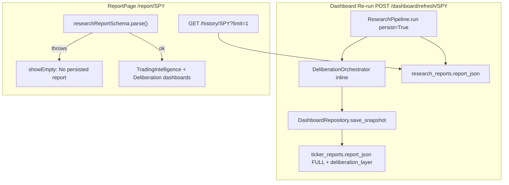

# Fix Open Full Report After Dashboard Re-run

## Problem

After **Re-run Analysis** on the dashboard, SPY shows a completed Reverse BWB card (data from `ticker_reverse_bwb_summary` + `ticker_reports`). **Open Full Report** navigates to `/report/SPY` but shows:

> No persisted report exists for SPY. Click Run analysis to generate one.

Terminal logs confirm the refresh **did** succeed (`watchlist.ticker.completed`, DB upserts) and `GET /history/SPY?limit=1` returns **200 OK** — so this is not a missing-row problem.

## Root cause (two gaps)



| Gap | Detail |
|-----|--------|
| **Split write path** | [`watchlist_batch.py`](backend/app/services/dashboard/watchlist_batch.py) persists pipeline output to `research_reports`, then runs DIL inline and saves the **merged** report (with `deliberation_layer`, assessment, council) only to [`ticker_reports.report_json`](backend/app/db/repositories/dashboard_repository.py). `research_reports` is never updated with the completed DIL layer. |
| **Wrong read path + silent parse failure** | [`ReportPage.tsx`](frontend/src/pages/ReportPage.tsx) loads only via `/history` and uses strict `.parse()`. On Zod failure the query errors, `latest.data` is undefined, and `showEmpty` (L102–103) shows the misleading empty message — it does not distinguish parse errors from truly missing data. |

The dashboard card works because it reads `GET /dashboard/tickers` (summary tables), not `/history`.

## Fix strategy

### 1. Backend — expose canonical full report from dashboard snapshot

Add a read endpoint in [`backend/app/api/v1/routes/dashboard.py`](backend/app/api/v1/routes/dashboard.py):

```
GET /api/v1/dashboard/tickers/{ticker}/report
```

- Returns `{ ticker, status, research_report_id, generated_at, report_json }` from `ticker_reports` (404 if ticker not on watchlist or no row).
- Implement via new `DashboardRepository.get_ticker_report_json(ticker)` method.
- Add Pydantic response model in [`backend/app/services/dashboard/schemas.py`](backend/app/services/dashboard/schemas.py).
- Add route test in [`backend/tests/dashboard/test_routes_helpers.py`](backend/tests/dashboard/test_routes_helpers.py) or a new small route test file.

This is the **authoritative** post-refresh report (includes inline DIL output the card was built from).

### 2. Backend — keep `research_reports` in sync after inline DIL (secondary)

In [`watchlist_batch.py`](backend/app/services/dashboard/watchlist_batch.py) `_refresh_ticker`, after DIL completes and before/after `save_snapshot`, patch the persisted `research_reports` row (using `research_report_id` from `_pipeline_meta.report_id`) with the merged `report_json` including `deliberation_layer`.

- Reuse [`DeliberationRepository.update_deliberation_layer`](backend/app/db/repositories/deliberation_repository.py) or add a thin `update_report_json` on persistence repo.
- Ensures `/history` and `GET /reports/{id}/deliberation` stay consistent for non-dashboard consumers.

### 3. Frontend — load full report from dashboard snapshot first

In [`frontend/src/pages/ReportPage.tsx`](frontend/src/pages/ReportPage.tsx):

- Add `useDashboardTickerReport(ticker)` hook (new file or in [`useDashboardCards.ts`](frontend/src/hooks/useDashboardCards.ts)) calling `GET /dashboard/tickers/{ticker}/report`.
- Resolve report as:

```typescript
displayReport = dashboardReport.data?.report_json
  ?? historyReport.data
  ?? research.data
  ?? null
```

- Replace `researchReportSchema.parse()` with **`safeParse`**; on failure show a specific error card ("Report loaded but failed validation") instead of "No persisted report exists".
- Wire [`useDashboardBatchSync`](frontend/src/hooks/useDashboardBatchSync.ts) on ReportPage (same as grid) so completing a re-run invalidates both dashboard report + history queries while the user stays on `/report/SPY`.
- Add query key e.g. `["dashboard", "ticker-report", ticker]` and invalidate it from [`useRefreshDashboard.ts`](frontend/src/hooks/useRefreshDashboard.ts) alongside existing `LATEST_REPORT_QUERY_KEY` invalidation.

### 4. Frontend — align Re-run on report page with dashboard refresh

For watchlist tickers (SPY, etc.), change **Run analysis / Re-run analysis** on ReportPage to call `POST /dashboard/refresh/{ticker}` via [`useRefreshDashboard`](frontend/src/hooks/useRefreshDashboard.ts) instead of legacy `GET /research/{ticker}` ([`useResearch`](frontend/src/hooks/useApi.ts)).

- Legacy `/research` path does not update dashboard tables — using it from the report page recreates the split-brain problem.
- Poll batch status + refetch dashboard report query while ticker is running (reuse `isTickerInActiveBatch` already imported in ReportPage).

### 5. Frontend — harden schema validation (prevent recurrence)

In [`frontend/src/types/schemas.ts`](frontend/src/types/schemas.ts):

- Add `.passthrough()` to nested option blocks (`expectedRangeSchema`, `moveProbabilitiesSchema`, `creditSafetySchema`, etc.) **or** make `options_intelligence` use `z.union([optionsIntelligenceSchema, z.record(z.unknown())])` so a single bad sub-field does not block the entire full-report view.
- Export a helper `parseResearchReportLoose(raw: unknown): ResearchReport | null` used by ReportPage.

### 6. Optional UX polish

- [`TickerCard.tsx`](frontend/src/components/dashboard/TickerCard.tsx): pass `report_id` via router state when navigating (`navigate('/report/SPY', { state: { reportId } })`) so ReportPage can show a loading hint — not required if dashboard report endpoint is primary.
- Show `latest.isError` / parse issues in the empty-state area with a **Retry** button.

## Files to change

| File | Change |
|------|--------|
| [`backend/app/api/v1/routes/dashboard.py`](backend/app/api/v1/routes/dashboard.py) | New `GET .../report` route |
| [`backend/app/db/repositories/dashboard_repository.py`](backend/app/db/repositories/dashboard_repository.py) | `get_ticker_report()` reader |
| [`backend/app/services/dashboard/schemas.py`](backend/app/services/dashboard/schemas.py) | Response model |
| [`backend/app/services/dashboard/watchlist_batch.py`](backend/app/services/dashboard/watchlist_batch.py) | Patch `research_reports` after inline DIL |
| [`frontend/src/pages/ReportPage.tsx`](frontend/src/pages/ReportPage.tsx) | Multi-source load, safeParse, batch sync, dashboard re-run |
| [`frontend/src/hooks/useDashboardCards.ts`](frontend/src/hooks/useDashboardCards.ts) or new hook | `useDashboardTickerReport` |
| [`frontend/src/hooks/useRefreshDashboard.ts`](frontend/src/hooks/useRefreshDashboard.ts) | Invalidate dashboard report query key |
| [`frontend/src/types/schemas.ts`](frontend/src/types/schemas.ts) | Looser nested validation helper |
| [`backend/tests/dashboard/`](backend/tests/dashboard/) | Route + repository tests |

## Verification

1. On dashboard, click **Re-run Analysis** for SPY; wait for card to show **Avoid** / completed.
2. Click **Open Full Report** → `/report/SPY` should render Trading Intelligence + Deliberation panels (not empty state).
3. Deliberation section should show completed desk/council data (from `deliberation_layer` in snapshot, not `status: unavailable`).
4. DevTools: confirm `GET /dashboard/tickers/SPY/report` returns 200 with `report_json.deliberation_layer`.
5. Confirm `GET /history/SPY?limit=1` also returns report with updated `deliberation_layer` after backend sync step.
6. Induce a schema mismatch (optional dev test) → page shows parse warning, not "No persisted report".

## Out of scope (separate small fix)

Your logs show `dil.resilience.routing.invalid_provider provider=openai role=portfolio_manager` — update `.env` council fallbacks to use `gpt` not `openai` (provider keys are `gpt`, `claude`, `deepseek`, `groq`).
