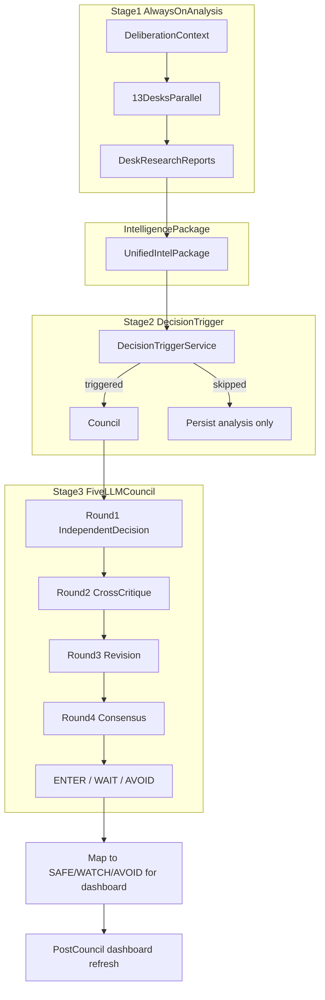

# Hybrid Analysis + Decision Council Architecture

## Current State vs Target

The 12-desk expansion ([`12-desk_dil_expansion_4400fce7.plan.md`](.cursor/plans/12-desk_dil_expansion_4400fce7.plan.md)) is complete, but the system still collapses analysis and decision into one layer:

- Desks emit `stance` (bullish/bearish) in Round 1 and **implicitly vote** via deterministic consensus ([`consensus.py`](backend/app/services/deliberation/debate/consensus.py))
- Debate runs among **desks**, not among the 5 frontier models as independent decision-makers
- Dashboard `decision` (`SAFE`/`WATCH`/`AVOID`) comes from credit-safety + Claude summarizer **before** DIL finishes ([`watchlist_batch.py`](backend/app/services/dashboard/watchlist_batch.py))
- Council roles (Portfolio Manager, Risk Manager, etc.) do not exist

**Target flow:**



---

## Design Principles

1. **Desks are analysts, not voters** — remove trade-decision semantics from desk outputs; keep analytical views as evidence
2. **Council is always 5 LLMs** — fixed role-to-provider mapping with per-role failover (your YAML spec)
3. **Council receives processed intel** — desk JSON package, not raw articles
4. **Desk debate off by default** — debate belongs to the council; existing desk debate code stays behind a flag for rollback
5. **Label separation** — council emits `ENTER`/`WAIT`/`AVOID`; dashboard/API keep `SAFE`/`WATCH`/`AVOID` via explicit mapping

**Mapping layer** (new [`decision_labels.py`](backend/app/services/deliberation/decision_labels.py)):

| Council | Dashboard |
|---------|-----------|
| `ENTER` | `SAFE` |
| `WAIT` | `WATCH` |
| `AVOID` | `AVOID` |

---

## Phase 1 — Analysis Layer Refactor + Quant Desk

**Goal:** Desks produce research artifacts; add 13th desk; build the intelligence package.

### 1A. New schemas ([`schemas.py`](backend/app/services/deliberation/schemas.py))

Add alongside existing types (keep `IndependentOpinion` temporarily for migration):

```python
TradeDecision = Literal["ENTER", "WAIT", "AVOID"]

class DeskResearchReport(BaseModel):
    role_key: str
    role_label: str
    model: ModelKey
    key_findings: list[str]
    metrics: dict[str, Any]          # desk-specific computed fields
    risks: list[str]
    invalidators: list[str]
    analytical_view: Stance          # evidence label, NOT a vote
    confidence_in_analysis: float    # 0-1, not trade conviction
    reasoning_steps: list[ReasoningStep]
    provider_attempts: list[str]
    error: str | None = None

class IntelligencePackage(BaseModel):
    ticker: str
    question: str                    # e.g. "Should we enter Reverse BWB?"
    trigger: str
    desks: dict[str, DeskResearchReport]
    options_snapshot: dict[str, Any]
    credit_safety: dict[str, Any]
    built_at: str

class CouncilMemberDecision(BaseModel):
    model: ModelKey
    council_role: str                # portfolio_manager, risk_manager, ...
    council_label: str
    decision: TradeDecision
    confidence: float
    reasoning_steps: list[ReasoningStep]
    key_risks: list[str]
    provider_attempts: list[str]

class CouncilConsensus(BaseModel):
    decision: TradeDecision
    support: dict[str, int]          # {"WAIT": 4, "ENTER": 1}
    confidence: float
    main_conflict: str
    debate_summary: str
    member_decisions: dict[str, CouncilMemberDecision]
```

Extend `DeliberationLayer` with nested sections (keep flat `round1`/`consensus` populated as deprecated mirrors during transition):

```python
analysis_layer: dict[str, Any] | None = None   # desk reports
intelligence_package: dict[str, Any] | None = None
council_layer: dict[str, Any] | None = None    # rounds + consensus
council_triggered: bool = False
council_question: str | None = None
```

### 1B. Refactor desk Round 1 → analysis round

- Rename internally: [`round1_independent.py`](backend/app/services/deliberation/debate/round1_independent.py) → `analysis/run_desk_analysis.py` (keep re-export)
- Update [`independent_analysis.txt`](backend/app/services/deliberation/prompts/independent_analysis.txt) + all 12 role prompts: **explicitly forbid trade decisions**; output `DeskResearchReport` JSON
- Replace final step titles like `"Options-Adjusted Stance"` with `"Options Assessment"` (analytical, not directional vote)

### 1C. Add Quant Desk (13th desk)

In [`desk_config.py`](backend/app/services/deliberation/desk_config.py):

- Add `quant_desk` to `RoleKey`, `ALL_DESK_KEYS`, `DESK_LABELS`, `ROLE_STEP_TITLES`
- Primary: `deepseek` (fallback chain per existing pattern); keep `devils_advocate_desk` unchanged
- New prompt: [`prompts/roles/quant_desk.txt`](backend/app/services/deliberation/prompts/roles/quant_desk.txt) — probabilities, expected value, sigma distances, backtest/analog stats from `historical_analogs` + `move_probabilities`
- `context_view_for_role`: options probabilities, analog outcomes, credit_safety score, flow z-scores

### 1D. Intelligence package builder

New [`intelligence/package_builder.py`](backend/app/services/deliberation/intelligence/package_builder.py):

```python
def build_intelligence_package(
    ticker: str,
    question: str,
    trigger: str,
    desk_reports: dict[str, DeskResearchReport],
    report: dict,
) -> IntelligencePackage
```

Selectively includes desk outputs relevant to the question (default: all active desks). Adds `options_intelligence.credit_safety`, `reverse_bwb`, `expected_range` as top-level snapshot fields for council readability.

### 1E. Disable desk debate by default

Add `DIL_DESK_DEBATE_ENABLED=false` to [`config.py`](backend/app/core/config.py). In [`orchestrator.py`](backend/app/services/deliberation/orchestrator.py), skip `run_cross_critique` / `run_revision_round` when false.

---

## Phase 2 — 5-LLM Decision Council

**Goal:** Independent council members debate from the intelligence package; produce `ENTER`/`WAIT`/`AVOID`.

### 2A. Council registry ([`council/council_config.py`](backend/app/services/deliberation/council/council_config.py))

Fixed 5-member panel (distinct from desk provider pool):

| Model key | Council role | Focus | Primary | Fallback |
|-----------|-------------|-------|---------|----------|
| `gpt` | Portfolio Manager | risk/reward, sizing | openai | claude |
| `claude` | Risk Manager | failure scenarios | anthropic | openai |
| `gemini` | Market Strategist | macro/regime | google | openai |
| `deepseek` | Quant Reviewer | numbers/probabilities | deepseek | openai |
| `groq` | Contrarian Investor | challenge consensus | groq | openai |

Implement via `CouncilMemberDefinition` dataclass + `execute_council_member()` mirroring [`role_executor.py`](backend/app/services/deliberation/role_executor.py) but **1 model = 1 role** (no desk sharing).

Env overrides: `DIL_COUNCIL_{ROLE}_FALLBACKS` in [`.env.example`](backend/.env.example).

### 2B. Council prompts

New directory [`prompts/council/`](backend/app/services/deliberation/prompts/council/):

- `portfolio_manager.txt`, `risk_manager.txt`, `market_strategist.txt`, `quant_reviewer.txt`, `contrarian_investor.txt`
- Shared base: [`council_decision.txt`](backend/app/services/deliberation/prompts/council/council_decision.txt) — receives `IntelligencePackage` JSON, must output `decision: ENTER|WAIT|AVOID`

### 2C. Four council debate rounds

New package [`council/`](backend/app/services/deliberation/council/):

| Round | Module | Behavior |
|-------|--------|----------|
| 1 | `round1_independent.py` | Each member decides independently from intel package |
| 2 | `round2_critique.py` | Cross-critique peer decisions (model-keyed, reuse routing patterns from [`routing.py`](backend/app/services/deliberation/debate/routing.py)) |
| 3 | `round3_revision.py` | Members may revise decision + confidence |
| 4 | `round4_consensus.py` | Deterministic vote tally + conflict extraction (no LLM arbiter, consistent with existing DIL constraint) |

Round 4 output shape matches your spec:

```json
{
  "decision": "WAIT",
  "support": {"WAIT": 4, "ENTER": 1},
  "confidence": 0.68,
  "main_conflict": "event risk vs premium attractiveness"
}
```

Tie-break: `WAIT` (conservative default).

### 2D. Orchestrator restructure

Refactor [`orchestrator.py`](backend/app/services/deliberation/orchestrator.py) into explicit stages:

```python
async def run(self, report, ticker) -> DeliberationLayer:
    context = build_deliberation_context(report, ticker)
    desk_reports = await run_desk_analysis(...)           # Stage 1
    intel = build_intelligence_package(...)               # Package

    trigger = evaluate_decision_trigger(report, intel)    # Stage 2
    if trigger.should_run_council:
        council = await run_decision_council(intel, ...)  # Stage 3
    else:
        council = None

    return DeliberationLayer(
        analysis_layer=desk_reports,
        intelligence_package=intel,
        council_layer=council,
        council_triggered=bool(council),
        ...
    )
```

Success threshold: `DIL_COUNCIL_MIN_MEMBERS` (default 3 of 5) for council; existing `DIL_MIN_MODELS` applies to desk analysis count.

---

## Phase 3 — Decision Triggers + Downstream Integration

**Goal:** Council runs when a trading decision is needed; results flow to dashboard.

### 3A. Decision trigger service

New [`triggers/decision_triggers.py`](backend/app/services/deliberation/triggers/decision_triggers.py):

```python
@dataclass
class DecisionTriggerResult:
    should_run_council: bool
    trigger: str
    question: str

def evaluate_decision_trigger(report, intel) -> DecisionTriggerResult
```

**V1 triggers** (configurable via `DIL_COUNCIL_TRIGGERS`):

| Trigger key | Condition | Question |
|-------------|-----------|----------|
| `reverse_bwb` | `options_intelligence` present + `reverse_bwb` block | "Should we enter this Reverse BWB?" |
| `ticker_avoidance` | credit_safety score &lt; 4 OR event_risk elevated | "Should we avoid this ticker?" |
| `size_reduction` | body_danger or pin_risk elevated | "Should we reduce size?" |

Default: `reverse_bwb` only (matches primary product). Always run analysis layer regardless.

### 3B. Post-council dashboard refresh

Extend [`runner.py`](backend/app/services/deliberation/runner.py) after DIL complete:

1. If `council_layer.consensus.decision` exists, map to dashboard label via `decision_labels.py`
2. Call new `DashboardRepository.patch_reverse_bwb_decision(ticker, council_decision, mapped_label)` OR re-invoke summarizer with council context injected
3. Prefer **patch path** (cheaper, deterministic) — update `ticker_reverse_bwb_summary.decision` + store `council_decision` column/JSON field

This fixes the timing gap where [`watchlist_batch.py`](backend/app/services/dashboard/watchlist_batch.py) writes the card before council finishes.

### 3C. Executive summary bridge

Update [`summary/extractor.py`](backend/app/services/summary/extractor.py):

- When `council_layer` present: outlook/confidence from council consensus; `decision` field stays `SAFE`/`WATCH`/`AVOID` (mapped)
- Add optional `council_decision_raw: ENTER|WAIT|AVOID` to executive summary schema for API consumers who want both vocabularies

### 3D. Reverse BWB summarizer alignment

Update [`reverse_bwb_summary.txt`](backend/app/services/dashboard/prompts/reverse_bwb_summary.txt) to treat credit_safety as **input signal**, not authoritative decision, when council output is available in report context.

---

## Phase 4 — Frontend + API + Tests

### 4A. API schema

Update deliberation API response ([`routes/deliberation.py`](backend/app/api/v1/routes/deliberation.py)) to expose:

- `analysis_layer.desks` — research cards (no vote semantics)
- `council_layer.rounds` — 4-round timeline keyed by council role
- `council_layer.consensus.decision` — `ENTER`/`WAIT`/`AVOID`
- `mapped_decision` — `SAFE`/`WATCH`/`AVOID` for grid compatibility

### 4B. Frontend ([`frontend/src/components/deliberation/`](frontend/src/components/deliberation/))

Split UI into two panels:

1. **Research Desks** — 13 desk cards showing findings/metrics/risks (remove conviction heatmap as vote matrix)
2. **Decision Council** — 5-member debate timeline with ENTER/WAIT/AVOID badges, support bar chart, main conflict callout

Reuse existing `DebateTimeline` patterns but keyed by `council_role` not `role_key`.

### 4C. Tests

| Area | File |
|------|------|
| Desk analysis schema | `tests/deliberation/test_desk_analysis.py` |
| Intelligence package | `tests/deliberation/test_intelligence_package.py` |
| Council rounds + consensus | `tests/deliberation/test_council.py` |
| Label mapping | `tests/deliberation/test_decision_labels.py` |
| Trigger evaluation | `tests/deliberation/test_decision_triggers.py` |
| Orchestrator integration | extend `test_orchestrator_mock.py` |
| Post-council dashboard patch | `tests/dashboard/test_council_refresh.py` |

---

## Config Surface (new env vars)

| Variable | Default | Purpose |
|----------|---------|---------|
| `DIL_COUNCIL_ENABLED` | `true` | Master switch for decision council |
| `DIL_DESK_DEBATE_ENABLED` | `false` | Legacy desk cross-critique/revision |
| `DIL_COUNCIL_MIN_MEMBERS` | `3` | Min successful council members |
| `DIL_COUNCIL_TRIGGERS` | `reverse_bwb` | Comma list of trigger keys |
| `DIL_COUNCIL_{ROLE}_FALLBACKS` | per role | Override failover chains |
| `DIL_ACTIVE_DESKS` | all 13 | Desk subset for dev cost control |

---

## Cost / Latency Expectations

| Stage | LLM calls | Notes |
|-------|-----------|-------|
| Desk analysis (13) | 13 parallel | Same as today + 1 quant desk |
| Desk debate | 0 | Off by default |
| Council R1 | 5 parallel | New |
| Council R2–R3 | 10 | 5 × 2 rounds |
| Council R4 | 0 | Deterministic |
| **Total new** | **+15 calls** | ~45–90s depending on providers |

Mitigations already planned: `DIL_ACTIVE_DESKS` subset, `DIL_COUNCIL_ENABLED=false` for analysis-only mode, provider failover.

---

## Migration / Backward Compatibility

- **`round1` / `debate_rounds` / `consensus`**: populate from new layers for 1 release cycle so existing frontend doesn't break; log deprecation warning
- **`IndependentOpinion.stance`**: desks still expose `analytical_view` using same enum for heatmap compatibility, but UI copy changes from "vote" to "view"
- **Quant + Devil's Advocate**: both active; DA challenges assumptions in analysis layer, Groq contrarian challenges in council layer — complementary, not redundant

---

## Out of Scope (defer)

- LLM-based Round 4 consensus synthesizer
- Real-time re-trigger on intraday events
- Multiple simultaneous council questions per ticker (v1: one primary question per run)
- Replacing `SAFE`/`WATCH`/`AVOID` globally (per your choice: council-only vocabulary)
