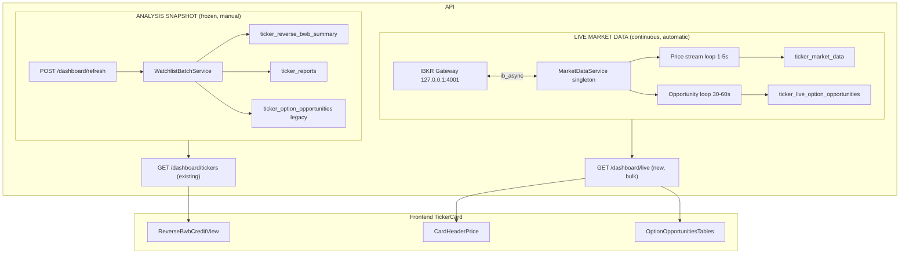

## 1. Architecture Overview

Two strictly separated data domains, written by different paths, read by different hooks:

Hard rule: the live worker writes only to live tables, never to snapshot tables. The batch service writes only to snapshot tables, never reads or replaces live data.

---

## 2. DB Schema Changes (new alembic `0013_market_data_tables.py`)

Two new tables, both UPSERT-keyed by `ticker` so reads are O(1) per card.

- `ticker_market_data`
  - `ticker TEXT PK`, `last_price NUMERIC`, `bid NUMERIC`, `ask NUMERIC`, `change_abs NUMERIC`, `change_pct NUMERIC`, `volume BIGINT`, `prev_close NUMERIC`, `feed_status TEXT` (`live|stale|halted`), `updated_at TIMESTAMPTZ`
- `ticker_live_option_opportunities`
  - `id UUID PK`, `ticker TEXT`, `side TEXT` (`call|put`), `rank INT`, `combo TEXT`, `expiration DATE`, `premium NUMERIC`, `init_margin NUMERIC`, `maint_margin NUMERIC`, `liquidity TEXT` (`Excellent|Good|Average|Poor`), `oi_min INT`, `vol_min INT`, `spread_pct NUMERIC`, `updated_at TIMESTAMPTZ`
  - `UNIQUE(ticker, side, rank)` so refresh is `DELETE WHERE ticker=? AND side=? + INSERT` per side, atomic in a single transaction.

ORM models added to [backend/app/db/models/tables.py](backend/app/db/models/tables.py).

The existing `ticker_option_opportunities` (placeholder snapshot) is left in place for backward compatibility but no longer rendered when the live feed is enabled.

---

## 3. Backend Services (Phase 1 + 3)

New package `backend/app/services/market_data/` with the singleton stack:

- `ibkr_connection.py` — `IbkrConnection` wraps a single `ib_async.IB()`. Owns connect/reconnect (exponential backoff 1s, 2s, 5s, 10s, 30s, 60s), exposes `state: "connected"|"connecting"|"disconnected"|"failed"` and `disconnected_event`. Single instance attached to `app.state.ibkr` in [backend/app/main.py](backend/app/main.py) lifespan.
- `market_data_service.py` — `MarketDataService` is the only thing other code calls. Methods:
  - `subscribe_quotes(symbols)` — `reqMktData` on each underlying once at startup; ticker callbacks push debounced rows into a write queue.
  - `snapshot_chain(ticker)` — `reqSecDefOptParams` + filtered chain rows for the configured DTE band.
  - `snapshot_option_quotes(contracts)` — batched `reqMktData(snapshot=True)` for a list of option contracts.
  - `what_if_margin(combo_legs)` — builds a BAG (combo) order with `whatIf=True` and returns `{init_margin, maint_margin}`.
- `options_opportunity_service.py` — `OptionsOpportunityService.generate(ticker)` does the full Phase 3 pipeline:
  1. Read latest `last_price` from `ticker_market_data`.
  2. `snapshot_chain(ticker)` filtered by `OPP_TARGET_DTE_MIN..MAX` (default 7..21).
  3. Build Reverse BWB candidates per side using existing strike-step logic from [backend/app/services/dashboard/opportunity_generator.py](backend/app/services/dashboard/opportunity_generator.py): short_inner near +/-0.5σ and +/-1.0σ, wing_width = max(step, 0.5σ).
  4. `snapshot_option_quotes` → mid premium per leg → net combo premium.
  5. Liquidity score from min(OI), min(volume), max(spread%/mid). Bucket: Excellent/Good/Average/Poor.
  6. Rank by `premium / max_risk` then liquidity tiebreak; keep top 4 per side, then call `what_if_margin` for the top 2 only (cost control: 12 × 4 WhatIf calls per cycle, not 12 × N).
  7. Return `[CallOpportunity × 2, PutOpportunity × 2]`, persist via repository.
- `repository.py` — `MarketDataRepository` with `upsert_quote`, `replace_opportunities(ticker, side, rows)`, `get_quotes`, `get_opportunities`, `get_dashboard_live_bundle()`.

Reverse BWB combo is structured as a 3-leg BAG:
- CALL: SELL short_inner CALL × 1, BUY long_short CALL × 1, SELL long_outer CALL × 1 (wing pays for body, classic reverse BWB credit posture).
- PUT: mirror geometry.
Existing math constants live in `opportunity_generator.py`; we factor them into a small `combo_geometry.py` module so both placeholder and live paths share the strike construction.

---

## 4. Worker Design (Phase 5)

`backend/app/services/market_data/worker.py` exposes `MarketDataWorker(service, repo, settings)` with two independently-scheduled asyncio loops, started from `main.py` lifespan after `IbkrConnection.connect()`:

- `_price_loop` — drains the quote write queue and flushes batched UPSERTs every `MARKET_DATA_PRICE_FLUSH_MS` (default 1000ms). Quotes themselves stream from IBKR continuously; we never poll IBKR for prices.
- `_opportunity_loop` — every `MARKET_DATA_OPP_INTERVAL_S` (default 45s), iterates the 12 watchlist tickers sequentially, calls `OptionsOpportunityService.generate(ticker)`, and writes via `replace_opportunities`. Sequential to respect IBKR pacing rules (~50 msgs/sec).

Both loops:
- No-op if `IbkrConnection.state != "connected"`.
- Catch and log per-ticker exceptions so one bad symbol cannot kill the loop.
- Mark `feed_status='stale'` on stored rows when no tick received for `>STALE_THRESHOLD_S`.

Hard-error fallback (per chosen behavior): when IBKR is offline, neither loop writes new rows; existing live rows in DB age out and the API returns `feed_status='disconnected'`. Snapshot endpoints continue to work normally.

Process model: the worker runs in the FastAPI process. Production must run with `--workers 1` (single-uvicorn-process), since IBKR Gateway only allows one client per `IBKR_CLIENT_ID`. Documented in deployment notes.

---

## 5. API Changes (Phase 6)

New router `backend/app/api/v1/routes/market_data.py` mounted from [backend/app/api/v1/router.py](backend/app/api/v1/router.py):

- `GET /api/v1/tickers/{ticker}/market-data` → `MarketDataResponse { ticker, price, bid, ask, change_abs, change_pct, volume, prev_close, feed_status, updated_at }`. 404 if ticker not on watchlist.
- `GET /api/v1/tickers/{ticker}/options-opportunities` → `{ calls: [LiveOpportunity × ≤2], puts: [LiveOpportunity × ≤2], updated_at, feed_status }`.
- `GET /api/v1/dashboard/live` → bulk: `{ feed_status, prices_updated_at, opportunities_updated_at, tickers: { SPY: { quote: {...}, opportunities: { calls: [...], puts: [...] } }, ... } }`. Single DB query joining both live tables; one HTTP round-trip for the whole grid.

All three endpoints are pure DB reads — they never touch IBKR directly, so they're cheap and safe to poll.

The existing `/dashboard/tickers` endpoint is unchanged. Its `price_snapshot` and `opportunities` fields stay populated for snapshot-time values; the frontend prefers the live endpoint when available and only falls back to snapshot if the user explicitly disables the live overlay (config flag, see Phase 7).

---

## 6. React Query Integration (Phase 8)

New hooks under [frontend/src/hooks/](frontend/src/hooks/):

- `useLiveMarketData()` — `GET /dashboard/live`, `refetchInterval: 4000`, `staleTime: 2000`. Returns the bulk bundle. Uses `select` with reference-stable identity per ticker so a price tick doesn't re-render options tables.
- `useTickerLiveQuote(ticker)` and `useTickerLiveOpportunities(ticker)` — convenience selectors over the same query (single network request), used directly inside `TickerCard` so each section subscribes only to the slice it needs.

These hooks never invalidate `["dashboard", "tickers"]` (the snapshot query), preserving Phase 9 separation.

`useRefreshDashboard` is unchanged. It triggers analysis only.

---

## 7. Frontend Updates (Phase 7 + 9)

Surgical edits inside [frontend/src/components/dashboard/TickerCard.tsx](frontend/src/components/dashboard/TickerCard.tsx):

- Pass `liveQuote` and `liveOpps` from `useLiveMarketData()` selectors at the page level into `TickerCard`.
- In the existing `<CardHeader … price={…} dailyChangePct={…} />` props, replace:
  - `price={card.price_snapshot?.price ?? null}` → `price={liveQuote?.price ?? null}`
  - `dailyChangePct={card.price_snapshot?.daily_change_pct ?? null}` → `dailyChangePct={liveQuote?.change_pct ?? null}`
- In the existing `<OptionOpportunitiesTables data={card.opportunities ?? null} />`, replace data source with `liveOpps ?? null`.
- When `feed_status === "disconnected"`:
  - `CardHeader` price renders `—` plus a small "Live data unavailable" caption (new tiny element).
  - `OptionOpportunitiesTables` shows the existing empty state with copy "Live data unavailable".
- Add a subtle "LIVE" pill next to the price when `feed_status === "live"`, mirroring the existing badge style in `CardAnalysisMeta`.

Sections that must NOT change:
- [frontend/src/components/dashboard/ReverseBwbCreditView.tsx](frontend/src/components/dashboard/ReverseBwbCreditView.tsx) — purely fed by `card.reverse_bwb` (the snapshot).
- [frontend/src/components/dashboard/CardAnalysisMeta.tsx](frontend/src/components/dashboard/CardAnalysisMeta.tsx) — `Updated:` and `Analysis:` continue to come from `card.generated_at` and `card.status`.
- `useDashboardCards()` polling and `useRefreshDashboard()` mutations — unchanged.

Type additions in [frontend/src/types/schemas.ts](frontend/src/types/schemas.ts): `liveQuoteSchema`, `liveOpportunitySchema`, `dashboardLiveResponseSchema`.

---

## 8. Configuration

Additions to [backend/app/core/config.py](backend/app/core/config.py) and `.env.example`:

- `IBKR_ENABLED=true`
- `IBKR_HOST=127.0.0.1`
- `IBKR_PORT=4001`
- `IBKR_CLIENT_ID=17`
- `IBKR_PAPER=true`
- `MARKET_DATA_PRICE_FLUSH_MS=1000`
- `MARKET_DATA_OPP_INTERVAL_S=45`
- `MARKET_DATA_STALE_THRESHOLD_S=10`
- `OPP_TARGET_DTE_MIN=7`
- `OPP_TARGET_DTE_MAX=21`
- `OPP_RANK_TOP_N_PER_SIDE=2`

`ib_async>=2.0` added to [backend/requirements.txt](backend/requirements.txt).

---

## 9. Deployment Plan

- Run a local IBKR Gateway (or TWS) on the target host before starting the backend; verify port 4001 (paper) / 4002 (live) and API access enabled.
- Production must run uvicorn with `--workers 1` (single FastAPI process) so that exactly one process holds the IBKR `clientId`. Documented in README. If horizontal scaling is needed later, the worker can be split into a sidecar process holding the IBKR session and exposing it via internal HTTP/gRPC.
- Required IBKR market-data subscriptions for the 12 symbols (US Equity Bundle + OPRA for options chains). Without these, IBKR returns `-10167` and the worker logs degrade to disconnected — surfaces correctly in the UI.
- Alembic migration `0013` applied as part of deploy.
- Feature flag rollout: ship `IBKR_ENABLED=false` to confirm zero regression on snapshot card; flip to `true` once Gateway connectivity is verified.

---

## 10. Testing Strategy

Backend unit tests (mocked `ib_async`):
- `tests/market_data/test_combo_geometry.py` — strike step, wing width for SPY/QQQ/AAPL/NVDA.
- `tests/market_data/test_opportunity_ranking.py` — premium/margin ranking, liquidity bucketing, top-2-per-side cap.
- `tests/market_data/test_what_if_margin.py` — BAG order construction (sides, ratios, exchange).
- `tests/market_data/test_repository.py` — UPSERT quote + atomic replace_opportunities.
- `tests/market_data/test_worker.py` — both loops continue running through transient `ConnectionError`; no writes when state != connected.

Backend integration:
- `tests/api/test_dashboard_live.py` — `/dashboard/live` shape, disconnected-state shape (feed_status='disconnected'), ticker not on watchlist.
- Confirm `/dashboard/refresh` does NOT touch live tables and `/dashboard/live` does NOT touch snapshot tables (regression guards).

Frontend:
- `tests/hooks/useLiveMarketData.test.ts` — interval, selector stability.
- `tests/components/TickerCard.test.tsx` — price overlay swaps in; `Decision`/`Credit Safety`/summary remain stable when only price ticks; "Live data unavailable" rendered when `feed_status='disconnected'`.

Manual smoke before merge:
- Connect to paper Gateway, observe SPY price ticking in UI, observe options table refreshing every 45s, verify Decision/summary do not change between two opportunity refreshes, click Re-Run Analysis and verify only the snapshot fields update.