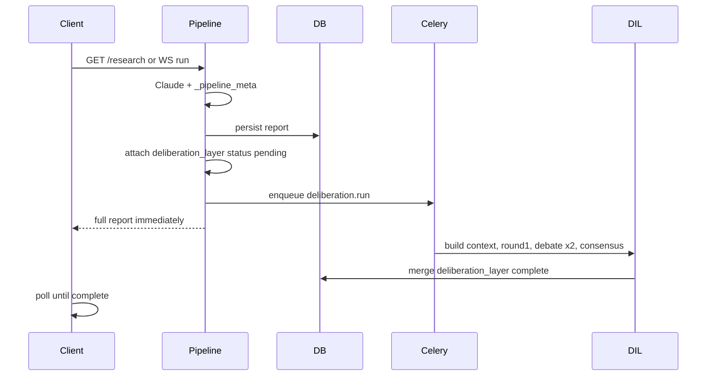

# Multi-LLM Deliberative Intelligence Layer (DIL)

## Constraints (non-negotiable)

- **Do not touch** [`TradingIntelligenceDashboard.tsx`](frontend/src/components/trading/TradingIntelligenceDashboard.tsx), [`deriveTradeDecision.ts`](frontend/src/lib/deriveTradeDecision.ts), [`ClaudeReportService`](backend/app/services/llm/claude_report.py), or existing report schema fields.
- **Additive only**: new `report.deliberation_layer` field; optional new DB table; new API route for polling.
- **Consensus is deterministic** (no LLM arbiter); **max 2 debate rounds**; **strict JSON** with Pydantic validation + `json_repair` fallback (reuse pattern from [`claude_report.py`](backend/app/services/llm/claude_report.py)).

## Execution model (per your choices)



Existing dashboard renders from the **immediate** response. New section shows a loading state, then panels when `deliberation_layer.status === "complete"`.

---

## Phase 1 — Backend domain module

Create [`backend/app/services/deliberation/`](backend/app/services/deliberation/) with the structure you specified:

| Module | Responsibility |
|--------|----------------|
| [`schemas.py`](backend/app/services/deliberation/schemas.py) | Pydantic models: `DeliberationContext`, `IndependentOpinion`, `DebateRound`, `ConsensusOutput`, `DeliberationLayer` |
| [`context_builder.py`](backend/app/services/deliberation/context_builder.py) | Build `DeliberationContext` from completed report (after `_pipeline_meta` exists) |
| [`orchestrator.py`](backend/app/services/deliberation/orchestrator.py) | `DeliberationOrchestrator.run(report) -> DeliberationLayer` |
| [`llm_clients/base.py`](backend/app/services/deliberation/llm_clients/base.py) | Shared `parse_strict_json()`, retries, timeouts |
| [`llm_clients/*.py`](backend/app/services/deliberation/llm_clients/) | OpenAI, Anthropic (debate role only—separate from report synthesis), Gemini, DeepSeek |
| [`debate/round1_independent.py`](backend/app/services/deliberation/debate/round1_independent.py) | Parallel `asyncio.gather` over enabled providers |
| [`debate/round2_cross_critique.py`](backend/app/services/deliberation/debate/round2_cross_critique.py) | Debate round 1 |
| [`debate/round3_revision.py`](backend/app/services/deliberation/debate/round3_revision.py) | Debate round 2 (final) |
| [`debate/consensus.py`](backend/app/services/deliberation/debate/consensus.py) | Thin wrapper calling `ConsensusEngine` |
| [`scoring/disagreement.py`](backend/app/services/deliberation/scoring/disagreement.py) | Matrix, divergence, contradiction density |
| [`scoring/confidence_drift.py`](backend/app/services/deliberation/scoring/confidence_drift.py) | Per-model before/after |
| [`scoring/weighting.py`](backend/app/services/deliberation/scoring/weighting.py) | Equal weights by default (no model dominance) |
| [`prompts/*.txt`](backend/app/services/deliberation/prompts/) | Independent / critique / revision templates |

### `DeliberationContext` builder

Input: full report dict **after** [`pipeline.py`](backend/app/services/orchestration/pipeline.py) lines 168–192 attach `_pipeline_meta`.

```python
# context_builder.py — fields sourced from existing report only
{
  "ticker": ticker,
  "market_context": {
    "price_prediction": report["price_prediction"],
    "price_snapshot": meta["price_snapshot"],
    "volatility_regime": meta["volatility_regime"],
  },
  "sentiment": {
    "overall_sentiment_score": report["overall_sentiment_score"],
    "overall_sentiment_label": report["overall_sentiment_label"],
    "sentiment_breakdown": report["sentiment_breakdown"],
  },
  "narrative": {
    "dominant_narrative": report["dominant_narrative"],
    "what_happened": report["what_happened"],
    "price_movers": report["price_movers"],
  },
  "key_events": report["key_events"],
  "source_reliability": report["source_reliability"],
  "historical_analogs": [],  # optional later via AnalogRepository
  "article_evidence": meta["article_evidence"][:30],
  "top_impact_events": meta["top_impact_events"],
  "evidence_summary": { "articles_analyzed", "unique_sources", "data_quality_note" },
}
```

No raw HTML; compact JSON only (~token budget cap on evidence list).

### LLM clients

Mirror [`ClaudeReportService`](backend/app/services/llm/claude_report.py): `aiohttp` + tenacity, system prompt enforcing **JSON-only**, strip markdown fences, validate with Pydantic.

**Provider registry** (enabled if API key non-empty):

| Model key | Config (new in [`config.py`](backend/app/core/config.py)) |
|-----------|-----------------------------------------------------------|
| `gpt` | `OPENAI_API_KEY`, `OPENAI_MODEL` (default `gpt-4o`) |
| `claude` | Reuse `ANTHROPIC_API_KEY` / `ANTHROPIC_MODEL` (debate prompts differ from synthesis) |
| `gemini` | `GEMINI_API_KEY`, `GEMINI_MODEL` |
| `deepseek` | `DEEPSEEK_API_KEY`, `DEEPSEEK_BASE_URL`, `DEEPSEEK_MODEL` |

**Partial models**: require `len(enabled) >= DIL_MIN_MODELS` (default `2`). If fewer, set `deliberation_layer.status = "skipped"` with reason.

Round 1 runs all enabled models **in parallel**. Each debate round: parallel per model, each receives **anonymized summaries** of others (model id + stance/confidence/key risks only—no raw chain-of-thought cross-leak beyond structured fields).

### Debate flow (max 2 rounds)

1. **Round 1 independent** → `round1: { model: IndependentOpinion }`
2. **Debate round 1** (`round2_cross_critique`) → critiques schema you specified
3. **Debate round 2** (`round3_revision`) → final revisions + `confidence_revision`
4. **Deterministic consensus** → `ConsensusEngine.aggregate(round1, debate_rounds, metrics)`

### `ConsensusEngine` (deterministic)

In [`scoring/weighting.py`](backend/app/services/deliberation/scoring/weighting.py) + [`debate/consensus.py`](backend/app/services/deliberation/debate/consensus.py):

- Map `stance` → numeric score (`bullish=1`, `neutral=0`, `bearish=-1`, `mixed=0.25`)
- **Equal-weight** mean stance → label (`weak bullish`, etc.)
- `agreement_score` = 1 − normalized variance of stance scores
- `uncertainty` = `high|medium|low` from confidence dispersion + disagreement density
- `main_conflicts` = topic pairs where models differ (from disagreement matrix)
- `hidden_risks` = deduped union of `key_risks`, `new_risks_identified`, `hidden_assumptions`
- `recommended_positioning` = rule-based from consensus stance + max risk tier
- `debate_summary` = template string from metrics (not LLM-generated)

### `DisagreementEngine`

Compute and expose under `deliberation_layer.metrics`:

- **disagreement_matrix**: rows = topics (`macro`, `earnings`, `volatility`, `valuation`, `liquidity`); cols = models; cells = stance or `agree|split|oppose` derived from reasoning step titles + keyword rules on `reasoning_steps[].title` / `analysis`
- **confidence_drift**: `{ model, before, after, delta }` from round1 vs final debate revision
- **model_divergence**, **confidence_spread**, **contradiction_density**, **reasoning_overlap** (Jaccard on risk/invalidator tokens)

---

## Phase 2 — Pipeline hook + Celery task

### Minimal change to [`pipeline.py`](backend/app/services/orchestration/pipeline.py)

After `_pipeline_meta` is attached and **before** return:

```python
report["deliberation_layer"] = {
    "status": "pending",
    "run_id": run_id,
    "started_at": datetime.now(UTC).isoformat(),
    "models_requested": ["gpt", "claude", "gemini", "deepseek"],
}
```

### Persist report ID for async update

Refactor [`persist_report`](backend/app/db/repositories/persistence_repository.py) to **return `UUID`** and store in meta:

```python
report["_pipeline_meta"]["report_id"] = str(report_id)
```

### Celery task

New [`backend/app/workers/tasks/deliberation.py`](backend/app/workers/tasks/deliberation.py):

```python
@celery_app.task(name="deliberation.run")
def run_deliberation_task(report_id: str) -> None:
    # asyncio.run: load report by id → DeliberationOrchestrator → patch report_json
```

Add repository method `update_deliberation_layer(report_id, layer)` using JSONB merge on `research_reports.report_json`.

Enqueue from pipeline when `persist=True` and `settings.dil_enabled`:

```python
from app.workers.tasks.deliberation import run_deliberation_task
run_deliberation_task.delay(str(report_id))
```

Also refresh Redis cache key `research:last:{ticker}` after deliberation completes.

### Config flags ([`config.py`](backend/app/core/config.py))

- `dil_enabled: bool` (default `True` in dev once keys exist)
- `dil_min_models: int = 2`
- `dil_max_debate_rounds: int = 2`
- Provider keys/models as above

Document new env vars in backend `.env.example` (not committed secrets).

---

## Phase 3 — API extension (additive)

**Do not change** `GET /research/{ticker}` response shape for existing fields.

New polling endpoint:

```
GET /api/v1/reports/{report_id}/deliberation
```

Returns `{ status, round1?, debate_rounds?, consensus?, metrics?, error?, completed_at? }` extracted from `report_json.deliberation_layer`.

Register in [`router.py`](backend/app/api/v1/router.py). Rate-limit like research.

Optional: extend WS [`websocket.py`](backend/app/api/v1/routes/websocket.py) with `type: "deliberation_complete"` push when Celery finishes (nice-to-have; polling is sufficient for v1).

---

## Phase 4 — Optional additive storage (calibration-ready)

Migration `0008_deliberation_runs.py`:

| Column | Purpose |
|--------|---------|
| `id`, `report_id` FK → `research_reports.id` | Link to report |
| `ticker`, `run_id` | Query/analytics |
| `status`, `models_used` | Run metadata |
| `layer_json` JSONB | Full deliberation payload |
| `created_at`, `completed_at` | Lineage |

Write from Celery on completion **in addition to** embedding in `report_json` (keeps history API working; enables SQL analytics later). Aligns with existing [`0007_calibration_lineage.py`](backend/alembic/versions/0007_calibration_lineage.py) direction.

---

## Phase 5 — Frontend (new section only)

### Insertion point

[`DashboardPage.tsx`](frontend/src/pages/DashboardPage.tsx) — sibling below existing dashboard:

```tsx
{report && (
  <>
    <TradingIntelligenceDashboard ... />
    <DeliberationDashboard report={report} ticker={ticker} isDark={theme === "dark"} />
  </>
)}
```

### New folder [`frontend/src/components/deliberation/`](frontend/src/components/deliberation/)

| Component | Panel |
|-----------|-------|
| `DeliberationDashboard.tsx` | Shell, section title **"AI Deliberation & Institutional Consensus"**, polling hook |
| `ModelOpinionCards.tsx` | Panel 1 — stance, confidence, risk, horizon per model |
| `ReasoningTree.tsx` | Panel 2 — `reasoning_steps` |
| `DebateTimeline.tsx` | Panel 3 — chronological critiques/revisions |
| `DisagreementMatrix.tsx` | Panel 4 — topic × model matrix |
| `ConfidenceDriftChart.tsx` | Panel 5 — before/after bars (reuse chart CSS vars like [`ResearchReportCharts.tsx`](frontend/src/components/dashboard/ResearchReportCharts.tsx)) |
| `HiddenRisksPanel.tsx` | Panel 6 |
| `ConsensusPanel.tsx` | Panel 7 |
| `InstitutionalVerdict.tsx` | Panel 8 — derived from consensus + metrics |

### Data loading

New hook [`useDeliberation.ts`](frontend/src/hooks/useDeliberation.ts):

- Read `report._pipeline_meta.report_id` and `report.deliberation_layer.status`
- If `pending` → `react-query` poll `GET /reports/{id}/deliberation` every 3s until `complete` or `failed`/`skipped`
- If `complete` → render panels from merged data
- If missing / old history report → show compact empty state (“Deliberation not available for this run”)

### Types

Add optional Zod schema `deliberationLayerSchema` in [`schemas.ts`](frontend/src/types/schemas.ts) — **keep** `researchReportSchema.passthrough()` so old reports never break validation.

**Do not** add deliberation fields to required Zod keys; **do not** modify `deriveTradingView`.

### Styling

Copy existing patterns: `Card`, uppercase section headers, `Pill` tones, `hsl(var(--border))` — match trading dashboard visually but as a **separate** `mt-6` block with its own heading.

---

## Phase 6 — Testing and observability

| Test | Target |
|------|--------|
| Unit | `ConsensusEngine`, `DisagreementEngine`, `confidence_drift` with fixture opinions |
| Unit | `context_builder` from sample report JSON |
| Integration | Celery task with mocked LLM clients returning fixed JSON |
| E2E smoke | Dashboard still renders when `deliberation_layer` absent |

Structured logs: `dil.round1.complete`, `dil.debate.round`, `dil.consensus`, per-model latency/errors.

---

## Risk mitigations

| Risk | Mitigation |
|------|------------|
| 8–12 LLM calls cost/latency | Async Celery; existing path returns immediately |
| Missing API keys | Run N≥2 enabled models; `skipped` if insufficient |
| LLM JSON drift | Pydantic + `json_repair`; per-model error capture without failing whole run |
| Stale Redis cache | Update cache on deliberation completion |
| Claude used twice | Separate prompts/clients; synthesis path untouched |

---

## File touch summary

**Backend (new)**: `backend/app/services/deliberation/**`, `backend/app/workers/tasks/deliberation.py`, `backend/app/api/v1/routes/deliberation.py`, `0008_deliberation_runs.py`

**Backend (minimal edits)**: [`pipeline.py`](backend/app/services/orchestration/pipeline.py), [`config.py`](backend/app/core/config.py), [`persistence_repository.py`](backend/app/db/repositories/persistence_repository.py), [`router.py`](backend/app/api/v1/router.py)

**Frontend (new)**: `frontend/src/components/deliberation/**`, `frontend/src/hooks/useDeliberation.ts`

**Frontend (minimal edits)**: [`DashboardPage.tsx`](frontend/src/pages/DashboardPage.tsx), [`schemas.ts`](frontend/src/types/schemas.ts) (optional deliberation types only)

**Untouched**: `TradingIntelligenceDashboard`, `deriveTradeDecision`, `ClaudeReportService`, existing API response fields
