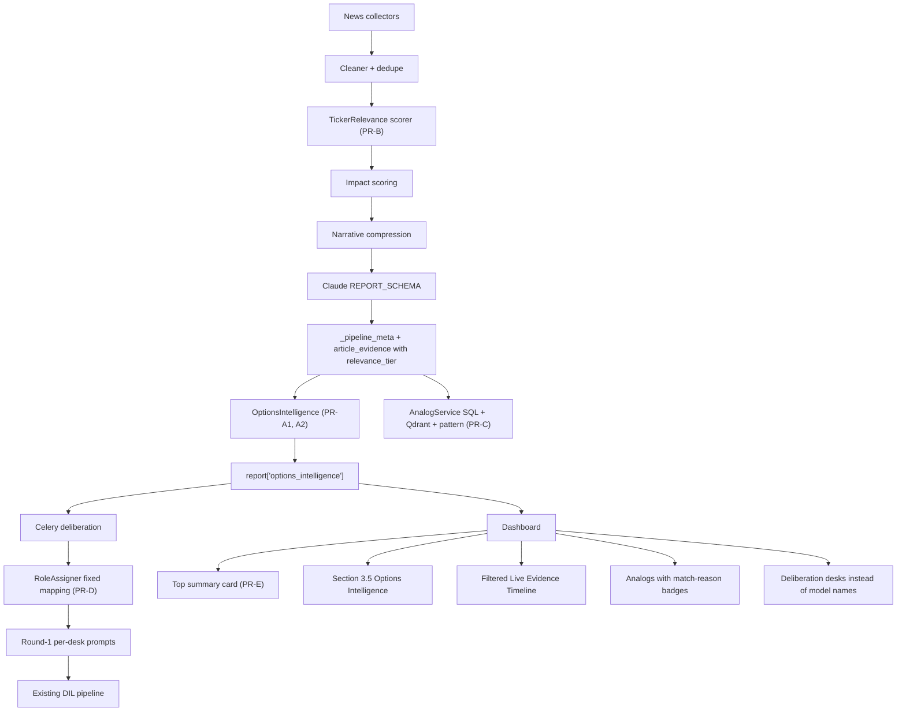

## Goal alignment to your audit

| Your priority | Where it gets fixed |
|---|---|
| P1 Options intelligence (Credit Safety, ±2-3% probs, pin risk, Reverse-BWB) | PR-A1 + PR-A2 |
| P2 Ticker cards (8.2/10 SAFE, Expected Range, Pin Risk, Event Risk) | PR-E |
| P3 Role-specialized deliberation (Macro / Options / Fundamental / Risk desks) | PR-D |
| "Too much noise in evidence timeline" (Cava, Workday, BJ's in NVDA report) | PR-B |
| "Historical analogs need work" (Sandisk, Iran for NVDA = weak match) | PR-C |

Decisions confirmed:
- Options intelligence is **hybrid / phased**: deterministic-from-vol ships first (PR-A1), live-IV adapter behind a flag ships second (PR-A2).
- Role specialization uses a **fixed mapping** (GPT=Macro, Claude=Fundamental, Groq=Options, DeepSeek=Risk, Gemini=Devil's Advocate). UI shows the desk label; tooltip reveals the underlying model.

---

## Architecture



Backward-compatibility rule: every new field is optional; legacy fields (`price_prediction`, `article_evidence`, `historical_analogs`, `consensus.*`, model keys like `gpt`/`claude`) keep their exact shape and meaning. UI falls back gracefully when new fields are absent.

---

## PR-A1 — Options Intelligence (deterministic, ships first)

**Why first**: this is the single biggest gap for your Reverse-BWB workflow and unblocks PR-E (ticker card).

**New backend module** `[backend/app/services/options/](backend/app/services/options/)`:

- `probability.py` — `move_probabilities(last_close, daily_vol_pct, horizon_days, drift=0) -> {p_up_2pct, p_dn_2pct, p_up_3pct, p_dn_3pct, p_in_range(lo, hi)}` using log-normal model with realized vol from `_pipeline_meta.volatility_regime` source data.
- `expected_range.py` — `expected_range(last_close, daily_vol_pct, horizon_days, z=1.0) -> {low, high, sigma_pct, confidence}` (1σ band, with confidence dampened by `data_quality_note` flags).
- `pin_risk.py` — `pin_risk(last_close, expected_range, round_levels=[5,10]) -> {score 0-1, nearest_round, distance_pct, label "Low|Medium|High"}`. Heuristic: high pin risk when last close sits within 0.3σ of a round-number magnet.
- `body_danger.py` — `body_danger_zone(last_close, expected_range, body_strikes) -> {short_body_lo, short_body_hi, distance_to_body_pct, label}`. For a Reverse-BWB, the "body" is the short-strike pair where max loss concentrates. Conservative default: body centered on `last_close ± 0.6σ`.
- `credit_safety.py` — `credit_safety_score(prob_block, pin_risk, body_danger, event_risk, vol_regime) -> {score 0-10, components{}, label "SAFE|CAUTION|UNSAFE"}`. Weighted formula; weights pinned in config so they're tunable without code change.
- `reverse_bwb.py` — `reverse_bwb_suitability(credit_safety, expected_range, vol_regime, event_density) -> {score 0-10, label, suggested_wing_width_pct, suggested_dte, rationale}`.
- `event_risk.py` — `event_risk_score(key_events, days_to_next_earnings, fomc_distance) -> {score 0-1, label}`. Pulls from existing `report['key_events']` and a small earnings-calendar shim (returns None for now; structure ready for live calendar later).

**Schema** — extend `[backend/app/services/deliberation/schemas.py](backend/app/services/deliberation/schemas.py)` style, but for the **report** create a Pydantic-validated `OptionsIntelligence` model and persist as `report['options_intelligence']`:

```
options_intelligence: {
  source: "realized_vol" | "live_iv",                # set by PR-A2 when upgraded
  horizon_days: int,
  expected_range: {low, high, sigma_pct, confidence},
  move_probabilities: {p_up_2pct, p_dn_2pct, p_up_3pct, p_dn_3pct, p_in_range_1sigma},
  pin_risk: {score, label, nearest_round, distance_pct},
  body_danger: {short_body_lo, short_body_hi, distance_pct, label},
  event_risk: {score, label, drivers: [...]},
  credit_safety: {score, label, components: {prob_block, pin_risk, body_danger, event_risk, vol_regime}},
  reverse_bwb: {score, label, suggested_wing_width_pct, suggested_dte, rationale},
  disclaimer: "Probability model from realized volatility; not financial advice."
}
```

**Pipeline hook** — `[backend/app/services/orchestration/pipeline.py](backend/app/services/orchestration/pipeline.py)` lines 131–166, after `_pipeline_meta` is populated and before `persist_report`:

```python
report["options_intelligence"] = OptionsIntelligenceService(settings).compute(
    last_close=meta["price_snapshot"]["last_close"],
    bars=bars,
    volatility_regime=meta["volatility_regime"],
    key_events=report.get("key_events") or [],
    horizon_days=settings.options_default_horizon_days,
).model_dump()
```

**Config** in `[backend/app/core/config.py](backend/app/core/config.py)`:
- `options_enabled: bool = True`
- `options_default_horizon_days: int = 3`
- `options_credit_safety_weights: dict` (defaults set in code constant for now)

**Frontend** — new `[frontend/src/components/options/OptionsIntelligencePanel.tsx](frontend/src/components/options/OptionsIntelligencePanel.tsx)` inserted in `[frontend/src/components/trading/TradingIntelligenceDashboard.tsx](frontend/src/components/trading/TradingIntelligenceDashboard.tsx)` as Section 3.5 (between Trade Decision Panel and "Why the tape is moving"). Renders:

- Credit Safety pill (color: green ≥7, amber 4–7, red <4)
- Expected Range with sigma %
- Probability grid (P up 2%, P down 2%, P in 1σ)
- Pin Risk badge with nearest round number
- Body Danger zone shading
- Reverse-BWB suggestion line ("Wing width 2.5% · DTE 7 · Score 7.8/10")

**Types** — extend `[frontend/src/types/schemas.ts](frontend/src/types/schemas.ts)` with optional `optionsIntelligenceSchema` and attach to `researchReportSchema` (already `.passthrough()`).

**Tests** — new `backend/tests/options/`:
- `test_probability.py` — analytic test of log-normal P(±k%) at known vol
- `test_credit_safety.py` — boundary cases (high pin + low body danger → mid score)
- `test_reverse_bwb.py` — vol regime sensitivity

---

## PR-A2 — Options Intelligence: live IV upgrade (gated)

Behind `OPTIONS_USE_LIVE_IV=false` until proven stable.

- New collector `[backend/app/services/market/options_chain.py](backend/app/services/market/options_chain.py)` using Polygon Options snapshot (or Tradier — provider behind `OPTIONS_CHAIN_PROVIDER`).
- Returns at-the-money IV, IV-30d, gamma exposure proxy, OI by strike for the configured DTE.
- `OptionsIntelligenceService` picks IV when available, otherwise falls back to realized vol — all downstream math unchanged because they consume a single `daily_vol_pct` input.
- Set `options_intelligence.source = "live_iv"` when used; UI shows an "IV-backed" pill.
- New env keys in `[backend/.env.example](backend/.env.example)`: `OPTIONS_USE_LIVE_IV`, `OPTIONS_CHAIN_PROVIDER`, `POLYGON_OPTIONS_API_KEY` (reuses existing key if same).
- Provider failure → silent fallback to realized vol; never crashes pipeline.

---

## PR-B — Evidence relevance & noise filter

Stops Cava / Workday / BJ's leaking into an NVDA report.

**New backend module** `[backend/app/services/relevance/ticker_relevance.py](backend/app/services/relevance/ticker_relevance.py)`:

- `score_article(article, ticker, ticker_aliases, sector_peers, macro_keywords) -> {tier, score, reasons[]}` where `tier ∈ {direct, related_sector, macro, unrelated}`.
- Rules (cheap, deterministic, no LLM):
  - `direct` — ticker symbol OR primary company name OR canonical aliases in headline or first paragraph
  - `related_sector` — ticker is in a static `SECTOR_PEERS` map (e.g. NVDA → `[AMD, AVGO, INTC, TSM, ARM, QCOM, MU, MRVL, ASML, AMAT, LRCX, KLAC, DELL, SMCI, ANET]`)
  - `macro` — fed / cpi / ppi / rates / yields / vix / spx / qqq / dxy / oil / fomc / payrolls / china
  - `unrelated` — none of the above
- `SECTOR_PEERS` and `TICKER_ALIASES` live in `backend/app/services/relevance/sector_map.py` — small static dict for the top ~50 tickers, easy to extend, no DB.

**Pipeline change** — `pipeline.py` builds `article_evidence` (lines 153–166) with `relevance_tier` and `relevance_score` added per row. Filter rule: `article_evidence` keeps `direct + related_sector + macro` only; `unrelated` is dropped. Counts of dropped per tier surface in `_pipeline_meta.relevance_stats`.

**Cluster filter** — `narrative_compression` continues to consume **only** `direct + related_sector` articles (config flag `INCLUDE_MACRO_IN_NARRATIVE=true`) so the dominant narrative isn't diluted by macro headlines.

**Frontend** — `[frontend/src/components/news/NewsTimeline.tsx](frontend/src/components/news/NewsTimeline.tsx)` adds a 4-tab filter chip row: `All · Direct · Related · Macro` with counts. Each row shows a small tier badge. New field reads safely default to `All` if absent (old reports keep working).

**Schemas** — extend `articleEvidenceSchema` in `[frontend/src/types/schemas.ts](frontend/src/types/schemas.ts)` with optional `relevance_tier` and `relevance_score`.

---

## PR-C — Historical analogs upgrade

Today `analog_repository.fetch_similar_events` does `WHERE ticker = X AND event_type = Y` SQL. The Qdrant `find_historical_analogs` exists in `[backend/app/services/qdrant/store.py](backend/app/services/qdrant/store.py)` but is **not wired** to the API. Fix it.

**New service** `[backend/app/services/analogs/analog_service.py](backend/app/services/analogs/analog_service.py)`:

- `fetch_analogs(ticker, event_type, narrative_seed, k=5) -> list[Analog]`
- Strategy: combine
  1. SQL exact-event-type results (current path) — fast, high precision on event type
  2. Qdrant semantic search by embedding of `dominant_narrative + key_events_text` — catches "sell-the-news after beat" type patterns
  3. **Pattern detector** — checks for: `earnings_beat_then_sell_off` (beat sentiment ≥0.4 followed by close < entry within 2 sessions), `sector_rotation_from_peer` (peer ticker up ≥3% same day as our ticker down ≥1%)
- Dedupe by `(ticker, published_at::date)`, rank by `0.4*event_match + 0.4*semantic + 0.2*pattern`.
- Return each analog with `{match_reason: "exact_event_type" | "semantic" | "earnings_beat_sell_off" | "sector_rotation", match_score, headline, published_at, close, volume, outcome_2d_return}`.

**API change** — `[backend/app/api/v1/routes/analogs.py](backend/app/api/v1/routes/analogs.py)` switches from `AnalogRepository` to `AnalogService`. Response gains optional `match_reason` and `match_score` per row. Existing fields preserved.

**Frontend** — `[frontend/src/lib/pipelineMeta.ts](frontend/src/lib/pipelineMeta.ts)` and Section 7 in `TradingIntelligenceDashboard.tsx` render a small badge per analog (`Same event type`, `Semantic match`, `Sell-the-news`, `Sector rotation`). No new component required.

**Note** — keeping the embedding ingestion (Qdrant write at article-clean time) is already in `[backend/app/services/qdrant/store.py](backend/app/services/qdrant/store.py)`; we just need to confirm it's called in the pipeline. If not, the service falls back gracefully to SQL + pattern matches.

---

## PR-D — Role-specialized deliberation (fixed mapping)

Fixes "Deliberation models too similar — all converge to same thesis."

**Mapping** — new `[backend/app/services/deliberation/roles.py](backend/app/services/deliberation/roles.py)`:

```
DESK_ROLES = {
  "gpt":      {"key": "macro_desk",            "label": "Macro Desk"},
  "claude":   {"key": "fundamental_desk",      "label": "Fundamental Desk"},
  "groq":     {"key": "options_desk",          "label": "Options Desk"},
  "deepseek": {"key": "risk_desk",             "label": "Risk Desk"},
  "gemini":   {"key": "devils_advocate_desk",  "label": "Devil's Advocate Desk"},
}
```

`DIL_USE_ROLE_SPECIALIZATION=true` gates the feature; off → existing generic prompts.

**Prompt files** — new directory `[backend/app/services/deliberation/prompts/roles/](backend/app/services/deliberation/prompts/roles/)`:

- `macro_desk.txt` — instructs the model to anchor reasoning on Fed/rates/liquidity/sector breadth; uses macro keys in context first; reasoning step titles fixed: `1. Rate & Liquidity, 2. Sector Breadth, 3. Risk-On/Off, 4. Macro Catalysts, 5. Macro-Adjusted Stance`.
- `fundamental_desk.txt` — earnings beat/miss, guidance, segment growth, margin trajectory, valuation multiple.
- `options_desk.txt` — IV vs realized vol, dealer positioning proxy, expected move, pin risk, structure suitability (consumes `report.options_intelligence` from PR-A1).
- `risk_desk.txt` — downside scenarios, invalidators, tail risks, position sizing; mandated to surface ≥3 hidden risks per round.
- `devils_advocate_desk.txt` — contrarian by mandate; must oppose the panel centroid.

**Round-1 changes** — `[backend/app/services/deliberation/debate/round1_independent.py](backend/app/services/deliberation/debate/round1_independent.py)` (lines 16–30):

```python
async def _run_one(client, context, role_spec):
    base_system = load_prompt("independent_analysis.txt")
    role_system = load_role_prompt(role_spec["key"])
    system = f"{base_system}\n\n--- Desk role ---\n{role_system}"
    user = build_role_user_message(context, client.model_key, role_spec)
    ...
```

`build_role_user_message` calls a new `context_view_for_role(context, role_key)` that emphasizes the relevant fields per desk (Macro desk gets a macro-keyword-filtered evidence subset; Options desk gets `options_intelligence`; Risk desk gets `key_events` + invalidator history). This makes inputs **different per desk**, which prevents the "same context → same thesis" convergence you observed.

**Schema** — extend `IndependentOpinion` in `[backend/app/services/deliberation/schemas.py](backend/app/services/deliberation/schemas.py)` with optional `role_key: str | None` and `role_label: str | None`.

**Persistence** — `DeliberationLayer.round1` already stores opinions keyed by model; we add `role` inside each opinion JSON. No DB migration needed (it's JSONB).

**Frontend** — `[frontend/src/components/deliberation/shared.tsx](frontend/src/components/deliberation/shared.tsx)`:

- Add `DESK_LABELS` map and `desk_for(modelKey)` helper.
- All deliberation panels that today render model names (`ModelOpinionCards`, `DebateTimeline`, `DisagreementMatrix`, `ConvictionHeatmap`, `ConfidenceDriftChart`, `ContradictionAnalysisPanel`, `DisagreementTopology`, `ReasoningTree`, `ThesisClusterSummary`) switch primary label to `desk_label`, with an info-tooltip / aria-label revealing the model name.
- Falls back to `MODEL_LABELS` for old reports lacking `role_key`.

**Debate routing** — unchanged; the existing `routing.py` (already shipped per the audit plan) keeps assigning targets by stance distance. Desk role is a Round-1 prompt change only — Rounds 2/3 still apply critique routing across desks.

**Tests** — `backend/tests/deliberation/test_roles.py`:
- Each role's prompt yields a parsed `IndependentOpinion` with the matching `role_key`.
- Role-filtered context views differ (assert macro_desk view has fewer non-macro evidence rows than fundamental_desk view).

---

## PR-E — Top-of-page ticker summary card

The at-a-glance card you sketched (`GOOGL · SAFE 8.2/10 · Expected Range 377-390 · Pin Risk Low · Event Risk Low`).

**Scope** — single-ticker dashboard (the current view). A true multi-ticker watchlist grid is a separate feature that needs batched reports + a watchlist store; flagged as a follow-up at the end of this plan.

**Frontend** — new `[frontend/src/components/trading/TickerSummaryCard.tsx](frontend/src/components/trading/TickerSummaryCard.tsx)` rendered at the very top of `[frontend/src/components/trading/TradingIntelligenceDashboard.tsx](frontend/src/components/trading/TradingIntelligenceDashboard.tsx)` (above Section 1):

- Big ticker glyph, last close, session %.
- Credit Safety pill (from `options_intelligence.credit_safety`).
- Expected Range pill (from `options_intelligence.expected_range`).
- Pin Risk pill (from `options_intelligence.pin_risk.label`).
- Event Risk pill (from `options_intelligence.event_risk.label`).
- Suggested Reverse-BWB line if `reverse_bwb.score ≥ 6`.
- Renders empty/minimal state if `options_intelligence` is absent (old reports).

No backend changes — it consumes PR-A1 output.

---

## Rollout order & guardrails

Ship in this order (each is a self-contained PR; each preserves existing behaviour):

1. **PR-A1** — Options Intelligence deterministic (backend math + new panel + types)
2. **PR-E** — Top ticker summary card (consumes PR-A1)
3. **PR-B** — Evidence relevance filter (independent)
4. **PR-C** — Historical analogs upgrade (independent)
5. **PR-D** — Role-specialized deliberation (depends on PR-A1 for Options Desk context)
6. **PR-A2** — Live IV upgrade (gated behind `OPTIONS_USE_LIVE_IV=false`)

All new features gated:
- `OPTIONS_ENABLED` (default true), `OPTIONS_USE_LIVE_IV` (default false)
- `RELEVANCE_FILTER_ENABLED` (default true), `INCLUDE_MACRO_IN_NARRATIVE` (default true)
- `ANALOG_SEMANTIC_ENABLED` (default true), `ANALOG_PATTERN_ENABLED` (default true)
- `DIL_USE_ROLE_SPECIALIZATION` (default true once PR-D's prompts are validated; ship as false for the first deploy)

Backward compatibility: every new field is optional, Zod uses `.optional()` over the already-`passthrough()`-ed `researchReportSchema`. No DB migration required for PR-A1, A2, B, D, E. PR-C reads from existing tables and Qdrant; no schema change.

---

## Success criteria (verifiable)

- Re-running the NVDA example produces:
  - `options_intelligence.credit_safety.score` populated, e.g. `4.5 / CAUTION` given Medium vol + post-earnings + neutral bias.
  - `expected_range` within ±1σ of the model's existing `price_prediction.low/high`.
  - `move_probabilities.p_dn_2pct > p_up_2pct` (matching the model's bearish tilt).
- Live Evidence Timeline drops Cava, Workday, BJ's, Global Ship Lease, Imperial Petroleum (all `unrelated`); shows Direct + Related (Qualcomm, Skyworks, AMD, Dell) + Macro (Dow, Fed) only.
- Section 7 Analogs returns at least one entry with `match_reason="earnings_beat_sell_off"` for an NVDA-like query.
- Deliberation panels label the 4 active providers as `Macro Desk / Fundamental Desk / Options Desk / Risk Desk` (or `Devil's Advocate Desk` when Gemini is enabled), with hover-tooltip showing the model name.
- Top of the dashboard shows the summary card with 4 pills (Credit Safety, Expected Range, Pin Risk, Event Risk) before Section 1.

---

## Follow-ups (intentionally not in this plan)

- Multi-ticker watchlist grid (true "ticker cards" page) — needs watchlist persistence and batched report runs.
- Real earnings calendar / FOMC calendar data feed for `event_risk_score` — currently uses `key_events` proxy.
- Outcome backtest of `credit_safety_score` vs realized 2-day return (use the `0009_calibration_lineage` columns already in place).
- LLM-assisted ticker alias / sector peer expansion (today's `SECTOR_PEERS` is a static dict).