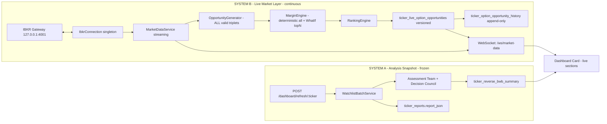

# Reverse BWB Trading Workstation

## Architecture (two strictly separated systems)



Rule: live market layer NEVER writes to `ticker_reverse_bwb_summary` or `ticker_reports`. Analysis snapshot NEVER reads from live tables to derive its fields (UI merges client-side).

## 1. Database migrations

Two new Alembic migrations under [backend/alembic/versions/](backend/alembic/versions/):

- `0014_opportunity_history.py` - create `ticker_option_opportunity_history` (append-only).
- `0015_live_opportunities_extended.py` - extend `ticker_live_option_opportunities` and drop the `UNIQUE(ticker, side, rank)` constraint (we now persist many rows per ticker/side).

Columns added to both tables (mirroring the spec):
- Strikes: `strike_long_wing_a`, `strike_short_body`, `strike_long_wing_b`
- `expiry_days` (int), `delta_pct` (numeric)
- `premium` (raw, sign preserved: negative = credit)
- `init_margin`, `maint_margin`, `init_margin_source` (`deterministic` | `whatif`)
- `liquidity` (int = `min(oi_leg1, oi_leg2, oi_leg3)`), `minimum_open_interest`, `minimum_volume`
- Per-leg: `oi_leg1/2/3`, `vol_leg1/2/3`, `iv_leg1/2/3`, `mid_leg1/2/3`
- `credit_efficiency` (numeric, `abs(premium*100) / init_margin * 100`)
- `ranking_score` (numeric)
- `underlying_price`, `iv` (atm)
- `opportunity_version` (uuid)
- `generated_at` (TIMESTAMPTZ)
- `snapshot_date` (date, history only)

Indexes:
- `ticker_live_option_opportunities`: `(ticker, side)`, `(ticker, opportunity_version)`, `(ticker, ranking_score DESC)`.
- `ticker_option_opportunity_history`: `(ticker, snapshot_date)`, `(ticker, generated_at DESC)`, `(opportunity_version)`.

ORM updates in [backend/app/db/models/tables.py](backend/app/db/models/tables.py): expand `TickerLiveOptionOpportunityModel`, add `TickerOptionOpportunityHistoryModel`.

## 2. Backend - opportunity generation

### Generator rewrite

[backend/app/services/market_data/options_opportunity_service.py](backend/app/services/market_data/options_opportunity_service.py) + helpers in `combo_geometry.py`.

Replace the current 2-candidates-per-side logic with full enumeration under the user-confirmed constraints:

```python
# Pseudocode
for expiration in chain.expirations_in_dte([0, 14]):
    strikes = chain.strikes_for(expiration)
    for s_body_idx, s_body in enumerate(strikes):
        for left_w in range(1, 21):              # wing width in strike steps
            for right_w in range(1, 21):
                if right_w == left_w: continue   # symmetric handled by either side
                s_inner_long  = strike_at(s_body_idx - left_w)  # for CALL
                s_outer_long  = strike_at(s_body_idx + right_w) # for CALL
                if not s_inner_long or not s_outer_long: continue
                quotes = quote_cache[expiration][...]
                if any leg OI < 10: continue
                premium = mid(long_a) + mid(long_b) - 2 * mid(short_body)
                if not is_credit(premium): continue
                yield Candidate(...)
```

Quotes are fetched in a single batched `snapshot_option_quotes(contracts)` per expiration (already supported). Generation is CPU-bound after quotes land - no extra IBKR calls.

### MarginEngine (new)

[backend/app/services/market_data/margin_engine.py](backend/app/services/market_data/margin_engine.py):

- `compute_deterministic(candidate)` for every row: `max_risk_dollars = max(wing_left, wing_right) * 100 * 1.05` (matches existing fallback at `options_opportunity_service.py`).
- `refine_top_n(candidates, n=settings.OPP_WHATIF_TOP_N)` (default 25/side/ticker, env-tunable): WhatIf via `IbkrConnection`, with retry/backoff and per-minute budget pulled from `settings.OPP_WHATIF_MAX_PER_MIN` (default 12). Failures keep deterministic value and log `whatif.failed`.
- `init_margin_source` column records which path produced each row.

### LiquidityEngine (new)

[backend/app/services/market_data/liquidity_engine.py](backend/app/services/market_data/liquidity_engine.py):

- `liquidity = min(oi_leg1, oi_leg2, oi_leg3)` (pure number, never string).
- Store `minimum_open_interest`, `minimum_volume`.
- Drop the categorical `grade_liquidity()` from the live path (keep only as a helper for legacy snapshot if anything still uses it - audit and remove).

### RankingEngine (new)

[backend/app/services/market_data/ranking_engine.py](backend/app/services/market_data/ranking_engine.py):

```python
score = (
    credit_efficiency * 0.40
    + math.log1p(max(liquidity, 1)) * 0.30
    - margin_penalty * 0.20         # margin / median_margin_for_ticker
    - pin_risk_penalty * 0.10       # |body - underlying| / underlying
)
```

Score only affects sorting; nothing is filtered out by score.

### Event-driven recalc + versioning

Modify [backend/app/services/market_data/worker.py](backend/app/services/market_data/worker.py):

- Track per-ticker `last_recalc_price`, `last_recalc_iv`, `last_recalc_at`.
- Trigger recalc when any of: underlying moved >0.25%, IV change >3% (atm via existing `options_chain.py`), 15min elapsed, or first tick after market open.
- Each recalc: generate UUID `opportunity_version`, write all rows to `ticker_live_option_opportunities` via `REPLACE` (DELETE by ticker+side then INSERT), then INSERT into `ticker_option_opportunity_history` with the same `opportunity_version` and today's `snapshot_date`.

## 3. WebSocket layer

New route [backend/app/api/v1/routes/market_data_ws.py](backend/app/api/v1/routes/market_data_ws.py):

- `WS /api/v1/ws/market-data`
- Client sends `{ "subscribe": ["SPY","QQQ",...] }`; server multiplexes.
- Two message types:
  - `{type: "tick", ticker, last, bid, ask, change_abs, change_pct, volume, ts}` - emitted as `MarketDataService` drains quotes (batched at 250ms to avoid flood).
  - `{type: "opportunity_version", ticker, side, opportunity_version, count, ts}` - emitted when a new version is persisted. Client then refetches that ticker/side over REST.
- Single shared `MarketDataPubSub` (asyncio fanout) wired in `app.state`, populated by the worker.

Frontend WebSocket client: new [frontend/src/hooks/useMarketDataSocket.ts](frontend/src/hooks/useMarketDataSocket.ts) using browser `WebSocket`, auto-reconnect with backoff, integration with TanStack Query cache:
- `tick` updates write directly to the per-ticker live-quote cache (no refetch).
- `opportunity_version` triggers `queryClient.invalidateQueries(["live-opportunities", ticker])`.

Existing `useLiveMarketData` 4s polling stays as fallback when WS is disconnected.

## 4. REST APIs

Extend [backend/app/api/v1/routes/market_data.py](backend/app/api/v1/routes/market_data.py):

- `GET /api/v1/tickers/{ticker}/options-opportunities` - returns ALL rows for ticker (already exists; remove top-N cap, paginate `?limit=&offset=&side=&sort=`).
- New `GET /api/v1/tickers/{ticker}/opportunity-explorer` - same data plus filter params `dte_min`, `dte_max`, `delta_min`, `delta_max`, `premium_min`, `premium_max`, `margin_min`, `margin_max`, `liquidity_min`, `credit_efficiency_min`, `sort=score|credit_efficiency|premium|margin|liquidity|delta|expiry_days`, `order=asc|desc`.
- New `GET /api/v1/tickers/{ticker}/opportunity-history?snapshot_date=&since=&limit=` - reads from `ticker_option_opportunity_history`.
- Extend `GET /api/v1/dashboard/live` response to include `opportunity_version` per (ticker, side) so the client can detect drift even if WS missed a message.

Pydantic schemas updated in [backend/app/services/market_data/schemas.py](backend/app/services/market_data/schemas.py) to expose `delta_pct`, `credit_efficiency`, `ranking_score`, `liquidity` (int), `init_margin_source`, `opportunity_version`, per-leg OI/volume.

## 5. Frontend - dashboard card

Install `@tanstack/react-virtual` (~12 KB) - no other lib changes needed.

Rewrite [frontend/src/components/dashboard/OptionOpportunitiesTables.tsx](frontend/src/components/dashboard/OptionOpportunitiesTables.tsx):

- Two side-by-side panels: CALL and PUT, each `fixed height 320px`, virtualized via `useVirtualizer({ count: rows.length, estimateSize: 32 })`, `overflow-y: auto`, `position: sticky; top: 0` header row.
- Columns: `Combo` | `Exp` | `Delta %` | `Premium` | `Margin` | `Liquidity` | `Cred Eff %` | `Score`.
- Liquidity rendered as raw number (`2354`, not "Good").
- Premium rendered with sign and color: negative = credit (green), positive = debit (red); show `$60` not `-0.60`.
- Sort by clicking column headers; client-side sort over already-loaded rows.
- Subscribe via `useTickerLiveOpportunities(ticker, side)` which uses WS-driven invalidation.

[frontend/src/components/dashboard/TickerCard.tsx](frontend/src/components/dashboard/TickerCard.tsx) layout (per spec):
- Header (live price, change%, updated ts, Re-Run Analysis, Open Full Report).
- Analysis Summary section reads ONLY from `card.reverse_bwb` (frozen).
- CALL + PUT virtualized tables read from live cache.
- Card has fixed total height, internal sections scroll independently.

## 6. Full Report - Opportunity Explorer

New tab/route inside [frontend/src/pages/ReportPage.tsx](frontend/src/pages/ReportPage.tsx) (or sub-route `/report/:ticker/opportunities`):

- Section 1 reuses `ReverseBwbCreditView`.
- Section 2 reuses `DeliberationDashboard` (already shows desks + assessment + council).
- Section 3 NEW: `OpportunityExplorer` component
  - Filters (CALL/PUT, DTE range, delta range, premium range, margin range, liquidity range, credit efficiency range)
  - Sorts (premium, margin, liquidity, credit efficiency, delta, score)
  - Virtualized table with extra columns: `OI Leg1/2/3`, `Vol Leg1/2/3`, `IV`, `Underlying Price`, `Init Margin (source)`, `Score Components`
  - Pagination over REST `/opportunity-explorer`

Optional historical replay button calls `/opportunity-history` for a chosen `snapshot_date`.

## 7. Snapshot integrity (Reverse BWB analysis layer)

No new code paths write to the snapshot; just enforce with:
- Static check in [backend/tests/market_data/test_separation_static.py](backend/tests/market_data/test_separation_static.py) extended to forbid any import of `dashboard_repository` from `market_data/` or `dil_resilience/`.
- Runtime assertion in `DashboardRepository.save_snapshot` already exists - keep.
- `Re-Run Analysis` button on the card stays unchanged (`POST /api/v1/dashboard/refresh/{ticker}`).
- The Decision/Credit Safety/Risk/Confidence/Outlook/Expected Range/Pin Risk/Event Risk/Summary fields on the card are read exclusively from `card.reverse_bwb` and remain stable across live ticks.

## 8. Tests

Backend (pytest):
- `backend/tests/market_data/test_full_generator.py` - chain fixture with ~40 strikes x 4 expirations produces N>=200 candidates; assert no top-N cap, all have non-positive premium filtered out, all have OI>=10.
- `backend/tests/market_data/test_margin_engine.py` - deterministic margin for all rows, WhatIf refines exactly `OPP_WHATIF_TOP_N` rows, failure path falls back without crashing.
- `backend/tests/market_data/test_ranking_engine.py` - score formula deterministic, monotone in credit_efficiency, ties broken by ranking_score then by combo.
- `backend/tests/market_data/test_history_archive.py` - one recalc appends N rows with shared `opportunity_version` and today's `snapshot_date`; second recalc bumps version, prior rows still readable.
- `backend/tests/market_data/test_event_driven_recalc.py` - simulated ticks: <0.25% move doesn't recalc; 0.3% move does; 15-min wall clock forces recalc.
- `backend/tests/market_data/test_websocket.py` - WS subscribe/unsubscribe, tick fanout, opportunity_version emission.
- Extend `test_separation_static.py` - forbid cross-domain imports.

Frontend (vitest + RTL + Playwright):
- `frontend/tests/OptionOpportunitiesTables.virtualized.test.tsx` - 5000 rows render <50 DOM rows; sticky header present; clicking column sorts in-place.
- `frontend/tests/useMarketDataSocket.test.ts` - reconnect on close, queue invalidation on `opportunity_version`.
- Playwright `e2e/dashboard.virtualization.spec.ts` - smoke test that a card with many opportunities scrolls without freezing.

## 9. Monitoring & ops

- Structured logs (existing `structlog`): `opp.generated{ticker, side, count, version}`, `opp.whatif{ticker, calls, failures, ms}`, `opp.recalc_trigger{ticker, reason}`, `ws.client{op, count}`, `ws.publish{type, ticker, ms}`.
- Prometheus counters (extend [backend/app/services/dil_resilience/metrics.py](backend/app/services/dil_resilience/metrics.py) pattern under new `market_data/metrics.py`): `opps_generated_total`, `opps_persisted_total`, `whatif_calls_total{result}`, `opportunity_version_total`, `ws_messages_total{type}`, `ws_active_clients`.
- Health endpoint additions in `/api/v1/dil/health` (or new `/health/market-data`): `ibkr_state`, `last_quote_ts`, `last_opp_version_per_ticker`, `whatif_budget_remaining`.

## 10. Config (.env)

Additions to [backend/.env.example](backend/.env.example) and [backend/app/core/config.py](backend/app/core/config.py):

- `OPP_DTE_MIN=0`, `OPP_DTE_MAX=14`
- `OPP_WING_MIN_STRIKES=1`, `OPP_WING_MAX_STRIKES=20`
- `OPP_MIN_LEG_OI=10`
- `OPP_WHATIF_TOP_N=25` (per side per ticker)
- `OPP_WHATIF_MAX_PER_MIN=12`
- `OPP_RECALC_PRICE_PCT=0.25`, `OPP_RECALC_IV_PCT=3.0`, `OPP_RECALC_MAX_AGE_S=900`
- `WS_TICK_BATCH_MS=250`

Drop / deprecate: `OPP_RANK_TOP_N_PER_SIDE` (replaced by `OPP_WHATIF_TOP_N`).

## 11. Deployment & rollout

1. Run Alembic upgrade (`alembic upgrade head`) - adds new columns and history table; old data preserved.
2. Deploy backend with `IBKR_ENABLED=true` and worker scale = 1 (existing constraint).
3. Deploy frontend with `VITE_WS_BASE_URL` pointing at the API host.
4. Smoke: open dashboard, verify (a) live price ticks within 1s, (b) opportunity table shows >>4 rows per side for SPY/QQQ, (c) Re-Run Analysis updates only the snapshot section, (d) Full Report Explorer filters/sorts correctly.

## What this leverages (already built)

- `IbkrConnection`, `MarketDataService.subscribe_quotes/snapshot_chain/snapshot_option_quotes/what_if_margin` in [backend/app/services/market_data/](backend/app/services/market_data/) - reused as-is.
- `MarketDataWorker` loop structure - extended, not replaced.
- `WatchlistBatchService`, `DeliberationOrchestrator`, Assessment Team, Decision Council, explainability assembler - untouched; they still drive the frozen Analysis Summary.
- Dashboard card frozen-vs-live merge logic in [frontend/src/components/dashboard/TickerCard.tsx](frontend/src/components/dashboard/TickerCard.tsx) - reused as-is.
- TanStack Query + axios + Tailwind + shadcn primitives - unchanged.