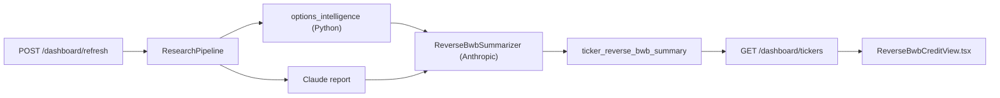
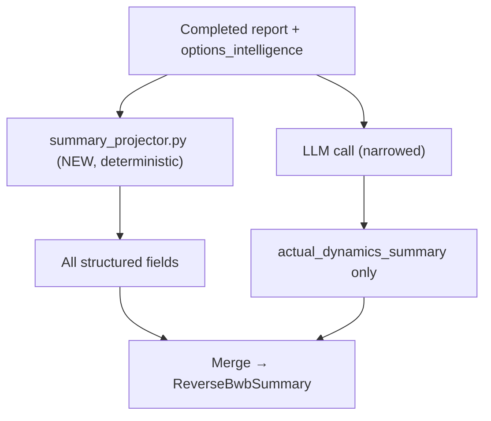

# Reverse BWB Credit View — Gap Analysis and Fix Plan

## What exists today

The dashboard already has a full **Section 2** per ticker card:



- **Frontend:** [`frontend/src/components/dashboard/ReverseBwbCreditView.tsx`](frontend/src/components/dashboard/ReverseBwbCreditView.tsx) renders all 16 fields from `card.reverse_bwb`.
- **Backend schema:** [`backend/app/services/dashboard/schemas.py`](backend/app/services/dashboard/schemas.py) defines strict `ReverseBwbSummary`.
- **Synthesis:** [`backend/app/services/dashboard/reverse_bwb_summarizer.py`](backend/app/services/dashboard/reverse_bwb_summarizer.py) + [`reverse_bwb_summary.txt`](backend/app/services/dashboard/prompts/reverse_bwb_summary.txt) ask the LLM to emit **every** structured field plus `actual_dynamics_summary`.

**Important:** Structured labels are **prompt rules enforced by the LLM**, not recomputed in Python after the call. Only `decision` can be patched later by council via [`decision_labels.py`](backend/app/services/deliberation/decision_labels.py) (`ENTER→SAFE`, `WAIT→WATCH`).

---

## Gap analysis (your spec vs current)

| Your spec | Current implementation | Gap severity |
|-----------|------------------------|--------------|
| **Decision:** Enter / Wait / Avoid | `SAFE` / `WATCH` / `AVOID` | Medium — wrong trader vocabulary |
| **Credit Safety Score:** __ / 10 | Same value, UI label "Credit Safety" | Low — label only |
| **Risk:** Low / Medium / High | Includes `Extreme` | Medium — extra bucket |
| **Confidence:** Low / Medium / High | Matches | None |
| **Today's outlook:** Bullish / Bearish / Sideways / Choppy | Also `Volatile`, `Mixed` | Medium — wider vocab |
| **Next 2–3 days outlook:** Bullish / Bearish / Sideways / Volatile | Same 6-value vocab as today | Medium — should differ from today |
| **Chance ±2–3%:** Low / Medium / High | `None` / `Low` / `Medium` / `High` / `Extreme`; math uses **3% tails only** | Medium — enum + math mismatch |
| **Expected range today** | Uses **3-day** horizon (`OPTIONS_DEFAULT_HORIZON_DAYS=3`) | **High** — label says "today", math is 3-day |
| **Expected range next 2–3 days** | √3 widening of today's band (not independent forecast) | Medium — mathematically odd |
| **Body / danger zone** | Field `danger_zone`, UI label "Danger Zone" | Low — label only |
| **Pin risk near body** | UI label "Pin Risk" | Low — label only |
| **IV / premium quality:** Poor / Average / Good | `Cheap` / `Fair` / `Elevated` / `Rich` | Medium — wrong scale |
| **Liquidity:** Poor / Average / Good | `Poor` / `Fair` / `Good` / `Excellent`; tier guess (no chain data) | Medium — enum + no real metric |
| **Actual dynamics summary** (calm vs 2–3% move, upside/downside bias, body safety; no generic advice) | 3–4 bullets allowed, but prompt is generic; sample output reads like generic trading advice | **High** — content quality |
| **Section title:** `[Ticker] — Reverse BWB Credit View` | Generic "Reverse BWB Credit View"; ticker is in card header only | Low — layout |

**Root cause:** The card *shape* matches your spec, but **vocabulary**, **horizon math**, and **summary quality** diverge. Structured fields are LLM-derived, so labels can drift between refreshes even when underlying math is stable.

---

## Recommended fix strategy

Split synthesis into two layers (mirrors the audit doc's Layer 1 / Layer 2, but with clear ownership):



1. **Deterministic projector** — compute every structured field in Python from `options_intelligence` + report metadata (reuse patterns from [`summary/extractor.py`](backend/app/services/summary/extractor.py)).
2. **Narrow LLM call** — only generate `actual_dynamics_summary` (3–4 sentences) with strict content rules and the precomputed structured context injected.
3. **Enum alignment** — update backend schema, frontend Zod, tone helpers, council mapping, and DB read normalization for old cached cards.
4. **Frontend label pass** — match your exact field labels and section title format.

---

## Implementation details

### 1. New deterministic projector

**Add:** [`backend/app/services/dashboard/summary_projector.py`](backend/app/services/dashboard/summary_projector.py)

Compute from report:

| Field | Rule |
|-------|------|
| `decision` | `Enter` if credit_safety ≥ 7; `Wait` if ≥ 4; else `Avoid`. Council `mapped_decision` overrides when present. |
| `credit_safety_score` | Passthrough `options_intelligence.credit_safety.score` (1 decimal) |
| `risk` | Low / Medium / High from score bands; cap former `Extreme` cases to `High` |
| `confidence` | Same logic as prompt (articles, data_quality, live_iv) |
| `today_outlook` | Map from `price_prediction.bias` + vol regime → Bullish / Bearish / Sideways / Choppy |
| `next_3d_outlook` | Same inputs → Bullish / Bearish / Sideways / Volatile |
| `chance_up/down_2_3_pct` | Use `max(p_up_2pct, p_up_3pct)` / `max(p_dn_2pct, p_dn_3pct)` at **3-day horizon** → Low / Medium / High |
| `expected_range_today` | Recompute with `horizon_days=1` via [`expected_range.py`](backend/app/services/options/expected_range.py) |
| `expected_range_next_3d` | Recompute with `horizon_days=3` (independent, not √3 scaling) |
| `danger_zone` | Format from `body_danger` half-width: `+/-X% around $PRICE` |
| `pin_risk`, `event_risk` | Copy labels; map any Extreme → High |
| `iv_quality` | Map `sigma_pct`: Poor / Average / Good |
| `liquidity` | Tier-based from [`watchlist.py`](backend/app/services/dashboard/watchlist.py): tier1→Good, tier2→Good, tier3→Average (until chain liquidity exists) |

**Update enums in** [`backend/app/services/dashboard/schemas.py`](backend/app/services/dashboard/schemas.py):

```python
DecisionLabel = Literal["Enter", "Wait", "Avoid"]
RiskLevel = Literal["Low", "Medium", "High"]
TodayOutlook = Literal["Bullish", "Bearish", "Sideways", "Choppy"]
NextOutlook = Literal["Bullish", "Bearish", "Sideways", "Volatile"]
ChanceLabel = Literal["Low", "Medium", "High"]
IvQualityLabel = Literal["Poor", "Average", "Good"]
LiquidityLabel = Literal["Poor", "Average", "Good"]
```

Extend `normalize_summary_dict()` to **upgrade legacy stored JSON** on read (e.g. `SAFE→Enter`, `Cheap→Poor`, `Extreme→High`) so existing DB rows don't break the frontend before refresh.

### 2. Refactor summarizer to narrative-only LLM

**Change:** [`backend/app/services/dashboard/reverse_bwb_summarizer.py`](backend/app/services/dashboard/reverse_bwb_summarizer.py)

- Call `project_structured_summary(ticker, report)` first.
- Replace full-card tool schema with a small tool that returns only `{ "actual_dynamics_summary": string[3..4] }`.
- Pass structured fields + key narrative snippets into the user message so the LLM **explains** the numbers, not re-derives them.

**Rewrite prompt** [`reverse_bwb_summary.txt`](backend/app/services/dashboard/prompts/reverse_bwb_summary.txt):

Mandatory sentence structure for `actual_dynamics_summary`:
1. **Calm vs move:** state whether the stock is likely to stay inside the expected range or make a 2–3% move.
2. **Directional bias:** which side (upside or downside) carries more risk and why (use move probabilities + outlook).
3. **Body / danger zone:** whether the short body is safe or risky given pin risk and body width.
4. *(Optional 4th)* Catalyst or IV/premium context tied to the above — **no generic trade advice** ("narrow wings", "wait for breakout", etc.).

Include explicit **DO NOT** list: no strategy recommendations, no greek letters, no repeating field labels verbatim.

### 3. Council / decision label alignment

**Update:** [`backend/app/services/deliberation/decision_labels.py`](backend/app/services/deliberation/decision_labels.py)

- Map council `ENTER/WAIT/AVOID` directly to dashboard `Enter/Wait/Avoid` (remove SAFE/WATCH intermediate).
- Update [`dashboard_repository.patch_reverse_bwb_decision`](backend/app/db/repositories/dashboard_repository.py) and tests in [`test_decision_labels.py`](backend/tests/deliberation/test_decision_labels.py), [`test_council_refresh.py`](backend/tests/dashboard/test_council_refresh.py).

### 4. Frontend alignment

**Update:** [`frontend/src/components/dashboard/ReverseBwbCreditView.tsx`](frontend/src/components/dashboard/ReverseBwbCreditView.tsx)

- Section title: `{summary.ticker} — Reverse BWB Credit View`
- Field labels exactly as spec:
  - Credit Safety Score
  - Today's outlook / Next 2–3 days outlook
  - Chance of +2–3% move / Chance of -2–3% move
  - Expected range today / Expected range next 2–3 days
  - Body / danger zone
  - Pin risk near body
  - IV / premium quality
  - Actual dynamics summary (keep 3–4 sentence bullet list)

**Update Zod mirrors:** [`frontend/src/types/schemas.ts`](frontend/src/types/schemas.ts)

**Update tone helpers:** [`frontend/src/lib/deriveDecisionTone.ts`](frontend/src/lib/deriveDecisionTone.ts) — map `Enter/Average/Poor` etc.; remove IV-specific `ivQualityTone` in favor of unified quality scale.

### 5. Tests and verification

| Area | Files to update |
|------|-----------------|
| Projector unit tests | **New** `backend/tests/dashboard/test_summary_projector.py` — horizon-1 vs horizon-3 ranges, chance bucketing, enum mapping |
| Summarizer tests | [`backend/tests/dashboard/test_reverse_bwb_summarizer.py`](backend/tests/dashboard/test_reverse_bwb_summarizer.py) — merge path, dynamics-only tool |
| Fixtures | [`backend/tests/dashboard/conftest.py`](backend/tests/dashboard/conftest.py) — new enum values |
| Legacy normalization | Test old SAFE/Cheap/Extreme payloads normalize on read |

**Manual verify after implementation:**
```bash
curl -X POST http://localhost:8000/api/v1/dashboard/refresh/SPY
curl http://localhost:8000/api/v1/dashboard/tickers/SPY | jq '.reverse_bwb'
```
Confirm: decision shows `Enter/Wait/Avoid`, today range is tighter than 3-day range, dynamics summary mentions calm vs move + directional bias + body safety.

---

## Out of scope (defer unless you want them now)

- Live options-chain liquidity metric (would need new data source; tier fallback stays)
- Wiring earnings/FOMC calendar into event risk (news-text matching remains)
- Report page `/report/:ticker` still uses quantitative `options_intelligence.reverse_bwb` — separate surface, unchanged

---

## Risk / migration note

Stored summaries in `ticker_reverse_bwb_summary` use old enums until refreshed. The read-path normalizer prevents UI breakage; a full watchlist refresh (`POST /dashboard/refresh`) repopulates all cards with the new vocabulary and corrected ranges.
