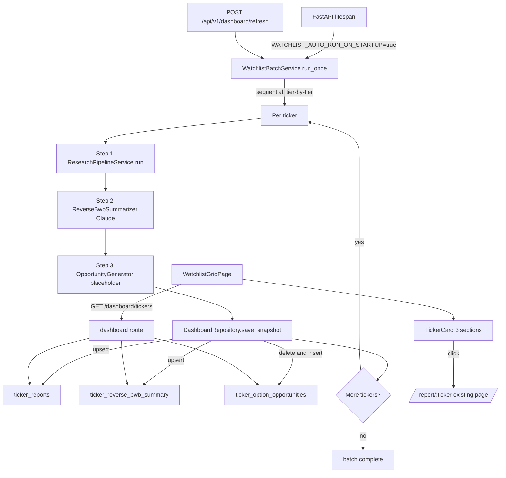

# Reverse BWB Intelligence Dashboard

## Architecture at a glance



## Important context

Most of this can be additive. Existing artifacts to **reuse without changes**:

- Pipeline: `ResearchPipelineService.run(ticker, days)` in `[backend/app/services/orchestration/pipeline.py](backend/app/services/orchestration/pipeline.py)` — async, returns the full report `dict` and already persists to `research_reports`.
- Options intelligence: `OptionsIntelligenceService.compute(...)` (already in pipeline) — its output is the **input** to the new Reverse BWB summary, not a replacement.
- Full report page: `[frontend/src/pages/ReportPage.tsx](frontend/src/pages/ReportPage.tsx)` and `/report/:ticker` route — unchanged.
- Tier definitions: `[frontend/src/config/watchlist.ts](frontend/src/config/watchlist.ts)` already matches the spec exactly (SPY/QQQ/IWM/DIA, AAPL/MSFT/AMZN/GOOGL, NVDA/TSLA/AMD/META).

Things being **replaced**:

- Per-card sections `ExecutiveMetrics`, `MovementRiskPanel`, `MarketIndicators`, `StatusStrip`, `ExecutiveSummary`, `ActionBar`, `ReportFooter`, `OptionsOpportunities` (mock) — these come out of the new `TickerCard`. The files stay on disk for now but become unused (cleanup deferred).
- `[frontend/src/hooks/useTickerSummaries.ts](frontend/src/hooks/useTickerSummaries.ts)` → replaced by `useDashboardCards` hitting the new endpoint.

---

## Backend

### 1. Config and watchlist constants

`[backend/app/core/config.py](backend/app/core/config.py)` — add:

```python
watchlist_auto_run_on_startup: bool = Field(default=False, alias="WATCHLIST_AUTO_RUN_ON_STARTUP")
watchlist_run_days: int = Field(default=7, alias="WATCHLIST_RUN_DAYS")
reverse_bwb_summary_enabled: bool = Field(default=True, alias="REVERSE_BWB_SUMMARY_ENABLED")
reverse_bwb_summary_model: str = Field(default="claude-3-5-sonnet-latest", alias="REVERSE_BWB_SUMMARY_MODEL")
reverse_bwb_summary_max_tokens: int = Field(default=1500, alias="REVERSE_BWB_SUMMARY_MAX_TOKENS")
```

`[backend/.env.example](backend/.env.example)` — mirror the same keys, default `WATCHLIST_AUTO_RUN_ON_STARTUP=false` so dev restarts don't burn API budget.

New file `backend/app/services/dashboard/watchlist.py` — Python mirror of the frontend tier list (sequential order: SPY → QQQ → IWM → DIA → AAPL → MSFT → AMZN → GOOGL → NVDA → TSLA → AMD → META), with `WATCHLIST_TIERS: list[Tier]` and `ALL_WATCHLIST_TICKERS: list[str]`.

### 2. Pydantic schemas

New file `backend/app/services/dashboard/schemas.py`:

- `ExpectedRange(low: float, high: float)`
- `RiskLevel = Literal["Low", "Medium", "High", "Extreme"]` (widens existing 3-level scale)
- `ConfidenceLevel = Literal["Low", "Medium", "High"]`
- `OutlookLabel = Literal["Bullish", "Bearish", "Choppy", "Volatile", "Sideways", "Mixed"]`
- `ChanceLabel = Literal["None", "Low", "Medium", "High", "Extreme"]`
- `IvQualityLabel = Literal["Cheap", "Fair", "Elevated", "Rich"]`
- `LiquidityLabel = Literal["Poor", "Fair", "Good", "Excellent"]`
- `DecisionLabel = Literal["SAFE", "WATCH", "AVOID"]`
- `ReverseBwbSummary` — all 17 fields from the spec, with `credit_safety_score: confloat(ge=0, le=10)` and `actual_dynamics_summary: list[str] = Field(min_length=3, max_length=4)`.
- `OptionOpportunity(combo: str, expiry: str, premium: float, margin: float, liquidity: LiquidityLabel)`
- `OptionOpportunities(calls: list[OptionOpportunity], puts: list[OptionOpportunity])`
- `DashboardTickerCard(ticker, company_name, tier, status, generated_at, price_snapshot, reverse_bwb, opportunities, error_message?)`
- `WatchlistBatchStatus(state, current_ticker?, completed: list[str], failed: list[str], started_at?, finished_at?)`

### 3. Database — new tables and migration

`[backend/app/db/models/tables.py](backend/app/db/models/tables.py)` — add three models:

- `TickerReportModel` — `id`, `ticker` (UNIQUE), `generated_at`, `report_json` (JSONB), `status` (`completed|failed`), `error_message` (nullable), `created_at`, `updated_at`. One row per ticker (upsert by ticker).
- `TickerReverseBwbSummaryModel` — `id`, `ticker` (UNIQUE), `report_id` (FK), all 17 R-BWB columns (scalars stored as columns; `expected_range_today`/`expected_range_next_3d` as JSONB; `actual_dynamics_summary` as JSONB array), `created_at`, `updated_at`. Upsert by ticker.
- `TickerOptionOpportunityModel` — `id`, `ticker` (indexed), `report_id` (FK), `option_type` (`CALL|PUT`), `combo`, `expiry`, `premium`, `margin`, `liquidity`, `rank` (int), `created_at`. Many rows per ticker; truncate-by-ticker on refresh.

New Alembic migration `backend/alembic/versions/0010_dashboard_tables.py` with the three tables, unique constraints, FKs, and indexes `(ticker)` + `(ticker, option_type, rank)`. Run via `alembic upgrade head` per existing convention.

### 4. Repositories

New file `backend/app/db/repositories/dashboard_repository.py` with `DashboardRepository(session: AsyncSession)`:

- `async def save_snapshot(ticker, report_json, summary: ReverseBwbSummary, opportunities: OptionOpportunities)` — single transaction, upserts ticker_reports and ticker_reverse_bwb_summary, deletes existing ticker_option_opportunities rows by ticker, inserts new rows.
- `async def mark_failed(ticker, error_message)` — upserts ticker_reports with status='failed' and clears summary/opportunities so the card cleanly shows "Data unavailable".
- `async def list_dashboard_cards() -> list[DashboardTickerCard]` — single JOIN query returning all watchlist tickers (LEFT JOIN so missing tickers appear with status='pending').
- `async def get_dashboard_card(ticker) -> DashboardTickerCard | None`.

### 5. Reverse BWB summarizer (new LLM call)

New file `backend/app/services/dashboard/reverse_bwb_summarizer.py`:

- Class `ReverseBwbSummarizer(settings, anthropic_client)`.
- `_build_context(report: dict) -> dict` — token-budgeted slice of the report: `dominant_narrative`, `what_happened`, `key_events[:5]`, `price_prediction`, `executive_summary`, `options_intelligence` (full), `_pipeline_meta.price_snapshot`. Pattern modeled on `[backend/app/services/deliberation/context_builder.py](backend/app/services/deliberation/context_builder.py)`.
- `async def summarize(ticker, report) -> ReverseBwbSummary` — calls Anthropic with **forced tool-use** for guaranteed JSON (mirrors `[backend/app/services/deliberation/llm_clients/anthropic_client.py](backend/app/services/deliberation/llm_clients/anthropic_client.py)`), parses with `ReverseBwbSummary.model_validate(...)`, falls back to `json_repair` on parse failure, raises `ReverseBwbSummaryError` after one retry.

New prompt file `backend/app/services/dashboard/prompts/reverse_bwb_summary.txt` — instructs the model to produce STRICT JSON matching the schema. Anchored on the existing deterministic options_intelligence values (so e.g. `credit_safety_score` typically passes through; LLM only translates to labels and writes `actual_dynamics_summary`). Includes an explicit field-by-field guide for label thresholds:

```
risk: Extreme if credit_safety_score < 2 OR sigma_pct > 4
pin_risk / event_risk: copy from options_intelligence labels, escalate to Extreme when score >= 0.85
chance_up_2_3_pct / chance_down_2_3_pct: derive from p_up_2pct / p_down_2pct
   p < 0.05 -> None, < 0.15 -> Low, < 0.30 -> Medium, < 0.50 -> High, else Extreme
today_outlook / next_3d_outlook: pick from the closed vocabulary based on price_prediction
expected_range_today: copy options_intelligence.expected_range
expected_range_next_3d: widen by sqrt(3)
danger_zone: format as "+/-X% around current price" using options_intelligence.body_danger
actual_dynamics_summary: 3-4 short declarative sentences, plain English, no jargon
```

### 6. Opportunity generator (placeholder)

New file `backend/app/services/dashboard/opportunity_generator.py`:

- `generate(ticker, report) -> OptionOpportunities` — deterministic, no LLM, no IO.
- Inputs from `report["options_intelligence"]`: current price, `expected_range.low/high`, `body_danger.short_lo/short_hi`, `liquidity_quality`, DTE.
- For CALL side: 2 plausible Reverse-BWB combos above price, strikes spaced by `0.5 * sigma` and `1.0 * sigma`. For PUT side: same below price.
- Expiry strings `"2D"`, `"5D"` from DTE; premium ≈ `0.5% * price`; margin ≈ wing_width * 100; liquidity mapped from `liquidity_quality`.
- Returns 2 calls + 2 puts per ticker; ordered by attractiveness (premium/margin ratio).
- Pluggable interface `OpportunitySource(Protocol)` so a future `IbkrOpportunitySource` can drop in without route changes.

### 7. Watchlist batch service

New file `backend/app/services/dashboard/watchlist_batch.py`:

- `class WatchlistBatchService(settings, session_factory, qdrant, cache, summarizer, opportunity_generator)`.
- `_state: WatchlistBatchStatus` kept in-process (also written to `app.state.watchlist_batch_state`).
- `async def run_once()`:
  ```python
  for tier in WATCHLIST_TIERS:
      for ticker in tier.tickers:
          self._state.current_ticker = ticker
          try:
              async with self.session_factory() as session:
                  pipeline = ResearchPipelineService(session, settings, qdrant, cache)
                  report = await pipeline.run(ticker, days=settings.watchlist_run_days, persist=True)
                  summary = await self.summarizer.summarize(ticker, report)
                  opportunities = self.opportunity_generator.generate(ticker, report)
                  await DashboardRepository(session).save_snapshot(ticker, report, summary, opportunities)
              self._state.completed.append(ticker)
          except Exception as exc:  # NEVER stop the batch
              log.exception("watchlist.ticker_failed", ticker=ticker)
              async with self.session_factory() as session:
                  await DashboardRepository(session).mark_failed(ticker, str(exc))
              self._state.failed.append(ticker)
  ```
- **Sequential by construction** — no `asyncio.gather`, one ticker at a time, satisfying spec.
- `async def run_single(ticker)` — same per-ticker block reused by the per-ticker refresh route.

### 8. Startup hook

`[backend/app/main.py](backend/app/main.py)` lifespan — after the existing dependency probes and after `yield` produces a running server, schedule (do not await):

```python
if settings.watchlist_auto_run_on_startup:
    batch = WatchlistBatchService.from_app_state(app, settings)
    app.state.watchlist_task = asyncio.create_task(batch.run_once())
```

Shutdown: best-effort cancel `app.state.watchlist_task` before `engine.dispose()`.

### 9. API routes

New file `backend/app/api/v1/routes/dashboard.py`, registered in `[backend/app/api/v1/router.py](backend/app/api/v1/router.py)`:

- `GET /api/v1/dashboard/tickers` → `{status: WatchlistBatchStatus, cards: list[DashboardTickerCard]}`. The cards array always contains all 12 tickers in tier/watchlist order; missing rows render with `status: "pending"`.
- `GET /api/v1/dashboard/tickers/{ticker}` → `DashboardTickerCard`.
- `POST /api/v1/dashboard/refresh` → schedules `run_once()` if not already running; 409 if running.
- `POST /api/v1/dashboard/refresh/{ticker}` → schedules `run_single(ticker)`.

Uses existing `SessionDep`, `@limiter.limit(...)`, and the projection helper pattern from `[backend/app/api/v1/routes/summaries.py](backend/app/api/v1/routes/summaries.py)`.

### 10. Tests

New `backend/tests/dashboard/` tree:

- `test_reverse_bwb_summarizer.py` — fixture report dict; mock Anthropic to return canned JSON; assert Pydantic validation + json_repair fallback path.
- `test_opportunity_generator.py` — deterministic shape, 2+2 rows, strikes bracket current price correctly.
- `test_watchlist_batch.py` — patch pipeline/summarizer/generator; verify sequential call order (SPY first, META last), verify a single-ticker exception does not abort the batch and `mark_failed` is called.
- `test_dashboard_repository.py` — upsert and truncate-by-ticker semantics.
- `test_dashboard_routes.py` — endpoint shape; missing-ticker rows return `status: pending`.

---

## Frontend

### 11. Schemas and API client

`[frontend/src/types/schemas.ts](frontend/src/types/schemas.ts)` — add Zod schemas mirroring backend Pydantic: `reverseBwbSummarySchema`, `optionOpportunitySchema`, `optionOpportunitiesSchema`, `dashboardTickerCardSchema`, `watchlistBatchStatusSchema`, `dashboardTickersResponseSchema`.

### 12. Hooks

- New `frontend/src/hooks/useDashboardCards.ts` — `GET /api/v1/dashboard/tickers`, query key `["dashboard", "tickers"]`, refetch every 30s; returns `{ status, cards }`.
- New `frontend/src/hooks/useRefreshDashboard.ts` — mutation hitting `POST /api/v1/dashboard/refresh` (full batch) and `POST /api/v1/dashboard/refresh/:ticker` (single).
- `[frontend/src/hooks/useRunAll.ts](frontend/src/hooks/useRunAll.ts)` — repointed at the new refresh endpoint (no more per-ticker `/research` fan-out from the browser; backend now owns sequencing).

### 13. New card components

New folder `frontend/src/components/dashboard/`:

- `TickerCard.tsx` — strict 3-section card per spec:
  1. `<CardHeader />` (reused from `[frontend/src/components/grid/CardHeader.tsx](frontend/src/components/grid/CardHeader.tsx)`; receives `price` and `dailyChangePct` from `card.price_snapshot` — placeholder values, IBKR-ready).
  2. `<ReverseBwbCreditView summary={card.reverse_bwb} />`.
  3. `<OptionOpportunitiesTables data={card.opportunities} />`.
  Card-level state: if `card.status === "failed"` or `"pending"`, render `<EmptyCardState message="Data unavailable — Retry pending" />` in place of sections 2 and 3, but keep section 1.
  Click handler: `useNavigate()` → `/report/${ticker}` (preserves existing click-through; entire card is the affordance now that `ActionBar` is removed).

- `ReverseBwbCreditView.tsx` — single component, no per-field truncation, renders in this order:
  - Top row: `Decision`, `Credit Safety Score`, `Risk`, `Confidence` (tone chips using existing `deriveDecisionTone` extended for `"Extreme"`).
  - Outlooks: `Today's Outlook`, `Next 2-3 Day Outlook`.
  - Chances: `Chance Up 2-3%`, `Chance Down 2-3%`.
  - Ranges: `Expected Range Today` (`$low – $high`), `Expected Range Next 3 Days`.
  - Risks: `Danger Zone` (free text), `Pin Risk`.
  - Quality: `Event Risk`, `IV Quality`, `Liquidity`.
  - Footer block: `Actual Dynamics Summary` — render `summary.actual_dynamics_summary.map(...)` as 3–4 short paragraphs with no `line-clamp`.

- `OptionOpportunitiesTables.tsx` — two stacked tables, columns exactly `Combo | Exp | Premium | Margin | Liquidity`, with tone chip for Liquidity. Fed by real `card.opportunities` (replaces mock `getMockOptionsData`).

- `EmptyCardState.tsx` — small component for failed/pending tickers.

### 14. Page refactor

`[frontend/src/pages/WatchlistGridPage.tsx](frontend/src/pages/WatchlistGridPage.tsx)`:

- Swap `useTickerSummaries` → `useDashboardCards`.
- Render the new `TickerCard` from `frontend/src/components/dashboard/` instead of the grid one.
- Render tiers via existing `[frontend/src/components/grid/TierSection.tsx](frontend/src/components/grid/TierSection.tsx)` (tier labels: "Tier 1", "Tier 2", "Tier 3" per spec).
- Header continues to host the existing `RunAllButton`, now wired to `useRefreshDashboard().refreshAll`; show batch progress from `response.status` (current ticker + counts).

`tone` helpers in `[frontend/src/lib/deriveDecisionTone.ts](frontend/src/lib/deriveDecisionTone.ts)` — extend to handle `"Extreme"` (→ `bad`), `"Choppy"`/`"Volatile"` (→ `warn`), and `"Cheap"|"Fair"|"Elevated"|"Rich"` for IV quality.

`[frontend/src/styles/index.css](frontend/src/styles/index.css)` — no token changes required; reuse existing terminal palette and `.grid-card` shell.

### 15. Routes and click-through

`[frontend/src/App.tsx](frontend/src/App.tsx)` — no changes. `/` keeps rendering `WatchlistGridPage`, `/report/:ticker` keeps rendering `ReportPage` against the existing full-report dataset from `/history/:ticker`.

---

## Failure handling, refresh, and success criteria recap

- Per-ticker exceptions are logged and persisted via `mark_failed`; the batch loop continues to the next ticker. Spec requirement satisfied.
- Cards for failed/pending tickers render `Data unavailable — Retry pending` while still showing the ticker header.
- Each successful step persists report + summary + opportunities in one DB transaction, so the dashboard cache (frontend Query) sees a consistent snapshot on the next 30s poll.
- Existing `ResearchPipelineService.run` is called unchanged (spec requirement: "Do NOT modify existing report generation").
- Click-through reuses the existing `/report/:ticker` page (spec requirement: "Do not redesign report page").
- Future IBKR swap is a single new `OpportunitySource` implementation + config flag — no frontend or route changes.