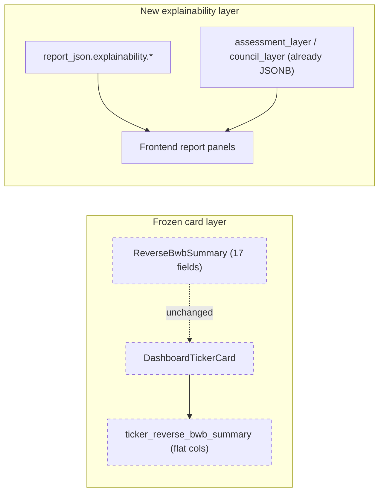

## Architectural principle

The dashboard card is **frozen**: `ReverseBwbSummary` (the 17-field card body) and `DashboardTickerCard` use Pydantic `extra="forbid"`, and the frontend Zod schemas mirror that contract. All new intelligence lands in **`report_json.explainability`** — a versioned, additive container served only by `GET /api/v1/dashboard/tickers/{ticker}/report` (the "Open Full Report" endpoint). No card route, no card column, no card UI changes.



Every new payload is **purely additive** and read by new frontend panels that render only when the payload is present (backward-compatible with old reports).

---

## Phase 0 — Foundation: `report_json.explainability` container

- Add `ExplainabilityLayer` Pydantic model in [backend/app/services/dashboard/schemas.py](backend/app/services/dashboard/schemas.py) with version-tagged sub-blocks: `credit_safety_breakdown`, `confidence_calibration`, `liquidity_assessment`, `structure_analysis`, `position_risk`, `macro_transmission`, `historical_analogs`, `assessment_reasoning`, `decision_justification`. Each is `Optional` so partial degradation is safe.
- Write the assembled block to `report_json["explainability"]` in [backend/app/services/dashboard/watchlist_batch.py](backend/app/services/dashboard/watchlist_batch.py) `_refresh_ticker` right after the deliberation layer is merged but before `save_snapshot`.
- Persist the same blob into a new JSONB column `ticker_reverse_bwb_summary.explainability` via a new alembic migration `0012_explainability_column.py`. This column is **never** returned by `/dashboard/tickers` (the card endpoint) — only by `/dashboard/tickers/{ticker}/report`.

Why a single container: keeps the existing `report_json` keys untouched, gives the frontend one panel root to look for, and makes versioned rollout trivial.

---

## Phase 1 — Credit Safety Breakdown (`explainability.credit_safety_breakdown`)

Extend [backend/app/services/options/credit_safety.py](backend/app/services/options/credit_safety.py) to return a richer decomposition while keeping its existing return contract (so `options_intelligence.credit_safety.score` stays identical and the card value never moves).

- Add a new builder `build_credit_safety_breakdown(options_intel, vol_regime, liquidity_grade)` that produces the 6-line trader breakdown the user requested:
  - `move_stability` (from `1 − sigma_pct/8` scaled to 0–10) — anchor metric
  - `pin_risk_impact` (negative if `pin_risk.score > 0.4`)
  - `event_risk_impact` (negative if `event_risk.score > 0.45`)
  - `volatility_impact` (negative in `high`/`elevated` regimes)
  - `structure_placement_impact` (from `body_danger.distance_pct`)
  - `liquidity_impact` (+/− from liquidity grade)
  - `final_credit_safety` = identical to `options_intel.credit_safety.score`
- Each line carries `{label, value, delta, explanation}` so the UI can show the bullet exactly like the user's example.
- The breakdown is **derivative**, never replaces or changes the weighted `credit_safety_score` produced today by `credit_safety_score()` in [backend/app/services/options/credit_safety.py:31](backend/app/services/options/credit_safety.py). The card field stays bit-identical.

Tests in `backend/tests/options/test_credit_safety_breakdown.py`: assert sum of deltas ≈ final − move_stability anchor, assert label-to-delta sign rules.

---

## Phase 2 — Confidence Calibration explanation (`explainability.confidence_calibration`)

Compose the user's exact 5-row block using **signals that already exist**:

| Row | Source |
|-----|--------|
| `raw_desk_confidence` | `deliberation_layer.consensus.calibration.confidence_aggregate` |
| `cross_agent_agreement` | `deliberation_layer.consensus.calibration.consensus_strength` |
| `evidence_overlap` | `deliberation_layer.consensus.calibration.evidence_quality` |
| `contradiction_penalty` | derived from `metrics.contradiction_density` and `disagreement.disagreement_matrix` (already computed in [backend/app/services/deliberation/scoring/disagreement.py](backend/app/services/deliberation/scoring/disagreement.py)) |
| `council_confidence_avg` | `council_layer.consensus.confidence` |
| `final_confidence_bucket` | mirrors the card's `confidence` enum exactly (no recomputation, no drift from card) |

New module `backend/app/services/deliberation/scoring/confidence_explain.py` with `build_confidence_calibration(deliberation_layer, card_confidence)`. Pure function over existing DIL outputs — no LLM calls, no extra cost.

Tests in `backend/tests/deliberation/test_confidence_explain.py`.

---

## Phase 3 — Liquidity Assessment (`explainability.liquidity_assessment`)

Today liquidity is a single enum on the card derived from a tier proxy. The report needs the 3-axis decomposition the user described.

- Extend [backend/app/services/deliberation/context/liquidity.py](backend/app/services/deliberation/context/liquidity.py) (already returns equity + options grades) with an `execution_quality` axis computed from `pin_risk.score`, `body_danger.distance_pct`, and current spread proxy when available from `options_intelligence`.
- New helper `build_liquidity_assessment()` produces:
  - `underlying_liquidity` (from existing equity grade)
  - `options_liquidity` (from existing options grade)
  - `execution_quality` (new — Poor when pin near body, Average otherwise, Good in clean tape)
  - `reason` (template-rendered short paragraph that names the specific driver, e.g. "Body strike 593 sits within 0.4σ of high-gamma round number 595; pinning likely to widen mid-spread on exit")
- The card's `liquidity` enum stays unchanged (still from the tier proxy / current rule).

---

## Phase 4 — Reverse BWB Structure Desk (HYBRID: deterministic module + new LLM desk)

### 4a. Deterministic structure-geometry module

New `backend/app/services/options/structure_geometry.py` exposing `compute_structure_geometry(spot, body_strike, wing_width_pct, credit, dte, sigma_pct)`:

- `distance_to_body_sigma`, `distance_to_body_pct`
- `body_exposure_pct` (how much of 1σ cone overlaps the body)
- `wing_protection_ratio` = wing distance / sigma
- `credit_efficiency` = credit / max_loss
- `risk_reward` = credit / (max_loss − credit)
- `breakevens` (upper / lower)
- Hand-off probabilities consumed by Phase 5

Wired into `OptionsIntelligenceService.compute()` in [backend/app/services/options/service.py](backend/app/services/options/service.py) and attached to `options_intelligence.structure_geometry` (a new key — not on the card).

### 4b. New LLM desk `reverse_bwb_structure_desk`

Following the existing desk pattern documented in the codebase mapping:
- Add `reverse_bwb_structure_desk` to `RoleKey` literal, `ALL_DESK_KEYS`, `DESK_LABELS`, `_DESK_PRIMARIES` in [backend/app/services/deliberation/desk_config.py](backend/app/services/deliberation/desk_config.py).
- Add `prompts/roles/reverse_bwb_structure_desk.txt` focused on body placement, wing width adequacy, credit efficiency, and the "should you take this credit at this geometry?" question.
- Add `context_view_for_role` branch giving this desk `options_intelligence.structure_geometry`, `body_danger`, `reverse_bwb`, `pin_risk`, and `move_probabilities`.
- Set primary LLM to `deepseek` (quant strength) with full failover chain.

Output flows into `intelligence_package.desks["reverse_bwb_structure_desk"]` — read by Assessment + Council (Phase 8) and surfaced in the report (Phase 10).

---

## Phase 5 — Position Risk Analysis (`explainability.position_risk`)

New `backend/app/services/options/position_risk.py` (pure deterministic, no LLM):

```python
def compute_position_risk(spot, body_strike, wing_width_pct, credit, sigma_pct, dte) -> PositionRisk:
    # Lognormal closed-form on terminal price
    return {
        "probability_of_profit": ...,
        "probability_of_touch": ...,        # reflection-principle
        "probability_of_breakeven": ...,
        "probability_of_max_loss": ...,
        "expected_value_usd": ...,          # integral over PnL(S_T) * pdf
        "method": "lognormal_closed_form",
        "assumptions": [...]
    }
```

Attached at `options_intelligence.position_risk` (new key) AND mirrored into `explainability.position_risk` for the report panel.

Tests in `backend/tests/options/test_position_risk.py`: closed-form checks against known scenarios (deep OTM body → low PoT, ATM body → high PoT, etc.).

---

## Phase 6 — Macro Transmission (`explainability.macro_transmission`)

Hybrid approach: deterministic chain skeleton + LLM enrichment via existing `macro_desk`.

- New `backend/app/services/deliberation/context/macro_transmission.py`:
  - Inputs: dominant_narrative, key_events, options_intelligence (event_risk drivers), regime_context, news_momentum
  - Output: a chain of nodes `[{node, label, direction, evidence}]` (the "Iran Peace Deal → Oil Down → Inflation Down → Yield Pressure Lower → Supportive For SPY" example the user gave).
  - Uses a small built-in topology table (event_type → first-order asset → ticker impact) for common macro shocks.
- Extend `macro_desk` prompt at [backend/app/services/deliberation/prompts/roles/macro_desk.txt](backend/app/services/deliberation/prompts/roles/macro_desk.txt) to consume `transmission_chain` from its context view and produce a `transmission_narrative` in its `reasoning_steps`.
- Final `explainability.macro_transmission = {chain: [...], narrative: macro_desk.transmission_narrative}`.

---

## Phase 7 — Historical Analog Engine (`explainability.historical_analogs`) — full simulation

### 7a. Wire AnalogService into the DIL pipeline

The DIL context already reads `_pipeline_meta.historical_analogs` (see [backend/app/services/deliberation/context_builder.py:153](backend/app/services/deliberation/context_builder.py)) but the main pipeline never writes it. Fix this by calling `AnalogService.fetch_analogs` in [backend/app/services/orchestration/pipeline.py](backend/app/services/orchestration/pipeline.py) and stashing the rows in `_pipeline_meta.historical_analogs`.

### 7b. Forward-path simulator

New `backend/app/services/analogs/setup_simulator.py`:

- For each analog row, read `close`, `published_at`, and the next ~`DTE` of historical bars from the prices table.
- Project the **current** Reverse BWB structure (body strike, wing width, credit) onto that forward path: did the underlying touch the body? touch a wing? expire inside?
- Aggregate across all N matches into `{n_setups, win_rate, avg_credit_retained, max_loss_frequency, avg_drawdown_pct, p_touch_body, breakdown_by_horizon: {1d, 3d, dte}}`.

### 7c. Persist + expose

- Add `setup_outcome_stats` to the existing analog row (or a parallel computation block).
- Final `explainability.historical_analogs = {matches: top_10, aggregates: {win_rate, ...}, lookback_window, sample_size_warning}`.

Tests in `backend/tests/analogs/test_setup_simulator.py` against synthetic price paths to validate touched-body and credit-retained math.

---

## Phase 8 — Assessment Team upgrade (`explainability.assessment_reasoning`)

Today the Assessment Team consumes a slim intel package (`round1_independent.py` builds `options_snapshot` + `desks`). The user wants them evaluating **Ticker Risk, Structure Risk, Position Risk, Historical Analogs, Macro Transmission** explicitly.

### Changes

- In [backend/app/services/assessment/round1_independent.py](backend/app/services/assessment/round1_independent.py), expand the intel slice to include the new deterministic blocks:
  - `options_intelligence.structure_geometry` (Phase 4a)
  - `options_intelligence.position_risk` (Phase 5)
  - `_pipeline_meta.historical_analogs` (Phase 7)
  - `explainability.macro_transmission` (Phase 6)
  - `desks.reverse_bwb_structure_desk` (Phase 4b)
- Update the three assessment role prompts in [backend/app/services/assessment/prompts/roles/](backend/app/services/assessment/prompts/roles/) so each analyst explicitly addresses the 5 risk lenses in their `reasoning_steps`.
- Extend `AssessmentMemberOpinion` schema in [backend/app/services/assessment/schemas.py](backend/app/services/assessment/schemas.py) with an optional `risk_lenses` field carrying short paragraphs for each lens.
- `explainability.assessment_reasoning` summarises the consensus across these 5 lenses (modal lens-by-lens) for the report UI.

**Critical**: card body fields (`risk`, `confidence`, `liquidity`, etc.) are produced by the same R4 merge as today — bit-identical behaviour. Only the **explanation payload** is new.

---

## Phase 9 — Decision Justification (`explainability.decision_justification`)

Council already produces 5 votes, 5 revisions, and `CouncilConsensus.debate_summary` / `main_conflict` (see [backend/app/services/deliberation/council/round4_consensus.py](backend/app/services/deliberation/council/round4_consensus.py)). The report just needs to surface them clearly.

- New helper `build_decision_justification(council_layer, intelligence_package)` in `backend/app/services/deliberation/council/justification.py`:
  - `council_votes`: `[{member, label, decision, confidence, top_reason}]` (top_reason = first `reasoning_step.title`)
  - `consensus`: `{decision, support_counts, confidence}` (already there)
  - `primary_reasons`: top 4 distinct themes mined from member `key_risks` + revision rationales — ranked by frequency
  - `dissent`: which member(s) disagreed with consensus + why
- Add a unit test that on a fixture council layer, `primary_reasons` contains "pin risk", "body placement", "credit efficiency", "event uncertainty" style themes.
- This is pure post-processing — no extra LLM calls; uses output council already produces.

---

## Phase 10 — Frontend rendering (NEW panels, ZERO card changes)

The card grid ([frontend/src/components/dashboard/TickerCard.tsx](frontend/src/components/dashboard/TickerCard.tsx), [frontend/src/components/dashboard/ReverseBwbCreditView.tsx](frontend/src/components/dashboard/ReverseBwbCreditView.tsx)) is not touched. Only the report page is enriched.

### New panels under [frontend/src/pages/ReportPage.tsx](frontend/src/pages/ReportPage.tsx)

Add a new directory `frontend/src/components/explainability/` with one component per phase:

- `CreditSafetyBreakdownPanel.tsx` — renders the 6-row breakdown (Phase 1)
- `ConfidenceCalibrationPanel.tsx` — 5-row breakdown (Phase 2)
- `LiquidityAssessmentPanel.tsx` — 3-axis grid + reason (Phase 3)
- `StructureAnalysisPanel.tsx` — geometry table + new desk's narrative (Phase 4)
- `PositionRiskPanel.tsx` — PoP/PoT/EV table (Phase 5)
- `MacroTransmissionPanel.tsx` — vertical chain of nodes + narrative (Phase 6)
- `HistoricalAnalogPanel.tsx` — aggregate stats card + top matches list (Phase 7)
- `AssessmentReasoningPanel.tsx` — 5-lens summary (Phase 8)
- `DecisionJustificationPanel.tsx` — vote table + primary reasons (Phase 9)

A new `ExplainabilitySection` wrapper composes them in order and renders only the panels whose payload is present. Mounted in `ReportPage.tsx` **alongside** the existing `TradingIntelligenceDashboard` + `DeliberationDashboard`. The grid card, opportunity tables, and `ReverseBwbCreditView` are completely untouched.

### Zod schema

Add an `explainabilitySchema` to [frontend/src/types/schemas.ts](frontend/src/types/schemas.ts) as a partial / optional block under the existing `researchReportSchema` (the report schema is already loose, so this is additive and old reports parse fine).

---

## Backward compatibility and rollout

- **Old reports without `explainability`**: every panel checks for its sub-block and renders nothing if absent — the report still works.
- **Old API consumers**: the card endpoint payload is byte-for-byte unchanged. `extra="forbid"` schemas guarantee no leakage.
- **DB migration**: `0012_explainability_column.py` adds a nullable JSONB column on `ticker_reverse_bwb_summary` — no breaking change.
- **Feature flag**: gate the whole explainability assembly behind `EXPLAINABILITY_ENABLED=true` env var (defaults true) so the entire layer can be disabled in one switch.

---

## Test coverage

- `backend/tests/options/test_credit_safety_breakdown.py` — Phase 1
- `backend/tests/deliberation/test_confidence_explain.py` — Phase 2
- `backend/tests/deliberation/test_liquidity_assessment.py` — Phase 3
- `backend/tests/options/test_structure_geometry.py` — Phase 4a
- `backend/tests/deliberation/test_reverse_bwb_structure_desk.py` — Phase 4b (uses existing mock desk runner)
- `backend/tests/options/test_position_risk.py` — Phase 5
- `backend/tests/deliberation/test_macro_transmission.py` — Phase 6
- `backend/tests/analogs/test_setup_simulator.py` — Phase 7
- `backend/tests/assessment/test_round1_intel_expansion.py` — Phase 8
- `backend/tests/deliberation/test_decision_justification.py` — Phase 9
- `backend/tests/dashboard/test_explainability_in_report.py` — integration: full pipeline writes all 9 blocks and `ReverseBwbSummary` is byte-identical to a baseline run with explainability disabled (this is the **acceptance test** for the "card unchanged" guarantee).

---

## Success-criteria checklist (maps to user's list)

- Dashboard cards unchanged — enforced by the integration test above + `extra="forbid"` + no edits to `TickerCard.tsx` / `ReverseBwbCreditView.tsx` / card schemas.
- Existing API contract unchanged — `/dashboard/tickers` payload byte-identical; only `/dashboard/tickers/{ticker}/report` grows.
- Existing card layout unchanged — no frontend grid changes.
- All new intelligence inside "Open Full Report" — `report_json.explainability` only.
- Every visible card value has a "Why?" — Credit Safety (Phase 1), Confidence (Phase 2), Liquidity (Phase 3), Pin Risk & Risk (Phases 3+4+5), Event Risk (Phases 5+6+7), Decision (Phase 9), Outlooks & Move Chances (Phases 5+6).