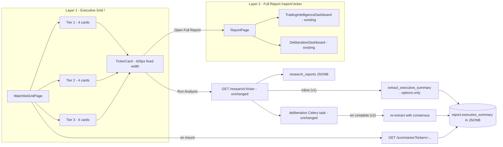
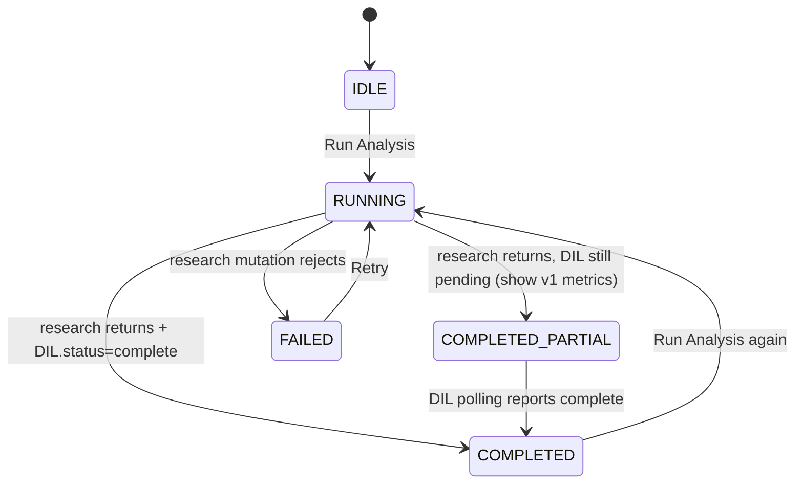

# Two-layer Ticker Grid Dashboard

## 1. Architecture overview



Two layers, identical backend pipeline:
- **Layer 1** is a pure projection — twelve cards rendered from `report.executive_summary` (a new additive block) plus live deliberation progress.
- **Layer 2** is the existing single-ticker view, untouched, now mounted at `/report/:ticker` instead of `/`.

Every change is additive: existing schemas stay, existing components stay, the DIL pipeline stays.

---

## 2. Backend integration plan

### 2.1 New `ExecutiveSummary` block (additive on `report_json`)

Pydantic model in [backend/app/services/summary/schemas.py](backend/app/services/summary/schemas.py):

```python
class ExecutiveSummary(BaseModel):
    decision: Literal["SAFE", "WATCH", "AVOID"]
    credit_safety_score: float          # 0..10
    outlook: Literal["Bullish", "Bearish", "Volatile", "Sideways", "Mixed"]
    risk: Literal["Low", "Medium", "High"]
    confidence: Literal["Low", "Medium", "High"]
    plus_move_risk: Literal["Low", "Medium", "High"]
    minus_move_risk: Literal["Low", "Medium", "High"]
    expected_range: ExpectedRangeShort  # {low, high}
    event_risk: Literal["Low", "Medium", "High"]
    iv_quality: Literal["Poor", "Fair", "Good", "Excellent"]
    liquidity: Literal["Poor", "Fair", "Good", "Excellent"]
    pin_risk: Literal["Low", "Medium", "High"]
    summary: str                        # <= 400 chars, 3-4 sentences
    summary_version: int                # 1 = options-only, 2 = with DIL consensus
    derived_at: str                     # ISO timestamp
```

### 2.2 Deterministic extractor [backend/app/services/summary/extractor.py](backend/app/services/summary/extractor.py)

`extract_executive_summary(report: dict) -> ExecutiveSummary` derives every field from already-existing data — no new LLM call. Mapping table:

- `decision` ← `options_intelligence.credit_safety.label` (SAFE/CAUTION/UNSAFE → SAFE/WATCH/AVOID)
- `credit_safety_score` ← `options_intelligence.credit_safety.score`
- `outlook` ← `deliberation_layer.consensus.consensus` (bullish/bearish/mixed/neutral) blended with `_pipeline_meta.volatility_regime`; fallback `price_prediction.bias`
- `risk` ← combo of `credit_safety.label` + `consensus.uncertainty`
- `confidence` ← `consensus.calibration.confidence_aggregate` thresholds (≥0.65 High, ≥0.35 Medium); fallback `price_prediction.confidence`
- `plus_move_risk` / `minus_move_risk` ← `move_probabilities.p_up_2pct` / `p_dn_2pct` thresholds (≥0.40 High, ≥0.20 Medium, else Low)
- `expected_range` ← `expected_range.{low, high}`
- `event_risk` / `pin_risk` ← labels from existing options_intelligence
- `iv_quality` ← derived from `volatility_regime` × `expected_range.confidence`
- `liquidity` ← `_pipeline_meta.price_snapshot.volume_vs_avg` thresholds
- `summary` ← composed from `consensus.debate_summary` (1 sentence) + truncated `dominant_narrative` (≤400 chars total)

All thresholds live in module-level constants for easy tuning.

### 2.3 Pipeline hook (additive, two stages)

In [backend/app/services/orchestration/pipeline.py](backend/app/services/orchestration/pipeline.py), after `options_intelligence` block is attached and before `persist_report`:

```python
# Stage 1 - inline extraction so the grid can paint immediately
report["executive_summary"] = extract_executive_summary(report).model_dump()
```

In [backend/app/services/deliberation/runner.py](backend/app/services/deliberation/runner.py), after `update_deliberation_layer` succeeds:

```python
# Stage 2 - re-extract with DIL consensus (outlook, risk, confidence get richer)
fresh = await repo.fetch_report_json(report_id)
fresh["executive_summary"] = extract_executive_summary(fresh).model_dump()
await repo.update_executive_summary(report_id, fresh["executive_summary"])
```

New JSONB-merge method `update_executive_summary(report_id, summary)` mirrors the existing `update_deliberation_layer` pattern. No DB migration.

### 2.4 New `/summaries` endpoint

[backend/app/api/v1/routes/summaries.py](backend/app/api/v1/routes/summaries.py):

```
GET /api/v1/summaries?tickers=SPY,QQQ,IWM,DIA,AAPL,MSFT,AMZN,GOOGL,NVDA,TSLA,AMD,META

Response: [
  {
    "ticker": "NVDA",
    "report_id": "uuid" | null,
    "deliberation_status": "pending|running|complete|failed|skipped" | null,
    "last_close": 124.5,
    "session_change_pct": 1.25,
    "executive_summary": ExecutiveSummary | null,
    "last_run_at": "2026-05-24T14:33:00Z" | null
  }, ...
]
```

Implementation: SQL `DISTINCT ON (ticker)` over `research_reports` ordered by `created_at DESC`, projecting only the slim fields above (no full report_json over the wire). Tickers without any report return `executive_summary: null`. Single round-trip for the entire grid load.

### 2.5 Backend file touch summary

| Type | Files |
|---|---|
| New | `services/summary/{__init__.py, schemas.py, extractor.py}`, `api/v1/routes/summaries.py`, `tests/summary/{test_extractor.py, test_summaries_route.py}` |
| Edit (additive) | `services/orchestration/pipeline.py`, `services/deliberation/runner.py`, `db/repositories/persistence_repository.py` (add `update_executive_summary`), `api/v1/router.py` (register route) |
| Untouched | `claude_report.py`, all `services/options/*`, all `services/deliberation/*` (engine), schemas of `OptionsIntelligence`, `DeliberationLayer`, `ResearchReport` |

---

## 3. Frontend component structure

```
frontend/src/
  config/
    watchlist.ts              <- WATCHLIST_TIERS static config (3 tiers x 4 tickers)
  pages/
    WatchlistGridPage.tsx     <- new home at /
    ReportPage.tsx            <- new, mounted at /report/:ticker
    DashboardPage.tsx         <- existing free-form workbench, kept at /workbench (backward compat)
  components/
    grid/
      TickerCard.tsx          <- the 420px card (8 sections, 4 states)
      CardHeader.tsx          <- ticker + company + price + daily change
      StatusStrip.tsx         <- big SAFE/WATCH/AVOID badge with credit safety
      ExecutiveMetrics.tsx    <- 2x2 grid: credit safety, outlook, risk, confidence
      MovementRiskPanel.tsx   <- +/-2-3% bars + expected range
      MarketIndicators.tsx    <- 4 chips: event risk, IV quality, liquidity, pin risk
      ExecutiveSummary.tsx    <- 3-4 sentence summary text block
      ActionBar.tsx           <- Run Analysis + Open Full Report buttons
      RunningProgress.tsx     <- per-model progress strip (gpt/claude/gemini/deepseek/groq)
      ReportFooter.tsx        <- last updated stamp
      TierSection.tsx         <- tier label + 4-card responsive grid row
      RunAllButton.tsx        <- top-right orchestrator
  hooks/
    useTickerSummaries.ts     <- react-query GET /summaries, refetchInterval 30s
    useRunAnalysis.ts         <- per-ticker mutation -> existing GET /research/:ticker
    useRunAll.ts              <- sequential orchestrator with concurrency=2
  lib/
    deriveDecisionTone.ts     <- color/tone helpers (SAFE/WATCH/AVOID, Low/Med/High)
    extractDashboardSummary.ts<- client-side fallback when backend hasn't yet extracted
```

---

## 4. Data flow

```mermaid
sequenceDiagram
  participant U as Trader
  participant Grid as WatchlistGridPage
  participant API as Backend
  participant Pipe as Pipeline
  participant Cel as Celery DIL

  U->>Grid: open /
  Grid->>API: GET /summaries?tickers=...
  API-->>Grid: 12 rows (some null, some with executive_summary)
  Grid->>U: render 12 cards (IDLE or COMPLETED)

  U->>Grid: click Run Analysis on NVDA card
  Grid->>API: GET /research/NVDA?days=7
  API->>Pipe: full pipeline (unchanged)
  Pipe->>Pipe: attach options_intelligence
  Pipe->>Pipe: extract_executive_summary v1
  Pipe->>API: persist + return report (with v1 summary)
  Pipe->>Cel: schedule_deliberation(report_id)
  API-->>Grid: report (report_id, executive_summary v1)
  Grid->>Grid: card -> RUNNING; start polling /reports/:id/deliberation
  Grid->>API: GET /reports/:id/deliberation (every 3s)
  Cel->>Cel: round1 (parallel) -> debate -> consensus
  Cel->>API: update_deliberation_layer(complete)
  Cel->>API: update_executive_summary v2 (with outlook, confidence, risk)
  API-->>Grid: status=complete
  Grid->>API: invalidate ticker summary -> GET /summaries (single ticker)
  API-->>Grid: row with executive_summary v2
  Grid->>U: card -> COMPLETED with full metrics

  U->>Grid: click Open Full Report
  Grid->>U: navigate to /report/NVDA -> existing TradingIntelligenceDashboard + DeliberationDashboard
```

Key guarantees:
- **The DIL pipeline is invoked exactly as today.** Only one new instruction runs after it (the extractor).
- **Card paints in two stages**: v1 (options-only) within seconds of Run Analysis returning, v2 (with consensus) when DIL completes ~30-90s later.
- **Open Full Report** is a route push only — same data, no extra fetches if it was just run.

---

## 5. Card state machine



Visual rules per state (each state shows the same 8 sections; only header chrome and metric values change):

- **IDLE**: header + actions + greyed metric placeholders (or last-known summary if `/summaries` returned data) + `Last updated 3h ago` footer.
- **RUNNING**: header + disabled actions + `RunningProgress` strip showing model progress derived from `useDeliberation`'s `round1` keys, `debate_rounds.length`, and `consensus` presence (`gpt ✓`, `claude ✓`, `gemini Running`, `deepseek Waiting`, `Consensus building...`).
- **COMPLETED**: full metrics, both buttons enabled.
- **FAILED**: red footer + `Retry` button.

---

## 6. State management

- **Server state**: TanStack React Query, three keys
  - `["summaries", tickerList.join(",")]` — `useTickerSummaries`, refetchInterval 30s
  - `["research", ticker, days]` — existing `useResearch` mutation, called per card via `useRunAnalysis(ticker)`
  - `["deliberation", reportId]` — existing `useDeliberation`, polls every 3s while pending/running, used by each card with an active run
- **Local UI state**: per-card status (`IDLE | RUNNING | COMPLETED | FAILED`) lives in the card itself, derived from React Query state — no Zustand store needed.
- **Run All orchestrator**: `useRunAll` keeps a tiny in-memory queue (concurrency = 2) and dispatches `useRunAnalysis(ticker).mutate()` calls; not persisted across reload.
- **Theme**: existing Zustand `useThemeStore` reused; grid forces dark visual chrome regardless via Tailwind `dark:` overrides on tokens.

---

## 7. Visual design system

Tailwind tokens added to [frontend/src/styles/index.css](frontend/src/styles/index.css) under `.dark` (the spec's exact palette):

```css
.dark {
  --bg-terminal: 222 39% 8%;        /* #0B1220 */
  --bg-card-terminal: 222 31% 12%;  /* #111827 */
  --border-terminal: 0 0% 100% / 0.08;
  --text-primary: 210 17% 98%;      /* #F9FAFB */
  --text-secondary: 217 11% 65%;    /* #9CA3AF */
  --decision-safe: 142 76% 45%;     /* #22C55E */
  --decision-watch: 38 92% 50%;     /* #F59E0B */
  --decision-avoid: 0 84% 60%;      /* #EF4444 */
}
```

Card shell: `width: 420px; min-height: 650px; border-radius: 12px; padding: 16px; gap: 12px between sections`. Identical dimensions across all 12 cards regardless of summary length (summary line-clamps at 4 lines).

Responsive: CSS grid with `repeat(auto-fill, minmax(420px, 1fr))` — 4-up desktop, 2-up tablet, 1-up mobile, no media queries beyond container queries.

Typography: Inter; ticker 32px / 700, price 28px / 600, section titles 11px / 700 / uppercase / 0.14em letterspacing, metrics 13px, summary 12px / leading-snug.

Color-coded badges via `deriveDecisionTone(label)`:
- SAFE / Low → emerald
- WATCH / Medium / Fair → amber
- AVOID / High / Poor → rose
- Good / Excellent → emerald with subtle saturation

---

## 8. UI mockup (single card, dark mode)

```
+------------------------------------------------------+
|  GOOGL                                       +1.25%  |
|  Alphabet Inc.                                       |
|  $383.47                                             |
|------------------------------------------------------|
|  [ Run Analysis ]            [ Open Full Report ]    |
|------------------------------------------------------|
|  +----------------------------------------------+    |
|  |  SAFE                  Credit Safety 8.2/10  |    |
|  +----------------------------------------------+    |
|------------------------------------------------------|
|  Credit Safety  8.2/10      Outlook    Sideways      |
|  Risk           Low         Confidence Medium        |
|------------------------------------------------------|
|  +2-3% Move Risk   LOW    [#░░░░░░░░░]               |
|  -2-3% Move Risk   MED    [###░░░░░░░]               |
|  Expected Range          377 -> 390                  |
|------------------------------------------------------|
|  Event Risk LOW   IV Quality GOOD                    |
|  Liquidity  EXC   Pin Risk   MED                     |
|------------------------------------------------------|
|  GOOGL remains range-bound. No major catalyst        |
|  exists within the DTE window. Premium collection    |
|  conditions remain favorable.                        |
|------------------------------------------------------|
|  Last updated 23 May 2026, 14:33 UTC                 |
+------------------------------------------------------+
```

RUNNING-state delta (replaces summary block while polling):
```
  Generating DIL Report
  GPT       ok
  Claude    ok
  Gemini    Running...
  DeepSeek  Waiting
  Groq      Waiting
  Consensus building...
```

---

## 9. Routing changes

[frontend/src/App.tsx](frontend/src/App.tsx):

```tsx
const router = createBrowserRouter([
  { path: "/", element: <RootLayout />, children: [
    { index: true, element: <WatchlistGridPage /> },
    { path: "report/:ticker", element: <ReportPage /> },
    { path: "workbench", element: <DashboardPage /> },  // backward compat
  ]},
]);
```

`ReportPage` reads `useParams<{ ticker: string }>()`, runs `useResearch(ticker, 7)` on mount only when there's no cached `["lastReport", ticker]` row, and renders the existing components verbatim:

```tsx
<TradingIntelligenceDashboard ticker={ticker} report={report} ... />
<DeliberationDashboard ticker={ticker} report={report} ... />
```

`DashboardPage.tsx` is moved to `/workbench` unchanged for power users / debugging.

---

## 10. Backward-compatibility & success criteria

- All new fields (`executive_summary`, `summary` route data) are optional; `researchReportSchema.passthrough()` continues to accept old reports.
- Existing reports persisted before this change have no `executive_summary` — `useTickerSummaries` falls back to `extractDashboardSummary(report_json)` client-side using `/history/{ticker}?limit=1` per missing ticker, so old data still renders.
- `TradingIntelligenceDashboard`, `DeliberationDashboard`, all `services/options/*`, all `services/deliberation/*` core engines, and the `OptionsIntelligence` schema are not modified.

A trader opening `/` should:
- See twelve cards laid out 4 per row on a 1920px monitor, each with identical 420px width.
- Have the entire dashboard usable within 30 seconds with last-known summaries already painted.
- Be able to fire `Run Analysis` on a single ticker (or `Run All`) and watch RUNNING progress per model live.
- Click `Open Full Report` and arrive at the existing rich report view at `/report/:ticker`.