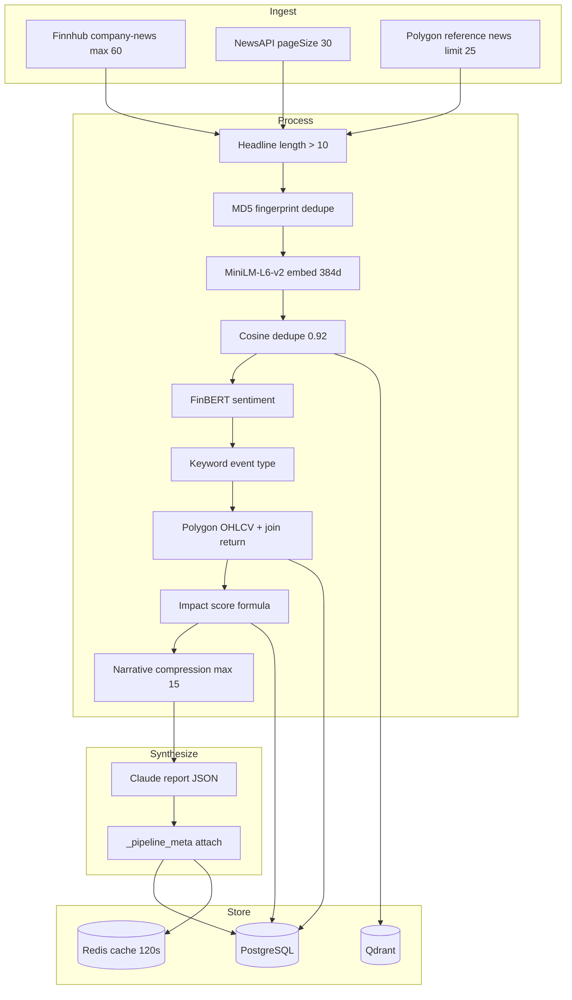
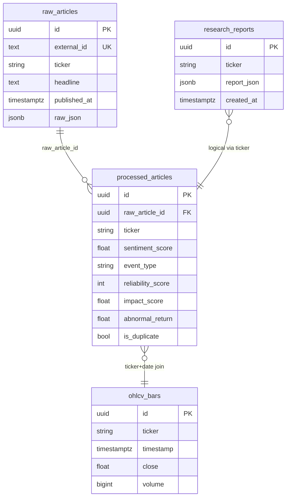
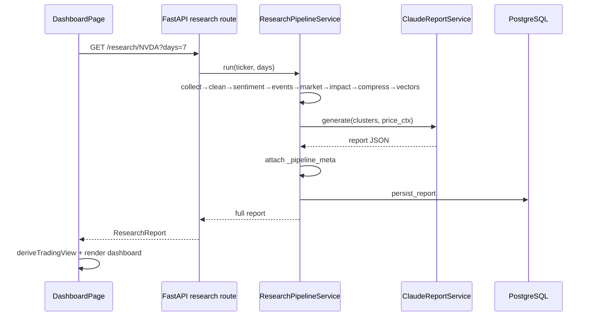
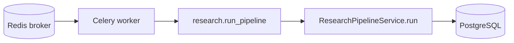
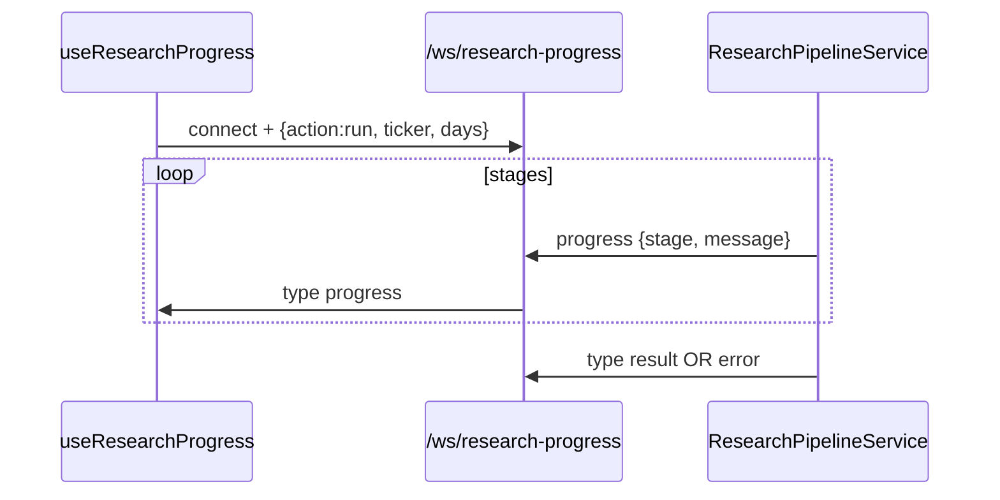

# Financial News Research Platform — Complete System Explainability

**Version audited:** API `4.0.0` · Modular backend `backend/app/` · Frontend `frontend/src/`  
**Audit date:** 2026-05-15  
**Purpose:** Full data lineage, calculation transparency, and UI-to-database mapping. No refactor implied.

---

## Table of Contents

1. [System Overview](#1-system-overview)
2. [UI Section Data Flows](#2-ui-section-data-flows)
3. [Calculation Encyclopedia](#3-calculation-encyclopedia)
4. [AI / LLM Explainability](#4-ai--llm-explainability)
5. [Event Pipeline (End-to-End)](#5-event-pipeline-end-to-end)
6. [Frontend Explainability](#6-frontend-explainability)
7. [Database Explainability](#7-database-explainability)
8. [Signal Engine (Desk Logic)](#8-signal-engine-desk-logic)
9. [Historical Analog Engine](#9-historical-analog-engine)
10. [Source Reliability Engine](#10-source-reliability-engine)
11. [Timeline Engine](#11-timeline-engine)
12. [Risk Engine](#12-risk-engine)
13. [Architecture Diagrams](#13-architecture-diagrams)
14. [Complete Code Map](#14-complete-code-map)
15. [Dead Code / Weak Logic Register](#15-dead-code--weak-logic-register)
16. [Glossary](#16-glossary)

**Modular deep-dives:** See [`docs/README.md`](docs/README.md) for the same material split by domain.

---

## 1. System Overview

### 1.1 What the platform does

On `GET /api/v1/research/{ticker}?days=N`, the backend:

1. Collects news from **Finnhub**, **NewsAPI**, and **Polygon Reference News**
2. Cleans, embeds, and **deduplicates** articles (sentence-transformers + cosine ≥ 0.92)
3. Scores sentiment with **FinBERT** (`ProsusAI/finbert`)
4. Assigns **event types** via keyword rules
5. Fetches **Polygon OHLCV**, joins same-day returns, computes **volatility regime**
6. Computes deterministic **impact scores**
7. **Compresses** narratives into clusters (max 15 to Claude)
8. **Upserts** vectors to **Qdrant** (384-dim cosine)
9. Synthesizes a JSON **research report** via **Anthropic Claude**
10. Attaches `_pipeline_meta` (evidence, price snapshot, top movers) and persists to PostgreSQL

The frontend renders a **10-panel trading desk** plus Evidence Deck from one `ResearchReport` object. Several desk metrics are **frontend-derived heuristics**, not backend formulas.

### 1.2 Critical architectural split

| Layer | Deterministic (code) | Probabilistic (LLM) | Frontend-only heuristics |
|-------|---------------------|---------------------|--------------------------|
| Sentiment | FinBERT | — | — |
| Impact score | Formula | — | — |
| Event type | Keyword rules | — | — |
| Volatility regime | Polygon returns | — | — |
| Narrative text | — | Claude | — |
| Confidence % | — | Claude `price_prediction.confidence` | Fallback: `abs(overall_sentiment_score)*100` |
| Trade quality | — | — | `deriveTradeDecision.ts` |
| NO TRADE | — | — | `deriveTradeDecision.ts` |
| News/price alignment | — | — | `deriveTradeDecision.ts` |
| Analogs (UI) | SQL by event_type | — | — |
| Vector analogs | Qdrant (unused by API) | — | — |

---

## 2. UI Section Data Flows

**Entry point:** `DashboardPage.tsx` → `useResearch.mutateAsync()` → `GET /api/v1/research/{ticker}?days=`

```
User → DashboardPage → useResearch → apiClient → FastAPI research.py
  → ResearchPipelineService.run() → [10 stages] → JSON report
  → setReport() → TradingIntelligenceDashboard
```

**Hooks that exist (not `useResearchQuery` / `useSignalMetrics`):**

| Hook | File | Endpoint |
|------|------|----------|
| `useResearch` | `frontend/src/hooks/useApi.ts` | `GET /research/{ticker}` |
| `useAnalogs` | same | `GET /analogs/{ticker}/{eventType}` |
| `useHistory` | same | `GET /history/{ticker}` |
| `useHealth` | same | `GET /health` |
| `useResearchProgress` | `frontend/src/hooks/useResearchProgress.ts` | WebSocket only |

---

### 2.1 Stock Snapshot

**UI:** `TradingIntelligenceDashboard.tsx` — Section `"1 · Stock snapshot"`

| Field displayed | Origin | Computation |
|-----------------|--------|-------------|
| Ticker | User input | Prop `ticker` |
| Last session % | `_pipeline_meta.price_snapshot.last_session_change_pct` | Backend: `(last_close - prior_close) / prior_close * 100` |
| Signal | `deriveTradingView().signal` | `price_prediction.bias` OR `overall_sentiment_label` |
| Confidence % | `deriveTradingView().signalConfidencePct` | Claude `confidence` OR `abs(overall_sentiment_score)*100` |
| Volatility | `price_prediction.volatility_regime` OR `_pipeline_meta.volatility_regime` | Backend `get_volatility_regime()` |
| News strength | `deriveTradingView().newsStrength` | Frontend heuristic (see §8) |
| Risk | `deriveTradingView().riskLevel` | Frontend heuristic (see §12) |
| Last close | `price_snapshot.last_close` | Polygon last bar |
| Volume vs 20d | `price_snapshot.volume_vs_avg` | `last_volume / avg(volume last 20 bars)` |
| Today importance | `isTodayImportant()` | Frontend: key_events count, articles_analyzed |
| data_mode | `report.data_mode` | LLM output (schema default `"real"`) |

**Data flow:**

```
TradingIntelligenceDashboard
  → useMemo(deriveTradingView)     [frontend/src/lib/deriveTradeDecision.ts]
  → getPriceSnapshot(report)       [frontend/src/lib/pipelineMeta.ts]
  → report.price_prediction        [Claude JSON]
  → report._pipeline_meta          [ResearchPipelineService.run post-process]
```

**Backend chain for price snapshot:**

```
polygon.py fetch_ohlcv → pipeline.py builds price_snapshot → report["_pipeline_meta"]
```

**Files:** `pipeline.py` L134-150, `polygon.py` L27-59

---

### 2.2 AI Market Summary

**UI:** Section `"2 · AI market summary"`

| Field | Source | Model |
|-------|--------|-------|
| `dominant_narrative` | Claude report JSON | Anthropic |
| `what_happened` | Claude | Anthropic |
| `price_movers` | Claude | Anthropic |
| `price_prediction.reasoning` | Claude | Anthropic |

**Data flow:**

```
NarrativeCompressionService.compress() → clusters[]
  → ClaudeReportService.generate(ticker, clusters, price_ctx)
  → report fields
  → TradingIntelligenceDashboard renders verbatim
```

**No frontend transformation** except empty-state message if fields missing.

**Prompt location:** Inline in `backend/app/services/llm/claude_report.py` (`SYSTEM_PROMPT`, `REPORT_SCHEMA`). No external `.md` prompt files.

---

### 2.3 Trade Decision Panel

**UI:** Section `"3 · Trade decision panel"`

| Field | Source |
|-------|--------|
| NO TRADE banner | `deriveTradingView().noTrade` — **frontend only** |
| Direction | `price_prediction.bias` |
| Expected move | `formatExpectedMove()` from `change_pct_low/high` — **Claude** |
| Momentum | `derived.momentumLabel` — maps vol regime → STRONG/QUIET/MODERATE |
| Vol regime | Backend + Claude |
| Inst. confidence | `signalConfidencePct` (see confidence) |
| Trade quality | `derived.tradeQuality` — **frontend grades A–C** |
| Strategy bullets | `derived.strategyBullets` — template text by bias/noTrade |

**Data flow:**

```
report → deriveTradingView() → Pills + strategy list
```

Backend does **not** compute trade quality or NO TRADE.

---

### 2.4 Why The Tape Is Moving

**UI:** Section `"4 · Why the tape is moving"`

| Field | Source |
|-------|--------|
| Catalyst list (top 8) | `report.key_events` sorted by `impact_score` desc |
| Impact label/score | Claude per-event in `key_events` |
| Event confidence block | Frontend: sources sharing `event_type` with top catalyst |

**Backend inputs to Claude clusters:** `impact_score`, `event_type`, `abnormal_return`, headlines.

**Event confidence (frontend):**

```typescript
// TradingIntelligenceDashboard.tsx — eventConfirm useMemo
// Filters article_evidence where event_type matches top key_events[0].type
// Lists distinct sources (max 8)
```

This is **multi-source echo detection**, not a statistical confidence score.

---

### 2.5 Source Stack

**UI:** Section `"5 · Source stack"`

| Field | Source |
|-------|--------|
| Source rows | `report.source_reliability[]` — **Claude aggregates** |
| Tier badge | `SourceBadge` infers tier from name regex OR uses Claude `tier` |
| Reliability score | Claude (should mirror backend constants when consistent) |
| Institutional/retail tone | `deriveTradingView()` from tier1/social averages |

**Backend ground truth for reliability (per article):**

```python
# constants.py SOURCE_RELIABILITY[source] or default 60
# cleaner.py assigns to ProcessedArticle.reliability_score
```

Claude may restate tiers in `source_reliability`; UI also re-infers via `SourceBadge.tsx` and `tierFromSourceName()` in `deriveTradeDecision.ts`.

---

### 2.6 News / Price Alignment

**UI:** Section `"6 · News / price alignment"`

**Entirely frontend-computed** in `deriveTradeDecision.ts`:

| Check | Logic |
|-------|-------|
| News bias | `price_prediction.bias` or overall sentiment |
| Price confirmation | Compare bias to `last_session_change_pct` and avg `abnormal_return` |
| Volume confirmation | `volume_vs_avg`: ≥1.15 YES, ≥0.9 WEAK, else NO |
| Momentum confirmation | vol regime × news strength heuristics |
| Conclusion | Count YES confirmations; special case bullish + price NO |

See [§8 Signal Engine](#8-signal-engine-desk-logic) for thresholds.

---

### 2.7 Historical Analogs

**UI:** Section `"7 · Historical analogs"`

```
DashboardPage
  → pickDominantEventType(report)   [pipelineMeta.ts — mode of event_type in evidence]
  → useAnalogs(ticker, eventType)
  → GET /api/v1/analogs/{ticker}/{event_type}
  → AnalogRepository.fetch_similar_events (SQL)
  → analogRows prop → dashboard list (max 5)
```

**SQL logic** (`analog_repository.py`):

```sql
SELECT headline, published_at, sentiment_score, impact_score, close, volume
FROM processed_articles p
LEFT JOIN ohlcv_bars o ON same ticker AND same calendar date
WHERE ticker = :ticker AND event_type = :event_type
ORDER BY impact_score DESC, published_at DESC
LIMIT 5
```

**NOT used:** `QdrantStoreService.find_historical_analogs()` (embedding similarity > 0.85).

---

### 2.8 Risk Panel

**UI:** Section `"8 · Risk panel"`

| Field | Source |
|-------|--------|
| `downside_risk` | Claude `price_prediction` |
| `upside_catalyst` | Claude |
| `data_quality_note` | Claude |
| Disclaimer | Claude (fallback string in UI) |
| Contradictory signals | `deriveTradingView().contradictory` — **frontend** |

---

### 2.9 Live Evidence Timeline

**UI:** Section `"9 · Live evidence timeline"` → `NewsTimeline`

| Field | Source |
|-------|--------|
| Articles | `_pipeline_meta.article_evidence` (max 60, sorted newest first in pipeline) |
| Timeline sort | `NewsTimeline` — newest first, limit 16 |
| Link-out | `row.url` from ingestion |

**Pipeline construction** (`pipeline.py` L152-166):

```python
article_evidence = [ {...} for a in sorted(unique, key=published_at, reverse=True)[:60] ]
```

Each row: headline, source, url, published_at, FinBERT scores, impact, reliability, event_type, abnormal_return.

---

### 2.10 Final Desk Verdict

**UI:** Section `"10 · Final desk verdict"`

| Field | Source |
|-------|--------|
| Bias + confidence | `pred.bias`, `derived.signalConfidencePct` |
| Why it matters bullets | `derived.whyImportant` — frontend templates + narrative |

---

### 2.11 Evidence Deck

**UI:** `"Evidence deck"` → `NewsCard` × 10

| Field | Source |
|-------|--------|
| Top 10 by impact | `article_evidence` sorted by `impact_score` desc |
| FinBERT label/score | Backend FinBERT |
| Impact band | `ImpactIndicator.tsx` thresholds |
| Reliability bar | `ReliabilityMeter.tsx` |
| AI summary line | `report.articles[].ai_summary` — **only if Claude populated**; matched by headline fuzzy match |
| Same-day return | `abnormal_return` — **misnamed**: actual daily close-to-close return |

**Headline match** (`findLlmArticle`): exact lowercase match, else substring overlap ≥40 chars.

---

## 3. Calculation Encyclopedia

### 3.1 Impact Score (deterministic)

**File:** `backend/app/services/impact_scoring/scorer.py`

\[
\text{impact\_score} = \min\Big(1,\; |s| \cdot \frac{r}{100} \cdot 2^{-age/3} \cdot w_{event} \cdot m_{vol}\Big)
\]

| Symbol | Meaning |
|--------|---------|
| \(s\) | `sentiment_score` ∈ [-1, 1] (FinBERT prob × direction) |
| \(r\) | `reliability_score` 0–100 |
| \(age\) | Days since `published_at` (UTC) |
| \(w_{event}\) | `EVENT_IMPACT_WEIGHTS[event_type]` or **0.5** |
| \(m_{vol}\) | high=1.3, medium=1.0, low=0.75, unknown=1.0 |

**Recency half-life:** 3 days.

**Rating:** GOOD — explicit, auditable, bounded [0,1].

---

### 3.2 Sentiment Score (FinBERT)

**File:** `backend/app/services/sentiment/finbert.py`

1. Text: `"{headline}. {content[:300]}"`
2. Tokenize max_length=512, batch=16
3. Softmax → pick argmax class
4. `sentiment_score = round(prob_best * direction, 3)`
   - positive → Bullish, +1
   - negative → Bearish, -1
   - neutral → 0

**Not** a compound bullish/bearish index across articles until Claude aggregates.

---

### 3.3 Volatility Regime

**File:** `backend/app/services/market/polygon.py` — `get_volatility_regime(bars, window=10)`

\[
\text{avg\_move} = \text{mean}\left(\left|\frac{C_i - C_{i-1}}{C_{i-1}}\right| \times 100\right)
\]

| Condition | Regime |
|-----------|--------|
| avg_move > 3% | high |
| avg_move > 1.5% | medium |
| else | low |
| < 2 bars | unknown |

Used in impact multiplier and shown in UI.

---

### 3.4 Abnormal Return (misnomer)

**File:** `polygon.py` — `join_price_to_articles`

```python
abnormal_return = returns[published_date]  # same-day close-to-close %
```

**Not** market-model abnormal return (no beta, no SPY adjustment).  
**Rating:** NEEDS IMPROVEMENT — label misleads quants and Claude.

---

### 3.5 Deduplication

**File:** `backend/app/services/embeddings/cleaner.py`

1. Drop headlines ≤10 chars
2. MD5 fingerprint dedupe: `md5(headline + source)`
3. Embed: `all-MiniLM-L6-v2`, L2-normalized, 384-d
4. Pairwise cosine > `dedupe_threshold` (default **0.92**)
   - Keep higher `reliability_score`
   - Mark other `is_duplicate=True`

Qdrant path: search top-3 neighbors; if score > threshold and different article_id → duplicate.

---

### 3.6 Narrative Compression

**File:** `backend/app/services/compression/narrative.py`

- Group by `(event_type, sentiment_label)`
- Cluster `sentiment_score` = mean; `impact_score` = max
- Sort clusters by impact desc; take top `max_articles_claude` (**15**)

---

### 3.7 Confidence Score

| Source | When |
|--------|------|
| `price_prediction.confidence` (int) | Claude synthesis — **primary in UI** |
| `abs(overall_sentiment_score) * 100` | Fallback if Claude field missing |

**There is no backend formula** like `0.35*sentiment + 0.25*reliability + ...`.

**Rating:** HIGH RISK for desk — confidence looks quantitative but is LLM-judgment unless fallback.

---

### 3.8 Trade Quality (frontend only)

**File:** `frontend/src/lib/deriveTradeDecision.ts`

| Grade | Conditions |
|-------|------------|
| NO TRADE | `noTrade` true |
| A | conf ≥ 85, no contradictions |
| A- | conf ≥ 78, news STRONG, no contradictions |
| B+ | conf ≥ 70 |
| B | default |
| C | conf < 45 |

**noTrade:** `Mixed` sentiment AND conf < 48 AND newsStrength ≠ STRONG

**Rating:** NEEDS IMPROVEMENT — presents as institutional grade; purely heuristic.

---

### 3.9 News Strength (frontend)

```typescript
avgImpact = mean(top_impact_events[].impact)
STRONG: articles_analyzed >= 40 AND avgImpact > 0.35
MODERATE: articles_analyzed >= 15 OR avgImpact > 0.25
else WEAK
```

---

### 3.10 Event Type (rules)

**File:** `backend/app/services/event_extraction/rules.py`

Keyword hit counts per category; winner if count > 0. No ML.

**Weakness:** "buy" in Analyst list false-positives; Supply Chain has TSMC-specific terms.

---

### 3.11 Expected Move

Claude outputs `change_pct_low`, `change_pct_high` in `price_prediction`.  
`formatExpectedMove()` displays min–max range. **Not** implied vol or options-derived.

---

### 3.12 Analog Similarity

**API path (used):** SQL filter `event_type` + sort `impact_score` — **not cosine similarity**.

**Qdrant path (unused):** cosine > **0.85**, same ticker filter in `find_historical_analogs`.

---

## 4. AI / LLM Explainability

### 4.1 Model & API

| Setting | Default | Env |
|---------|---------|-----|
| Model | `claude-sonnet-4-6` | `ANTHROPIC_MODEL` |
| Base URL | `https://api.anthropic.com` | `ANTHROPIC_BASE_URL` |
| max_tokens | 4000 | hardcoded |
| Retries | 3× on `aiohttp.ClientError` | exponential 2–15s |

### 4.2 Orchestration sequence

```
clusters[] + price_ctx → user message JSON
  → POST /v1/messages (system=SYSTEM_PROMPT)
  → strip ``` fences → json.loads → json_repair fallback
  → dict merged into report
```

### 4.3 System prompt responsibilities

- Synthesize narrative (do **not** re-score sentiment)
- Explain price movers using `abnormal_return` when present
- Output **only** JSON matching `REPORT_SCHEMA`
- Escape quotes in strings

### 4.4 Context passed to Claude

**User message contains:**

1. Ticker
2. `price_ctx`: last_close, volatility_regime, recent_returns (last 7 days), avg_daily_vol_pct
3. Up to 15 clusters with: event_type, sentiment, impact_score, headlines, abnormal_return, reliability
4. Full schema template

**Token drivers:** cluster count capped at 15; each cluster includes up to 3 headlines.

### 4.5 Hallucination protections (actual)

| Protection | Status |
|------------|--------|
| Pre-computed sentiment/impact | YES — prompt forbids re-score |
| Grounded clusters only | YES |
| JSON schema enforcement | Soft — repair parser, no jsonschema validate |
| Source URL verification | UI link-out only |
| Deterministic confidence | NO |

### 4.6 Fallback behavior

- Market fetch failure → `vol_regime = "medium"`, price_ctx error field
- Collector source failure → other sources still run (`asyncio.gather` with exceptions)
- JSON parse failure → `json_repair.loads`; else 500

### 4.7 OpenAI

**Not used** in modular backend. Anthropic only.

---

## 5. Event Pipeline (End-to-End)



### Stage table

| Stage ID | Service | Persists |
|----------|---------|----------|
| collect | NewsCollectorService | raw_articles |
| clean | NewsCleanerService | — |
| sentiment | SentimentService | — |
| events | EventExtractionService | — |
| market | MarketDataService | ohlcv_bars |
| impact | EventImpactScoringService | processed_articles |
| compress | NarrativeCompressionService | — |
| vectors | QdrantStoreService | Qdrant points |
| report | ClaudeReportService | research_reports |
| done | — | Redis `research:last:{ticker}` |

---

## 6. Frontend Explainability

### 6.1 Component tree

```
main.tsx (QueryClientProvider)
└── App.tsx → RouterProvider
    └── RootLayout (useThemeStore → html.dark)
        └── DashboardPage
            ├── HealthStrip → useHealth
            ├── Controls → useResearch / useResearchProgress
            ├── History → useHistory
            └── TradingIntelligenceDashboard (10 sections + evidence + charts)
```

### 6.2 State flow

| State | Location | Set by |
|-------|----------|--------|
| `report` | `DashboardPage` useState | HTTP run, history click |
| `ticker`, `days` | useState | User input |
| Theme | Zustand `useThemeStore` | Toggle button |
| Derived desk metrics | useMemo in dashboard | `deriveTradingView(report)` |

**WebSocket run does not set `report`** — progress only.

### 6.3 React Query

| Key | staleTime | enabled |
|-----|-----------|---------|
| `["health"]` | 15s | always |
| `["history", ticker]` | default | ticker non-empty |
| `["analogs", ticker, eventType]` | default | report exists |
| mutation `["research", ticker, days]` | — | on Run HTTP |

### 6.4 Color logic summary

| Component | Rule |
|-----------|------|
| Pill ok/warn/bad | session %, risk HIGH, trade NO TRADE |
| SourceBadge | Tier 1 emerald, 2 sky, 3 amber, Social violet |
| ImpactIndicator | ≥0.45 HIGH rose, ≥0.22 MED amber |
| Sentiment text | bull emerald, bear rose |

### 6.5 Charts (`ResearchReportCharts.tsx`)

Optional collapsed section; uses Recharts on `sentiment_breakdown`, `key_events`, `source_reliability`, `articles`, `price_prediction` bands.

---

## 7. Database Explainability

### 7.1 ER diagram



### 7.2 Qdrant collection

| Property | Value |
|----------|-------|
| Name | `article_embeddings` (configurable) |
| Dimensions | 384 |
| Distance | COSINE |
| Payload | article_id, ticker, headline, source, published_at, sentiment, event_type, impact_score |

### 7.3 Caching

| Key | TTL | Purpose |
|-----|-----|---------|
| `research:last:{TICKER}` | 120s | Last report JSON in Redis |

### 7.4 Indexes (Alembic 0001)

- `idx_processed_ticker_date`
- `idx_ohlcv_ticker_ts`
- `idx_reports_ticker`

---

## 8. Signal Engine (Desk Logic)

All in `deriveTradeDecision.ts` unless noted.

### 8.1 Why bullish/bearish/mixed

- **Backend:** FinBERT per article; Claude sets `overall_sentiment_label` and `price_prediction.bias`
- **UI Signal pill:** prefers `price_prediction.bias`, else `overall_sentiment_label`

### 8.2 Why confidence low/high

- Primary: Claude integer `confidence` (opaque reasoning)
- Fallback: magnitude of `overall_sentiment_score`
- Trade grades threshold at 45, 70, 78, 85

### 8.3 Why trade quality B vs C

- C if conf < 45
- B default middle ground
- Upgrades need high conf + STRONG news + zero contradictory flags

### 8.4 Why "mixed"

Claude outputs `overall_sentiment_label: "Mixed"` when bull/bear clusters balance in synthesis.

### 8.5 Why NO TRADE

```typescript
mixed && conf < 48 && newsStrength !== "STRONG"
```

### 8.6 Contradictory signal rules

1. Bullish bias + `change_pct_base` < -0.5
2. Bearish bias + `change_pct_base` > 0.5
3. Bullish label + last session red
4. STRONG news + volume_vs_avg < 0.85

---

## 9. Historical Analog Engine

### 9.1 What the UI shows

SQL rows: same ticker + same `event_type` as dominant type in evidence, ranked by impact.

### 9.2 Dominant event type

```typescript
// pipelineMeta.pickDominantEventType — plurality vote in article_evidence
// fallback: first key_events[].type
```

### 9.3 Unused vector analogs

`find_historical_analogs(embedding, ticker)`:

- Search global top `limit*3`
- Filter `payload.ticker == ticker` AND `score > 0.85`

**Would be better for semantic similarity** but not wired to `/analogs`.

### 9.4 Bad analog causes

| Issue | Cause |
|-------|-------|
| Wrong event bucket | Keyword misclassification |
| Same headline repeated | Dedupe failed (<0.92 similarity) |
| High impact but irrelevant | Keyword event weights |
| No semantic match in SQL path | event_type equality only |

**Rating:** NEEDS IMPROVEMENT — label "Historical analogs" implies embedding similarity; implementation is SQL filter.

---

## 10. Source Reliability Engine

### 10.1 Backend table (`constants.py`)

| Source | Score |
|--------|-------|
| SEC Filing | 98 |
| Reuters | 92 |
| Bloomberg | 91 |
| WSJ | 88 |
| Financial Times | 87 |
| AP | 86 |
| CNBC | 78 |
| Yahoo Finance | 72 |
| MarketWatch | 70 |
| Seeking Alpha | 58 |
| Reddit | 35 |
| Twitter/X | 30 |
| **Unknown** | **60** |

Assigned at clean stage: `SOURCE_RELIABILITY.get(source, 60)`.

### 10.2 Why Reuters > Yahoo

Hardcoded editorial trust prior — not learned from outcomes.

### 10.3 Impact on scores

Reliability enters impact formula linearly: `rel_weight = score/100`.

Dedupe tie-break: keep higher reliability article.

### 10.4 Multi-source confirmation

Frontend `eventConfirm` and `whyImportant` count distinct sources — not a backend score.

---

## 11. Timeline Engine

### 11.1 Ordering

1. Pipeline: unique articles, `published_at` descending, cap 60 → `article_evidence`
2. `NewsTimeline`: sort newest first, `limit=16`

### 11.2 Impact in timeline

Display only — sorting is **time-first**, not impact-first.

### 11.3 Timestamp normalization

- Collectors: UTC from API timestamps
- Display: browser `toLocaleTimeString`

### 11.4 Duplicate suppression

Backend `is_duplicate` excludes dupes from `unique` list in evidence.

---

## 12. Risk Engine

### 12.1 LLM risks

`downside_risk`, `upside_catalyst` — free text from Claude.

### 12.2 Frontend risk level

```typescript
mixed + high vol → HIGH
high vol alone → MEDIUM
mixed alone → MEDIUM
low vol → LOW
else MEDIUM
```

### 12.3 Contradictory / weak tape / low volume

See §8.6 — all frontend rules.

### 12.4 Overbought

**Not implemented** — no RSI/overbought logic in codebase.

---

## 13. Architecture Diagrams

### 13.1 System context

```mermaid
C4Context
  title System Context
  Person(trader, "Desk User")
  System(platform, "FinResearch Platform")
  System_Ext(finnhub, "Finnhub")
  System_Ext(newsapi, "NewsAPI")
  System_Ext(polygon, "Polygon")
  System_Ext(anthropic, "Anthropic")
  SystemDb(pg, "PostgreSQL")
  SystemDb(qdrant, "Qdrant")
  SystemDb(redis, "Redis")
  trader --> platform
  platform --> finnhub
  platform --> newsapi
  platform --> polygon
  platform --> anthropic
  platform --> pg
  platform --> qdrant
  platform --> redis
```

### 13.2 Request sequence (HTTP research)



### 13.3 Celery worker flow



**Note:** HTTP route runs pipeline **inline**; Celery task exists but is not called from routes.

### 13.4 WebSocket flow



WS path does not use Redis cache; builds fresh pipeline instance.

---

## 14. Complete Code Map

### 14.1 Backend — file purposes

| File | Purpose | Inputs | Outputs |
|------|---------|--------|---------|
| `main.py` | FastAPI app, lifespan, metrics | env | HTTP app |
| `api/v1/routes/research.py` | Research endpoint | ticker, days | report JSON |
| `api/v1/routes/analogs.py` | Analog endpoint | ticker, event_type | SQL rows |
| `api/v1/routes/history.py` | Past reports | ticker, limit | metadata + json |
| `api/v1/routes/websocket.py` | Progress stream | WS message | progress events |
| `services/orchestration/pipeline.py` | Orchestrator | ticker, days | report + meta |
| `services/collectors/news_collector.py` | Multi-source fetch | ticker, window | RawArticle[] |
| `services/embeddings/cleaner.py` | Dedupe + embed | RawArticle[] | ProcessedArticle[] |
| `services/sentiment/finbert.py` | Sentiment | ProcessedArticle[] | scored articles |
| `services/event_extraction/rules.py` | Event typing | articles | event_type field |
| `services/market/polygon.py` | OHLCV + joins | ticker | bars, returns |
| `services/impact_scoring/scorer.py` | Impact | articles, vol regime | impact_score |
| `services/compression/narrative.py` | LLM input clusters | articles | cluster dicts |
| `services/llm/claude_report.py` | Report synthesis | clusters, price_ctx | report dict |
| `services/qdrant/store.py` | Vector CRUD | embeddings | search results |
| `db/repositories/persistence_repository.py` | Writes | ORM models | DB rows |
| `db/repositories/analog_repository.py` | Analog SQL | ticker, type | rows |
| `core/constants.py` | Reliability + event weights | — | lookup dicts |
| `workers/tasks/research.py` | Celery entry | ticker | async run |

### 14.2 Frontend — file purposes

| File | Purpose |
|------|---------|
| `pages/DashboardPage.tsx` | Shell, run controls, report state |
| `components/trading/TradingIntelligenceDashboard.tsx` | All 10 desk sections |
| `lib/deriveTradeDecision.ts` | Trade quality, alignment, NO TRADE |
| `lib/pipelineMeta.ts` | Access `_pipeline_meta` |
| `hooks/useApi.ts` | React Query HTTP |
| `hooks/useResearchProgress.ts` | WebSocket progress |
| `types/schemas.ts` | Zod validation |
| `components/news/NewsCard.tsx` | Evidence row |
| `components/news/NewsTimeline.tsx` | Timeline |
| `components/dashboard/ResearchReportCharts.tsx` | Optional charts |

---

## 15. Dead Code / Weak Logic Register

| Item | Location | Rating | Notes |
|------|----------|--------|-------|
| `find_historical_analogs` | qdrant/store.py | NEEDS IMPROVEMENT | Not called by API |
| `compute_intraday_volatility` result | polygon.py | DEAD | `del vol` in join |
| `event_impact_scores` table | legacy v3 only | DEAD | Not in Alembic |
| `pipeline_runs` table | legacy v3 | DEAD | Unused |
| `ArticleDrawer` | frontend | DEAD | returns null |
| `quant/interfaces.py` | backend | STUB | Placeholder interfaces |
| Celery from HTTP | routes | NEEDS IMPROVEMENT | Task exists, not enqueued |
| Confidence as LLM int | claude_report | HIGH RISK | Looks quantitative |
| Trade quality A/B/C | deriveTradeDecision | HIGH RISK | Not backtested |
| `abnormal_return` naming | polygon.py | NEEDS IMPROVEMENT | Plain daily return |
| Keyword event extraction | rules.py | NEEDS IMPROVEMENT | False positives |
| SQL "analogs" | analog_repository | NEEDS IMPROVEMENT | Not embedding-based |
| Sector/SPY notes | deriveTradeDecision | GOOD | Honest "not wired" |
| Impact formula | scorer.py | GOOD | Deterministic |
| FinBERT pipeline | finbert.py | GOOD | Standard model |
| Dedupe 0.92 | cleaner.py | GOOD | Tunable threshold |
| json_repair fallback | claude_report | GOOD | Production hardening |
| Source reliability constants | constants.py | GOOD | Explicit priors |
| Dual tier inference | SourceBadge + Claude | NEEDS IMPROVEMENT | Can disagree |

---

## 16. Glossary

| Term | Definition |
|------|------------|
| **Cluster** | Group of articles sharing event_type + sentiment_label for LLM input |
| **Impact score** | Deterministic [0,1] article importance |
| **Evidence** | `article_evidence` rows in `_pipeline_meta` |
| **Vol regime** | high/medium/low from recent daily % moves |
| **Desk derivation** | Frontend `deriveTradingView` heuristics |
| **Analog (UI)** | SQL match on event_type, not embedding neighbor |
| **NO TRADE** | Frontend stand-aside flag, not broker order |

---

## Appendix A — Environment variables

| Variable | Role |
|----------|------|
| `FINNHUB_API_KEY` | Company news |
| `NEWSAPI_KEY` | Everything search |
| `POLYGON_API_KEY` | News + OHLCV |
| `ANTHROPIC_API_KEY` | Report synthesis |
| `DATABASE_URL` | PostgreSQL async |
| `REDIS_URL` | Cache + rate limit |
| `QDRANT_HOST/PORT` | Vector store |
| `EMBED_MODEL` | Default all-MiniLM-L6-v2 |
| `FINBERT_MODEL` | Default ProsusAI/finbert |
| `DEDUPE_THRESHOLD` | Default 0.92 |
| `MAX_ARTICLES_CLAUDE` | Default 15 |

---

## Appendix B — API routes

| Method | Path | Handler file |
|--------|------|--------------|
| GET | `/api/v1/health` | health.py |
| GET | `/api/v1/ready` | health.py |
| GET | `/api/v1/research/{ticker}` | research.py |
| GET | `/api/v1/history/{ticker}` | history.py |
| GET | `/api/v1/analogs/{ticker}/{event_type}` | analogs.py |
| GET | `/api/v1/admin/info` | admin.py |
| WS | `/api/v1/ws/research-progress` | websocket.py |
| GET | `/metrics` | main.py |

---

*End of master document. For domain-split copies see `docs/`.*
