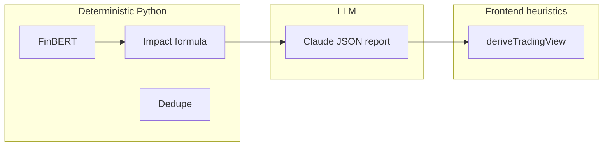

# System Architecture Overview

See also: [`../../detail_docs.md`](../../detail_docs.md) §1, §13

## Components

| Layer | Technology | Path |
|-------|------------|------|
| API | FastAPI 4.x | `backend/app/main.py` |
| Worker | Celery + Redis | `backend/app/workers/` |
| DB | PostgreSQL (async SQLAlchemy) | `backend/app/db/` |
| Vectors | Qdrant 384-d cosine | `backend/app/services/qdrant/store.py` |
| Cache | Redis JSON 120s | `backend/app/services/cache/redis_cache.py` |
| UI | React + Vite + TanStack Query | `frontend/src/` |

## Docker services (`docker-compose.yml`)

- `api` — Uvicorn on :8000
- `postgres`, `redis`, `qdrant`
- `celery-worker` — `research.run_pipeline` task
- `frontend` — Vite dev proxy `/api` → API

## Trust boundaries

**Rule of thumb:** Anything labeled confidence, trade quality, or alignment on the desk is either Claude or `deriveTradeDecision.ts` — verify before treating as quant signal.
