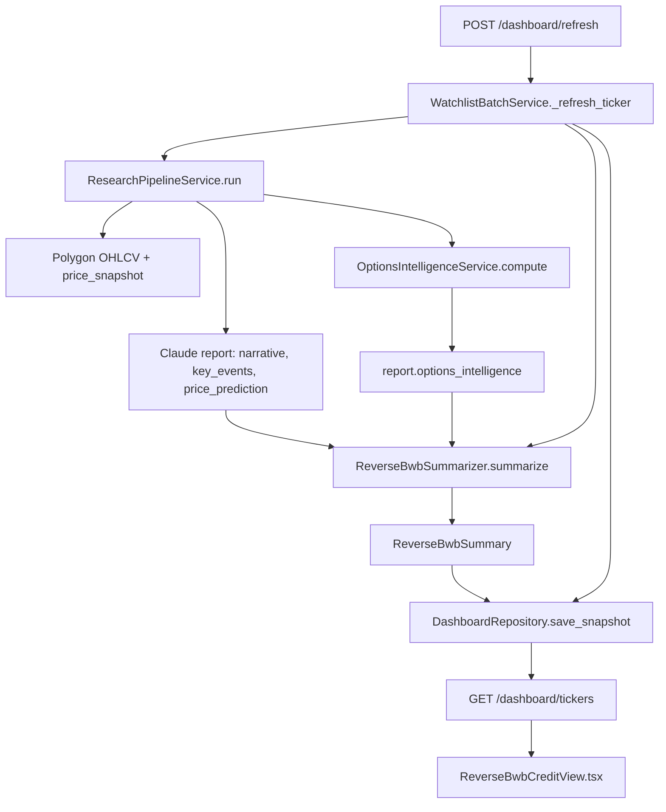
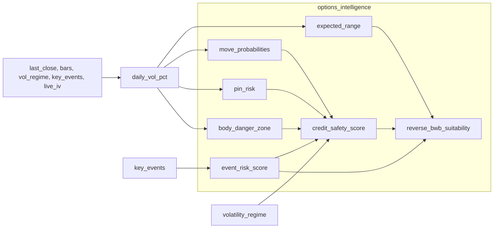

# Reverse BWB Credit View — Field Audit

This document traces every field shown in the dashboard **Reverse BWB Credit View** (Section 2 of each ticker card) from raw data sources through deterministic calculations, LLM synthesis, database persistence, API delivery, and frontend rendering.

Use it to audit any watchlist ticker (SPY, QQQ, NVDA, etc.) or to verify that displayed values match underlying logic.

---

## Table of contents

1. [Executive summary](#1-executive-summary)
2. [Trigger and orchestration](#2-trigger-and-orchestration)
3. [Upstream data sources](#3-upstream-data-sources)
4. [Layer 1 — Deterministic options_intelligence](#4-layer-1--deterministic-options_intelligence)
5. [Layer 2 — LLM ReverseBwbSummary synthesis](#5-layer-2--llm-reversebwbsummary-synthesis)
6. [Field-by-field audit table](#6-field-by-field-audit-table)
7. [SPY worked example](#7-spy-worked-example)
8. [Persistence and API read path](#8-persistence-and-api-read-path)
9. [Known gaps and audit flags](#9-known-gaps-and-audit-flags)
10. [How to re-run and verify](#10-how-to-re-run-and-verify)
11. [Appendix — Related but separate surfaces](#11-appendix--related-but-separate-surfaces)

---

## 1. Executive summary

### Architecture in one sentence

Each Credit View card is **pre-computed during batch refresh**, not at read time: the research pipeline produces deterministic options math, an Anthropic LLM maps that into trader-facing labels, and the result is stored in Postgres until the next refresh.

### Two layers

| Layer | What it does | Where it lives |
|-------|--------------|----------------|
| **Layer 1 — Deterministic** | Volatility, ranges, probabilities, pin/body/event risk, credit safety score | `backend/app/services/options/` |
| **Layer 2 — LLM synthesis** | Decision, outlooks, chance buckets, formatted strings, dynamics narrative | `backend/app/services/dashboard/reverse_bwb_summarizer.py` + prompt |

### Important distinction

The dashboard Credit View uses **`ReverseBwbSummary`** (LLM trader card). The full report page at `/report/:ticker` uses a different object — **`options_intelligence.reverse_bwb`** (quantitative suitability score, wing width, DTE). Same underlying math, different presentation layer.

### End-to-end flow



### Deterministic submodule dependency graph



---

## 2. Trigger and orchestration

### Entry points

| Trigger | Endpoint / config | Handler |
|---------|-------------------|---------|
| Manual refresh all | `POST /api/v1/dashboard/refresh` | `WatchlistBatchService.run_once()` |
| Manual refresh one ticker | `POST /api/v1/dashboard/refresh/{ticker}` | `WatchlistBatchService.run_single()` |
| Auto on startup | `WATCHLIST_AUTO_RUN_ON_STARTUP=true` | `asyncio.create_task(batch.run_once())` in app lifespan |

**Source:** [`backend/app/services/dashboard/watchlist_batch.py`](../backend/app/services/dashboard/watchlist_batch.py)

### Per-ticker refresh sequence

For each ticker, `_refresh_ticker()` runs these steps **sequentially** (no parallel ticker processing):

1. **`ResearchPipelineService.run(ticker, days=WATCHLIST_RUN_DAYS, persist=True)`**
   - Collects news, runs sentiment, calls Claude for narrative report
   - Fetches Polygon OHLCV bars and price snapshot
   - Optionally fetches live ATM IV from options chain
   - Computes `report["options_intelligence"]` via `OptionsIntelligenceService`
   - Persists full report to `research_reports` table

2. **`ReverseBwbSummarizer.summarize(ticker, report)`**
   - Builds token-budgeted context from report
   - Calls Anthropic with forced tool `emit_reverse_bwb_summary`
   - Validates response against `ReverseBwbSummary` Pydantic schema

3. **`PlaceholderOpportunitySource.generate(ticker, report)`**
   - Builds Section 3 option opportunity rows (separate from Credit View)

4. **`DashboardRepository.save_snapshot(...)`**
   - UPSERT `ticker_reports` (latest report JSON per ticker)
   - UPSERT `ticker_reverse_bwb_summary` (Credit View payload)
   - DELETE + INSERT `ticker_option_opportunities`

### Failure isolation

Any exception in steps 1–4:

- Ticker added to batch `failed` list
- `DashboardRepository.mark_failed(ticker, error)` sets status `failed`
- **Stale summary and opportunities are deleted** so the UI shows empty state instead of yesterday's data
- Batch continues to the next ticker

### Watchlist order

12 tickers run in tier order defined in [`backend/app/services/dashboard/watchlist.py`](../backend/app/services/dashboard/watchlist.py):

```
SPY → QQQ → IWM → DIA → AAPL → MSFT → AMZN → GOOGL → NVDA → TSLA → AMD → META
```

Tier 1 = index ETFs, Tier 2 = mega-cap tech, Tier 3 = high-beta growth.

---

## 3. Upstream data sources

All Credit View fields ultimately depend on inputs gathered during `ResearchPipelineService.run`.

### Market data

| Input | JSON path | Source | Computation |
|-------|-----------|--------|-------------|
| `last_close` | `_pipeline_meta.price_snapshot.last_close` | Polygon OHLCV | Most recent bar close |
| `daily_change_pct` | `_pipeline_meta.price_snapshot.daily_change_pct` | Polygon OHLCV | Today vs prior close % change (card header only) |
| `bars` | In-memory during pipeline | `MarketDataService.fetch_ohlcv` | Historical daily bars |
| `volatility_regime` | `_pipeline_meta.volatility_regime` | `MarketDataService.get_volatility_regime(bars)` | Avg abs daily move over last **10** bars: `>3%` → `high`, `>1.5%` → `medium`, else `low` |

**Source:** [`backend/app/services/market/polygon.py`](../backend/app/services/market/polygon.py)

Realized daily vol for options math uses a **20-bar** window (same absolute-move formula), which may differ slightly from the 10-bar regime label.

### News / narrative (Claude report)

| Input | JSON path | Used for |
|-------|-----------|----------|
| `key_events` | `report.key_events` | Event risk score; dynamics summary context |
| `price_prediction` | `report.price_prediction` | Today / next 3d outlook rules |
| `what_happened`, `dominant_narrative`, `executive_summary` | Top-level report keys | Dynamics summary; LLM context |
| `overall_sentiment_score/label` | Top-level report keys | Dynamics summary tone |
| `articles_analyzed` | `report.articles_analyzed` | Confidence label; data-quality penalty |
| `data_mode`, `data_quality_note` | Report metadata | Confidence label; range confidence penalty |

### Live implied volatility (optional)

| Input | Source | Gate |
|-------|--------|------|
| `live_iv_pct` | `OptionsChainService.fetch_atm_iv_pct(ticker, target_dte=OPTIONS_DEFAULT_HORIZON_DAYS)` | Only when `OPTIONS_USE_LIVE_IV=true` |

Providers: Polygon (default) or Tradier via `OPTIONS_CHAIN_PROVIDER`.

**Source:** [`backend/app/services/market/options_chain.py`](../backend/app/services/market/options_chain.py)

On failure or when disabled, the pipeline falls back to realized vol from bars. `source` in `options_intelligence` becomes `"realized_vol"` instead of `"live_iv"`.

### Environment configuration

From [`backend/app/core/config.py`](../backend/app/core/config.py) and [`backend/.env.example`](../backend/.env.example):

| Variable | Default | Effect on Credit View |
|----------|---------|----------------------|
| `OPTIONS_ENABLED` | `true` | If false, no `options_intelligence` block |
| `OPTIONS_DEFAULT_HORIZON_DAYS` | `3` | Horizon for range, probabilities, pin/body |
| `OPTIONS_USE_LIVE_IV` | `false` | Live IV vs realized vol |
| `OPTIONS_CHAIN_PROVIDER` | `polygon` | IV data source |
| `OPTIONS_CREDIT_SAFETY_WEIGHTS` | `{}` (use defaults) | Override credit safety component weights |
| `REVERSE_BWB_SUMMARY_ENABLED` | `true` | Disable → summarizer raises, ticker fails |
| `REVERSE_BWB_SUMMARY_MODEL` | `claude-sonnet-4-6` | Anthropic model for card synthesis |
| `REVERSE_BWB_SUMMARY_MAX_TOKENS` | `1500` | LLM output budget |
| `ANTHROPIC_API_KEY` | — | Required for summarizer |
| `WATCHLIST_RUN_DAYS` | `7` | News lookback window for pipeline |
| `WATCHLIST_AUTO_RUN_ON_STARTUP` | `false` | Auto batch on server start |

---

## 4. Layer 1 — Deterministic options_intelligence

**Orchestrator:** [`backend/app/services/options/service.py`](../backend/app/services/options/service.py) → `OptionsIntelligenceService.compute`

**Attached to report at:** `report["options_intelligence"]` during pipeline stage in [`backend/app/services/orchestration/pipeline.py`](../backend/app/services/orchestration/pipeline.py) (lines ~231–257).

**Schema:** [`backend/app/services/options/schemas.py`](../backend/app/services/options/schemas.py) → `OptionsIntelligence`

### Volatility selection

```python
if live_iv_pct > 0:
    daily_vol_pct = live_iv_pct / sqrt(252)   # annualized IV → daily %
    source = "live_iv"
else:
    daily_vol_pct = mean(abs daily % moves, last 20 bars)  # fallback 1.5%
    source = "realized_vol"
```

### Data-quality penalty

Applied to **expected range confidence** (not credit safety score directly):

| Condition | Penalty |
|-----------|---------|
| `data_mode != "real"` | +0.15 |
| `articles_analyzed < 10` | +0.10 |
| Maximum | 0.30 |

### 4.1 Expected range

**File:** [`backend/app/services/options/expected_range.py`](../backend/app/services/options/expected_range.py)

```
sigma_pct = max(daily_vol_pct, 0.05) * sqrt(horizon_days)
pct_move  = (z * sigma_pct) / 100          # z = 1.0 (1-sigma band)
low       = round(last_close * (1 - pct_move), 2)
high      = round(last_close * (1 + pct_move), 2)
confidence = base_conf(z) - data_quality_penalty   # base 0.68 for z=1
```

**Outputs used by Credit View:** `low`, `high`, `sigma_pct` (via LLM for IV Quality and Risk).

### 4.2 Move probabilities

**File:** [`backend/app/services/options/probability.py`](../backend/app/services/options/probability.py)

Log-normal, driftless model: `ln(S_T/S_0) ~ N(0, σ²T)` where `σ = daily_vol_pct/100 * sqrt(horizon_days)`.

| Output | Meaning |
|--------|---------|
| `p_up_2pct`, `p_dn_2pct` | One-sided tail P(return ≥ ±2%) |
| `p_up_3pct`, `p_dn_3pct` | One-sided tail P(return ≥ ±3%) — **used for Chance Up/Down labels** |
| `p_in_range_1sigma` | P(return within ±σ_horizon) — **credit safety prob_block input** |

### 4.3 Pin risk

**File:** [`backend/app/services/options/pin_risk.py`](../backend/app/services/options/pin_risk.py)

1. Find nearest round strike among steps `(5, 10)` to `last_close`
2. `distance_pct = |price - nearest_round| / price * 100`
3. `sigma_horizon_pct = max(daily_vol_pct * sqrt(horizon_days), 0.05)`
4. `ratio = distance_pct / sigma_horizon_pct`

| Label | Condition | Score range |
|-------|-----------|-------------|
| High | ratio ≤ 0.3 | 0.85 – 1.0 |
| Medium | ratio ≤ 0.7 | ~0.45 – 0.85 |
| Low | else | ~0.0 – 0.30 |

Higher score = worse pin risk (spot hugging a round-number magnet relative to expected move).

### 4.4 Body danger zone

**File:** [`backend/app/services/options/body_danger.py`](../backend/app/services/options/body_danger.py)

Approximates the Reverse BWB short-strike "body" as a band centered on spot:

```
half_width = 0.6 * sigma_horizon_pct / 100
short_body_lo = last_close * (1 - half_width)
short_body_hi = last_close * (1 + half_width)
in_body_ratio = 1 - min(distance_from_center / half_band, 1.0)
```

| Label | Condition |
|-------|-----------|
| High | `in_body_ratio >= 0.7` (spot near center of body) |
| Medium | `in_body_ratio >= 0.35` |
| Low | else |

For credit safety, body danger is mapped to a 0..1 "badness" score in the orchestrator:

- Low → 0.15
- Medium → 0.5
- High → 0.85

### 4.5 Event risk

**File:** [`backend/app/services/options/event_risk.py`](../backend/app/services/options/event_risk.py)

Scans up to 10 `key_events` from the Claude report:

- **High-impact tokens** in event text: `earnings`, `fomc`, `fed`, `cpi`, `guidance`, `merger`, `acquisition`, `fda`
- Weight from `impact_score` or `impact` label (high/med/low)
- Optional calendar hooks (`days_to_next_earnings`, `fomc_distance_days`) exist but are **not wired** today

| Label | Score |
|-------|-------|
| High | ≥ 0.65 |
| Medium | ≥ 0.35 |
| Low | < 0.35 |

### 4.6 Credit safety score

**File:** [`backend/app/services/options/credit_safety.py`](../backend/app/services/options/credit_safety.py)

Default weights (overridable via `OPTIONS_CREDIT_SAFETY_WEIGHTS`):

| Component | Weight | Input | Direction |
|-----------|--------|-------|-----------|
| `prob_block` | 0.35 | `p_in_range_1sigma` | higher = safer |
| `pin_risk` | 0.20 | pin risk score 0..1 | inverted: `1 - score` |
| `body_danger` | 0.20 | mapped 0.15/0.5/0.85 | inverted |
| `event_risk` | 0.15 | event risk score 0..1 | inverted |
| `vol_regime` | 0.10 | lookup table | low→0.85, medium→0.55, high→0.20, unknown→0.45 |

```
weighted = sum(weight_i * safe_component_i) / sum(weights)
credit_safety_score = round(weighted * 10, 2)
```

Internal label thresholds (options block, not dashboard Decision):

| Label | Score |
|-------|-------|
| SAFE | ≥ 7.0 |
| CAUTION | ≥ 4.0 |
| UNSAFE | < 4.0 |

### 4.7 Reverse BWB suitability (report page, not Credit View)

**File:** [`backend/app/services/options/reverse_bwb.py`](../backend/app/services/options/reverse_bwb.py)

```
vol_headroom = clamp(1.0 - expected_range_sigma_pct / 8.0, 0, 1)
score = 0.6 * (credit_safety_score / 10) + 0.4 * vol_headroom
```

Also suggests wing width (1.5–3.0% of spot) and DTE (4–14 days, shortened by event risk).

Used by LLM for **outlook rules** (`reverse_bwb.label`) and shown on the report page — not displayed directly on the dashboard Credit View.

---

## 5. Layer 2 — LLM ReverseBwbSummary synthesis

### Files

| Role | Path |
|------|------|
| Summarizer | [`backend/app/services/dashboard/reverse_bwb_summarizer.py`](../backend/app/services/dashboard/reverse_bwb_summarizer.py) |
| Prompt rules | [`backend/app/services/dashboard/prompts/reverse_bwb_summary.txt`](../backend/app/services/dashboard/prompts/reverse_bwb_summary.txt) |
| Output schema | [`backend/app/services/dashboard/schemas.py`](../backend/app/services/dashboard/schemas.py) → `ReverseBwbSummary` |

### Context passed to the LLM (`_build_context`)

Truncated slice of the completed report:

```json
{
  "ticker", "data_mode", "data_quality_note", "articles_analyzed",
  "overall_sentiment_score", "overall_sentiment_label",
  "dominant_narrative", "what_happened", "price_movers",
  "key_events": [ top 5, truncated descriptions ],
  "price_prediction",
  "options_intelligence": { full block },
  "executive_summary",
  "price_snapshot"
}
```

Full article lists and DIL transcripts are **dropped** to stay within token budget.

### LLM call pattern

- Anthropic Messages API with **forced tool use** (`emit_reverse_bwb_summary`)
- System prompt = full contents of `reverse_bwb_summary.txt`
- Model: `REVERSE_BWB_SUMMARY_MODEL` or fallback `ANTHROPIC_MODEL`
- Retries once on `aiohttp.ClientError`

### Validation pipeline

1. Extract JSON from tool response (fallback: parse text content)
2. `normalize_summary_dict()` — fix casing drift (`"none"` → `"None"`, etc.)
3. `ReverseBwbSummary.model_validate()` — strict schema, `extra="forbid"`
4. On failure → `ReverseBwbSummaryError` → ticker marked `failed`

### Prompt rule source of truth

All LLM-derived labels follow the closed vocabulary and thresholds in [`reverse_bwb_summary.txt`](../backend/app/services/dashboard/prompts/reverse_bwb_summary.txt). The summarizer does **not** post-process or re-derive labels in Python — it trusts the LLM to follow prompt rules.

---

## 6. Field-by-field audit table

This is the primary reference for auditing any ticker card.

### Legend

- **Layer:** `Deterministic` = pure Python math; `LLM (rule)` = prompt-mandated mapping; `LLM (free)` = narrative synthesis
- **Frontend:** All fields render in [`frontend/src/components/dashboard/ReverseBwbCreditView.tsx`](../frontend/src/components/dashboard/ReverseBwbCreditView.tsx)

---

### Decision

| Property | Value |
|----------|-------|
| UI label | Decision |
| API key | `reverse_bwb.decision` |
| Layer | LLM (rule) |
| Source inputs | `options_intelligence.credit_safety.score` |
| Rule | `SAFE` if score ≥ 7; `WATCH` if 4 ≤ score < 7; `AVOID` if score < 4 |
| Frontend | `MetricCell`, `toneFor(decision)`, emphasis styling |
| Values | `SAFE` \| `WATCH` \| `AVOID` |

Note: Dashboard uses WATCH/AVOID; the options block uses CAUTION/UNSAFE for the same score bands.

---

### Credit Safety

| Property | Value |
|----------|-------|
| UI label | Credit Safety |
| API key | `reverse_bwb.credit_safety_score` |
| Layer | Deterministic → LLM passthrough |
| Source inputs | `options_intelligence.credit_safety.score` |
| Rule | Round to 1 decimal; display as `X.X / 10` |
| Computation | See [§4.6 Credit safety score](#46-credit-safety-score) |
| Frontend | `formatScore()` → `"4.1 / 10"`, `toneForScore()` (≥7 ok, ≥4 warn, else bad) |

---

### Risk

| Property | Value |
|----------|-------|
| UI label | Risk |
| API key | `reverse_bwb.risk` |
| Layer | LLM (rule) |
| Source inputs | `credit_safety_score`, `options_intelligence.expected_range.sigma_pct` |
| Rule | Low if score ≥ 7; Medium if ≥ 4; High if ≥ 2; **Extreme** if score < 2 **OR** sigma_pct > 4 |
| Frontend | `MetricCell`, `toneFor(risk)` |
| Values | `Low` \| `Medium` \| `High` \| `Extreme` |

---

### Confidence

| Property | Value |
|----------|-------|
| UI label | Confidence |
| API key | `reverse_bwb.confidence` |
| Layer | LLM (rule) |
| Source inputs | `articles_analyzed`, `data_quality_note`, `options_intelligence.source`, `credit_safety_score` |
| Rule | **Low** if data_quality_note flags issues OR fewer than 5 articles; **Medium** default; **High** if `source == "live_iv"` AND credit score within 0.5 of a label boundary |
| Frontend | `MetricCell`, `toneFor(confidence)` |

---

### Today's Outlook

| Property | Value |
|----------|-------|
| UI label | Today's Outlook |
| API key | `reverse_bwb.today_outlook` |
| Layer | LLM (rule) |
| Source inputs | `price_prediction.bias`, `_pipeline_meta.volatility_regime`, `options_intelligence.reverse_bwb.label` |
| Rule | Bullish bias + low/medium vol → Bullish; Bearish + low/medium vol → Bearish; high vol + mixed → Volatile/Choppy; tight range + mixed → Sideways; range expansion + multiple drivers → Mixed |
| Frontend | `MetricCell`, `outlookTone()` |
| Values | `Bullish` \| `Bearish` \| `Choppy` \| `Volatile` \| `Sideways` \| `Mixed` |

---

### Next 2-3 Day Outlook

| Property | Value |
|----------|-------|
| UI label | Next 2-3 Day Outlook |
| API key | `reverse_bwb.next_3d_outlook` |
| Layer | LLM (rule) |
| Source inputs | Same as Today's Outlook |
| Rule | Same vocabulary and mapping rules as today_outlook |
| Frontend | `MetricCell`, `outlookTone()` |

---

### Chance Up 2-3%

| Property | Value |
|----------|-------|
| UI label | Chance Up 2-3% |
| API key | `reverse_bwb.chance_up_2_3_pct` |
| Layer | LLM buckets deterministic probability |
| Source inputs | `options_intelligence.move_probabilities.p_up_3pct` |
| Buckets | p < 0.05 → None; p < 0.15 → Low; p < 0.30 → Medium; p < 0.50 → High; else Extreme |
| Frontend | `MetricCell`, `toneFor()` |

**Audit flag:** Label says "2-3%" but math uses **3% upside tail only** (`p_up_3pct`).

---

### Chance Down 2-3%

| Property | Value |
|----------|-------|
| UI label | Chance Down 2-3% |
| API key | `reverse_bwb.chance_down_2_3_pct` |
| Layer | LLM buckets deterministic probability |
| Source inputs | `options_intelligence.move_probabilities.p_dn_3pct` |
| Buckets | Same as Chance Up |
| Frontend | `MetricCell`, `toneFor()` |

---

### Expected Range Today

| Property | Value |
|----------|-------|
| UI label | Expected Range Today |
| API key | `reverse_bwb.expected_range_today.{low,high}` |
| Layer | Deterministic → LLM copy |
| Source inputs | `options_intelligence.expected_range.low`, `.high` |
| Rule | Copy values, round to 2 decimals |
| Computation | See [§4.1 Expected range](#41-expected-range) |
| Frontend | `formatRange()` → `"$738.38 – $752.90"` |

**Audit flag:** Uses `OPTIONS_DEFAULT_HORIZON_DAYS` (default **3**), not a 1-day horizon despite the "Today" label.

---

### Expected Range Next 3 Days

| Property | Value |
|----------|-------|
| UI label | Expected Range Next 3 Days |
| API key | `reverse_bwb.expected_range_next_3d.{low,high}` |
| Layer | LLM transform |
| Source inputs | Derived from `expected_range_today` |
| Rule | Widen today's range by **√3** symmetrically around midpoint, round to 2 decimals |
| Frontend | `formatRange()` |

**Audit flag:** This is a √3 scaling of the same band, not an independent 3-day recompute.

---

### Danger Zone

| Property | Value |
|----------|-------|
| UI label | Danger Zone |
| API key | `reverse_bwb.danger_zone` |
| Layer | LLM string format |
| Source inputs | `options_intelligence.body_danger.short_body_lo/hi`, `last_close`, `body_danger.label` |
| Rule | `X = ((short_body_hi - short_body_lo) / 2 / last_close) * 100`, 1 decimal; format `"+/-X% around current price"`; append `(wide)` if body_danger.label == High |
| Computation | Body band from [§4.4](#44-body-danger-zone) |
| Frontend | Raw string in `MetricCell` |

---

### Pin Risk

| Property | Value |
|----------|-------|
| UI label | Pin Risk |
| API key | `reverse_bwb.pin_risk` |
| Layer | Deterministic → LLM copy + escalation |
| Source inputs | `options_intelligence.pin_risk.label`, `.score` |
| Rule | Copy label; escalate to **Extreme** if underlying score ≥ 0.85 |
| Computation | See [§4.3 Pin risk](#43-pin-risk) |
| Frontend | `MetricCell`, `toneFor()` |

---

### Event Risk

| Property | Value |
|----------|-------|
| UI label | Event Risk |
| API key | `reverse_bwb.event_risk` |
| Layer | Deterministic → LLM copy + escalation |
| Source inputs | `options_intelligence.event_risk.label`, `.score`, `key_events` |
| Rule | Copy label; escalate to **Extreme** if score ≥ 0.85 |
| Computation | See [§4.5 Event risk](#45-event-risk) |
| Frontend | `MetricCell`, `toneFor()` |

---

### IV Quality

| Property | Value |
|----------|-------|
| UI label | IV Quality |
| API key | `reverse_bwb.iv_quality` |
| Layer | LLM (rule) |
| Source inputs | `options_intelligence.expected_range.sigma_pct`, `options_intelligence.source` |
| Rule | sigma_pct < 1.0 → Cheap; < 2.0 → Fair; < 3.5 → Elevated; ≥ 3.5 → Rich |
| Frontend | `MetricCell`, `ivQualityTone()` |

When `source == "realized_vol"`, this reflects realized-move sigma, not market implied vol.

---

### Liquidity

| Property | Value |
|----------|-------|
| UI label | Liquidity |
| API key | `reverse_bwb.liquidity` |
| Layer | LLM fallback (tier inference) |
| Source inputs | Prompt references `options_intelligence.liquidity_quality` — **field does not exist** in schema |
| Fallback rule | ETFs → Excellent; mega-caps → Good; else Fair |
| Tier map | Tier 1 (SPY/QQQ/IWM/DIA), Tier 2 (AAPL/MSFT/AMZN/GOOGL), Tier 3 (NVDA/TSLA/AMD/META) |
| Frontend | `MetricCell`, `toneFor()`, col-span-2 |

---

### Actual Dynamics Summary

| Property | Value |
|----------|-------|
| UI label | Actual Dynamics Summary |
| API key | `reverse_bwb.actual_dynamics_summary[]` |
| Layer | LLM (free synthesis) |
| Source inputs | `what_happened`, `dominant_narrative`, `key_events`, `executive_summary`, `options_intelligence`, sentiment |
| Rule | 3–4 plain-English sentences; no greek letters; describes current moment within 3-day horizon |
| Frontend | `<ul>/<li>` list + Chip showing `"N pts"` count |

This is the only field with no deterministic formula — content varies between refreshes.

---

### Trace checklist (generic per-ticker)

Given a completed card JSON, inspect these paths in `ticker_reports.report_json`:

| Card field | Verify in `options_intelligence` / report |
|------------|---------------------------------------------|
| Credit Safety | `.credit_safety.score` + `.credit_safety.components` |
| Decision / Risk | `.credit_safety.score`, `.expected_range.sigma_pct` |
| Confidence | `.source`, `report.articles_analyzed`, `report.data_quality_note` |
| Outlooks | `report.price_prediction`, `_pipeline_meta.volatility_regime`, `.reverse_bwb.label` |
| Chance Up/Down | `.move_probabilities.p_up_3pct`, `.p_dn_3pct` |
| Expected Range Today | `.expected_range.low`, `.high`, `.horizon_days` |
| Expected Range Next 3d | Recompute √3 widening from today's range |
| Danger Zone | `.body_danger.short_body_lo/hi`, `.last_close`, `.body_danger.label` |
| Pin Risk | `.pin_risk.score`, `.label`, `.nearest_round`, `.distance_pct` |
| Event Risk | `.event_risk.score`, `.label`, `.drivers`; cross-check `report.key_events` |
| IV Quality | `.expected_range.sigma_pct`, `.source` |
| Liquidity | Watchlist tier in `watchlist.py` (no deterministic field) |
| Dynamics Summary | `report.what_happened`, `dominant_narrative`, `key_events` |

---

## 7. SPY worked example

Sample card values (from a live refresh):

```
Decision: WATCH
Credit Safety: 4.1 / 10
Risk: Medium
Confidence: Medium
Today's Outlook: Bullish
Next 2-3 Day Outlook: Sideways
Chance Up 2-3%: None
Chance Down 2-3%: None
Expected Range Today: $738.38 – $752.90
Expected Range Next 3 Days: $732.10 – $759.18
Danger Zone: +/-0.6% around current price (wide)
Pin Risk: Extreme
Event Risk: High
IV Quality: Cheap
Liquidity: Excellent
Actual Dynamics Summary: 4 sentences
```

Assumed pipeline state: `last_close = 745.64`, `daily_vol_pct ≈ 0.56%` (realized), `horizon_days = 3`, `volatility_regime = low`, pin at round **745**, high event risk from macro news.

### Step 1 — Daily vol and sigma

```
daily_vol_pct = 0.56%          (mean abs daily move, 20-bar window)
sigma_pct     = 0.56 * sqrt(3) = 0.969%
source        = "realized_vol" (OPTIONS_USE_LIVE_IV=false)
```

### Step 2 — Expected range today

```
pct_move = 0.969 / 100 = 0.00969
low  = 745.64 * (1 - 0.00969) = 738.38
high = 745.64 * (1 + 0.00969) = 752.90
```

Matches card. Note: this is a **3-day 1-sigma band**, not intraday.

### Step 3 — Expected range next 3 days

```
midpoint   = (738.38 + 752.90) / 2 = 745.64
half_width = (752.90 - 738.38) / 2 = 7.26
widened    = 7.26 * sqrt(3) = 12.58
low        = 745.64 - 12.58 ≈ 733.06
high       = 745.64 + 12.58 ≈ 758.22
```

Card shows $732.10 – $759.18 — small difference from LLM rounding or slightly different input close; same formula.

### Step 4 — Pin risk → Extreme

```
nearest_round  = 745
distance_pct   = |745.64 - 745| / 745.64 * 100 = 0.086%
ratio          = 0.086 / 0.969 = 0.089  (≤ 0.3 → High)
pin score      = 0.85 + (0.3 - 0.089) * 0.5 ≈ 0.956
LLM escalation = score ≥ 0.85 → Extreme
```

Dynamics summary correctly cites "pin-risk score of 0.956" at the 745 magnet.

### Step 5 — Body danger → Danger Zone string

```
half_width_pct = 0.6 * 0.969 = 0.581%
body_lo ≈ 741.31, body_hi ≈ 749.97
X = 0.581% ≈ 0.6%  →  "+/-0.6% around current price (wide)"
label = High (spot at center of body)
```

### Step 6 — Move probabilities → Chance None

With daily vol ~0.56% and 3-day horizon, `p_up_3pct` and `p_dn_3pct` are both **< 0.05** → bucket **None**.

Low realized vol makes large moves statistically unlikely in the driftless model.

### Step 7 — Credit safety → 4.1 → WATCH

Illustrative component breakdown:

| Component | Raw | Safe (inverted if needed) | Weighted |
|-----------|-----|---------------------------|----------|
| prob_block | ~0.68 | 0.68 | 0.35 × 0.68 = 0.238 |
| pin_risk | 0.956 | 0.044 | 0.20 × 0.044 = 0.009 |
| body_danger | 0.85 (High) | 0.15 | 0.20 × 0.15 = 0.030 |
| event_risk | ~0.70 (High) | 0.30 | 0.15 × 0.30 = 0.045 |
| vol_regime | low → 0.85 | 0.85 | 0.10 × 0.85 = 0.085 |

```
weighted ≈ 0.407 → credit_safety_score ≈ 4.1
Decision: 4 ≤ 4.1 < 7 → WATCH
Risk: 4 ≤ 4.1 < 7 → Medium
```

Pin risk and event risk drag the score down despite low vol regime.

### Step 8 — IV Quality Cheap

```
sigma_pct = 0.969 < 1.0 → Cheap
```

### Step 9 — Liquidity Excellent

SPY is Tier 1 index ETF → prompt fallback assigns **Excellent** (no live chain liquidity metric).

### Step 10 — Outlooks and dynamics

- **Today Bullish / Next 3d Sideways:** LLM applied prompt rules using bullish `price_prediction.bias`, low vol regime, and mixed reverse_bwb suitability (CAUTION label at score ~4).
- **Dynamics summary:** Free LLM synthesis from narrative (Iran peace optimism, chip earnings, Fed/Warsh transition) cross-referenced with pin risk and low realized vol — not formula-derived.

---

## 8. Persistence and API read path

### Database tables

Migration: [`backend/alembic/versions/0010_dashboard_tables.py`](../backend/alembic/versions/0010_dashboard_tables.py)

| Table | Contents |
|-------|----------|
| `ticker_reports` | Latest full `report_json` per ticker + status |
| `ticker_reverse_bwb_summary` | Validated `ReverseBwbSummary` JSON |
| `ticker_option_opportunities` | Section 3 call/put rows |

**Write:** [`backend/app/db/repositories/dashboard_repository.py`](../backend/app/db/repositories/dashboard_repository.py) → `save_snapshot`

**Read:** `list_dashboard_cards()` LEFT JOINs all watchlist tickers — missing rows become `status: "pending"` placeholders.

### API endpoints

| Method | Path | Returns |
|--------|------|---------|
| GET | `/api/v1/dashboard/tickers` | `{ status: WatchlistBatchStatus, cards: DashboardTickerCard[] }` |
| GET | `/api/v1/dashboard/tickers/{ticker}` | Single `DashboardTickerCard` |
| POST | `/api/v1/dashboard/refresh` | Batch status |
| POST | `/api/v1/dashboard/refresh/{ticker}` | Batch status |

**Route file:** [`backend/app/api/v1/routes/dashboard.py`](../backend/app/api/v1/routes/dashboard.py)

### Frontend read path

```
GET /dashboard/tickers
  → useDashboardCards (TanStack Query, 30s poll)
  → dashboardTickersResponseSchema.parse (Zod)
  → WatchlistGridPage builds cardByTicker map
  → TickerCard (gate: status === "completed" && reverse_bwb)
  → ReverseBwbCreditView (renders all fields)
  → CardHeader (ticker, price from card.price_snapshot)
```

**Key files:**

- [`frontend/src/hooks/useDashboardCards.ts`](../frontend/src/hooks/useDashboardCards.ts)
- [`frontend/src/components/dashboard/TickerCard.tsx`](../frontend/src/components/dashboard/TickerCard.tsx)
- [`frontend/src/types/schemas.ts`](../frontend/src/types/schemas.ts) → `reverseBwbSummarySchema`

### Client-side formatting only

The frontend **does not recompute** any Credit View values. It only:

- Formats ranges: `$X.XX – $Y.YY`
- Formats score: `X.X / 10`
- Applies tone/color via [`frontend/src/lib/deriveDecisionTone.ts`](../frontend/src/lib/deriveDecisionTone.ts)

---

## 9. Known gaps and audit flags

Reviewers should treat these as intentional or pending limitations — not bugs in the audit doc itself.

| # | Gap | Impact |
|---|-----|--------|
| 1 | **"Expected Range Today" uses 3-day horizon** | Label implies 1 trading day; math uses `OPTIONS_DEFAULT_HORIZON_DAYS=3` |
| 2 | **"Next 3 Days" is √3 widening** | Not a separate vol forecast; compounds the horizon mismatch |
| 3 | **Chance labels say "2-3%" but use 3% tails** | `p_up_3pct` / `p_dn_3pct` only; 2% probabilities computed but unused on card |
| 4 | **`liquidity_quality` not in OptionsIntelligence schema** | Liquidity is LLM tier guess, not chain open interest / spread data |
| 5 | **Live IV off by default** | `OPTIONS_USE_LIVE_IV=false` → realized vol drives ranges, IV Quality, probabilities |
| 6 | **No live earnings/FOMC calendar** | Event risk from news text matching only; calendar hooks in code are unwired |
| 7 | **LLM non-determinism** | Outlooks, dynamics summary, edge labels may differ between refreshes |
| 8 | **Separate from DIL** | Credit View does not wait for multi-LLM deliberation; uses Claude narrative + options math |
| 9 | **Vol regime window ≠ vol input window** | Regime uses 10 bars; daily_vol_pct uses 20 bars |
| 10 | **Pin steps fixed at 5 and 10** | May miss other magnet strikes (e.g. $50 increments on high-priced names) |

---

## 10. How to re-run and verify

### Refresh and read API

```bash
# Refresh all 12 watchlist tickers (sequential, may take several minutes)
curl -X POST http://localhost:8000/api/v1/dashboard/refresh

# Refresh single ticker
curl -X POST http://localhost:8000/api/v1/dashboard/refresh/SPY

# Read all cards
curl http://localhost:8000/api/v1/dashboard/tickers | jq '.cards[] | select(.ticker=="SPY")'

# Read single card
curl http://localhost:8000/api/v1/dashboard/tickers/SPY | jq '.reverse_bwb'
```

### Inspect raw options_intelligence

The full deterministic block lives inside the stored report:

```bash
# Via research API (if report persisted)
curl http://localhost:8000/api/v1/research/SPY | jq '.options_intelligence'

# Or query Postgres directly
# SELECT report_json->'options_intelligence' FROM ticker_reports WHERE ticker = 'SPY';
```

### Unit tests (regression anchors)

| Area | Test files |
|------|------------|
| Options math | [`backend/tests/options/test_credit_safety.py`](../backend/tests/options/test_credit_safety.py), [`test_probability.py`](../backend/tests/options/test_probability.py), [`test_pin_and_body.py`](../backend/tests/options/test_pin_and_body.py), [`test_reverse_bwb.py`](../backend/tests/options/test_reverse_bwb.py), [`test_service.py`](../backend/tests/options/test_service.py) |
| LLM summarizer | [`backend/tests/dashboard/test_reverse_bwb_summarizer.py`](../backend/tests/dashboard/test_reverse_bwb_summarizer.py) |
| Batch orchestration | [`backend/tests/dashboard/test_watchlist_batch.py`](../backend/tests/dashboard/test_watchlist_batch.py) |
| API / repository | [`backend/tests/dashboard/test_routes_helpers.py`](../backend/tests/dashboard/test_routes_helpers.py), [`test_repository_helpers.py`](../backend/tests/dashboard/test_repository_helpers.py) |

Run:

```bash
cd backend && pytest tests/options/ tests/dashboard/ -q
```

### Manual audit procedure

1. Trigger refresh for target ticker
2. Fetch `GET /dashboard/tickers/{ticker}` — note all 16 Credit View fields
3. Fetch `report_json.options_intelligence` — recompute credit safety, ranges, pin score by hand
4. Compare LLM labels (Decision, outlooks, dynamics) against prompt rules in `reverse_bwb_summary.txt`
5. Flag any mismatch using [§9 Known gaps](#9-known-gaps-and-audit-flags)

---

## 11. Appendix — Related but separate surfaces

### Option Opportunities (Section 3)

Same batch refresh, different generator: [`backend/app/services/dashboard/opportunity_generator.py`](../backend/app/services/dashboard/opportunity_generator.py)

Builds placeholder strike combos from `expected_range` and watchlist tier liquidity. Not part of the Credit View audit above.

### Report page options panel

| Component | Data source |
|-----------|-------------|
| [`frontend/src/components/trading/TickerSummaryCard.tsx`](../frontend/src/components/trading/TickerSummaryCard.tsx) | `options_intelligence` from research API |
| [`frontend/src/components/options/OptionsIntelligencePanel.tsx`](../frontend/src/components/options/OptionsIntelligencePanel.tsx) | Full options block including `reverse_bwb` suitability |

Uses `reverseBwbSchema` (score, label, wing width, DTE) — not `ReverseBwbSummary`.

### Card header price

`card.price_snapshot` comes from `_pipeline_meta.price_snapshot` at save time, rendered by [`frontend/src/components/grid/CardHeader.tsx`](../frontend/src/components/grid/CardHeader.tsx). Not part of `ReverseBwbSummary`.

---

*Last aligned with codebase: May 2026. Primary source files: `backend/app/services/options/`, `backend/app/services/dashboard/`, `frontend/src/components/dashboard/ReverseBwbCreditView.tsx`.*
