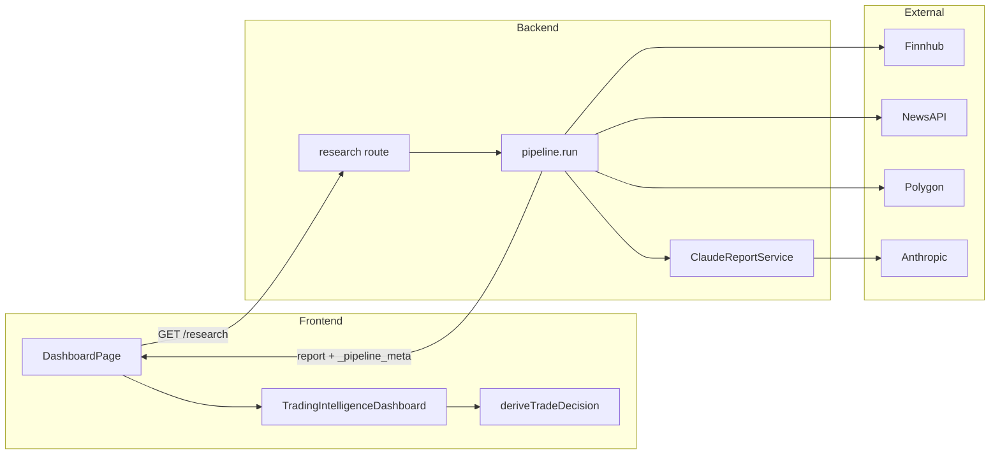
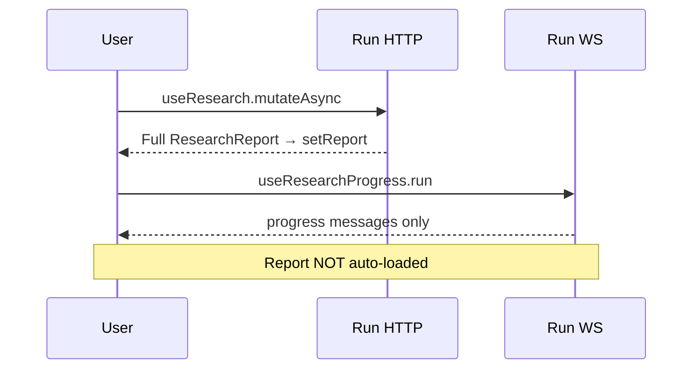

# Architecture Diagrams

Canonical copies also live in [`../../detail_docs.md`](../../detail_docs.md) §13.

## End-to-end data flow

## WebSocket vs HTTP

## Database ER

See [`../../detail_docs.md`](../../detail_docs.md) §7.1
