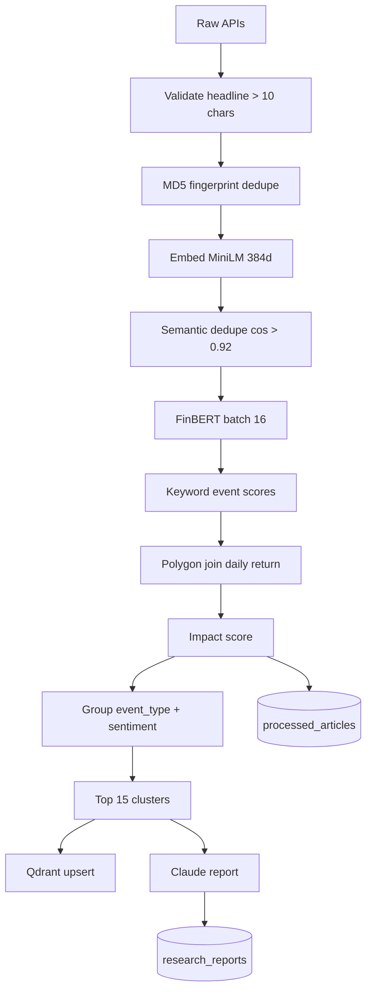

# Event Pipeline — News Flow



## Collector source mapping

| ID prefix | API | Source field |
|-----------|-----|--------------|
| `fh-` | Finnhub | `item.source` |
| `na-` | NewsAPI | `source.name` |
| `pg-` | Polygon | `publisher.name` |

## Event extraction

Keyword count winner per article. Ties broken by Python `max()` ordering on dict keys (insertion order dependent).

## Compression cluster shape

```json
{
  "event_type", "sentiment", "sentiment_score", "article_count",
  "impact_score", "top_headline", "abnormal_return", "headlines": [...]
}
```

See [`../../detail_docs.md`](../../detail_docs.md) §5 for full stage table.
